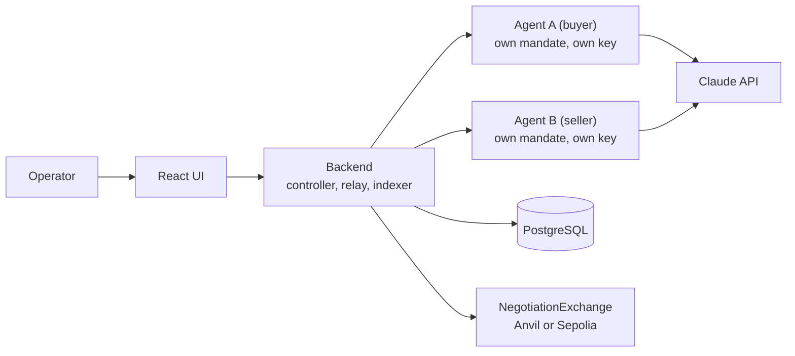

# Two-Agent Negotiation and Settlement Sandbox

An observable experiment in agent negotiation and financial execution. Two independently instructed AI agents negotiate the price of a fixed quantity of a mock asset. Every valid public action is recorded on an Ethereum testnet by a non-upgradeable smart contract, and the agreed exchange settles atomically with test tokens, or not at all.

**Status:** governance documents complete; repository scaffolded and the local stack runs. Protocol, contracts and services are not yet built. See [docs/build_plan.md](docs/build_plan.md).

## What it demonstrates

1. Two agents pursue separate objectives without seeing each other's private limits.
2. Offers and counteroffers are genuine model decisions, not a scripted price.
3. The negotiation can be reconstructed from contract events and calldata alone.
4. Both parties authorize the exact economic terms with linked EIP-712 signatures.
5. Settlement moves both token legs in one transaction or reverts entirely.
6. Walk-away, expiry, operator abort, model failure, and infrastructure failure are distinct, recorded outcomes.
7. A presenter can replay any run and explain the agreement, the authority chain, and the balances.

## What it does not claim

All assets are test tokens and all economics are simulated. The operator controls both agents on one host, so this is process isolation for an experiment, not independent counterparties. A successful run proves a working negotiation and authorization protocol. It does not prove customer demand, trading performance, or production security.

## How it works



The operator sets each agent's private mandate and starts a run. On each turn the backend sends the active agent an allowlisted observation. The agent's policy (a live model or a deterministic baseline) returns one of three decisions: offer, accept, or walk away. A policy signer inside the agent service validates the decision against the mandate and public state, constructs the typed message itself, and signs it. The relay submits it. The contract verifies signer, role, sequence, configuration hash, and expiry before recording it, and on acceptance transfers both legs in the same transaction.

## Stack

| Part | Choice |
|---|---|
| Interface | React, TypeScript, Vite |
| Backend and agents | Python 3.12, FastAPI, Pydantic, SQLAlchemy, web3.py |
| Model | Anthropic Claude via the official SDK |
| Contracts | Solidity, OpenZeppelin, Foundry |
| Database | PostgreSQL |
| Chains | Anvil (31337) locally, Ethereum Sepolia (11155111) for public demos |
| Local infra | Docker Compose |

## Repository layout

| Path | Contents | Built in |
|---|---|---|
| `apps/web/` | React application and typed API client | Stage 4 |
| `services/api/` | FastAPI backend: run controller, chain relay, indexer | Stage 2 |
| `services/agent/` | Agent service; run as two instances | Stages 2 and 3 |
| `packages/protocol/` | JSON schemas, ABI artifacts, EIP-712 fixtures, reason tables, reconstruction tool | Stage 1 |
| `contracts/` | Solidity sources, Foundry tests, deployment scripts | Stage 1 |
| `scenarios/` | Manufactured scenario templates and evaluation populations | Stages 1 and 6 |
| `infra/` | Compose profiles, environment template, key and scan scripts | Stage 0 |
| `docs/` | Specification, governance documents, runbook, deployment manifests, evidence |  |

## Documentation

Start at [docs/README.md](docs/README.md). The originating specification is [docs/Agent-Negotiation-Sandbox-System-Spec-v0.1.md](docs/Agent-Negotiation-Sandbox-System-Spec-v0.1.md). Contributors read [docs/contributing.md](docs/contributing.md) before every change; AI assistants read [CLAUDE.md](CLAUDE.md).

## Getting started

The contracts and the protocol package are in (stage 1). What is not in yet is anything that drives
them: the backend, the agent services and the two policies arrive in stages 2 and 3, so there is no
run to start from a browser. What works today is a deployable exchange, a settlement you can drive
by hand, and a tool that reconstructs it from chain data alone.

Prerequisites: [uv](https://docs.astral.sh/uv/), Node 22 with Corepack, [Foundry](https://getfoundry.sh),
Docker with Compose. Exact versions are in [ADR-033](docs/decision_log.md). `make` and the
pre-commit hooks find these themselves wherever they are installed; for your own shell, see
[docs/runbook.md](docs/runbook.md) section 1.

```sh
make setup                  # uv sync, pnpm install, pre-commit install
make up                     # PostgreSQL and Anvil, waits for both health checks
make ci                     # every gate the build has earned so far
make down                   # stop, keeping the database volume
```

To see the contracts work, deploy them to the local Anvil and reconstruct a session from the chain:
[docs/runbook.md](docs/runbook.md) sections 4 and 5.

`make help` lists the rest. Configuration lives in `infra/.env.example`; copy it to `infra/.env`,
which is git-ignored, when a stage needs one. The local profile runs on defaults without it.

The stack keeps to itself: its own Compose project (`agent_negotiation`), its own volume
(`agent_negotiation_postgres_data`), its own database and role, and a host port that defaults to
55432 rather than 5432 so it does not collide with another project's PostgreSQL. `POSTGRES_PORT`
moves the published host port; inside the network, services use `postgres:5432`. See
[docs/runbook.md](docs/runbook.md) section 2.

The operator runbook covers local startup, the ports, keys, deploying the contracts and
reconstructing a session from chain data. Recovery, funding a testnet demonstration, replay and
export arrive with the stages that make them true; it is completed in stage 5.

## License

Apache-2.0. See [LICENSE](LICENSE) and [NOTICE](NOTICE). Every Solidity source carries `// SPDX-License-Identifier: Apache-2.0` as its first line.

All assets, balances, prices, and mandates in this project are manufactured experiment inputs on test networks. Nothing here is a financial product or a claim about real economic value.

## Governance in one paragraph

Docs and code move together: any change to protocol, API, schema, behaviour, or a requirement updates the affected documents in the same change set. Decisions are recorded in [docs/decision_log.md](docs/decision_log.md). Gaps are raised with the product owner in [docs/open_questions.md](docs/open_questions.md) rather than assumed.
