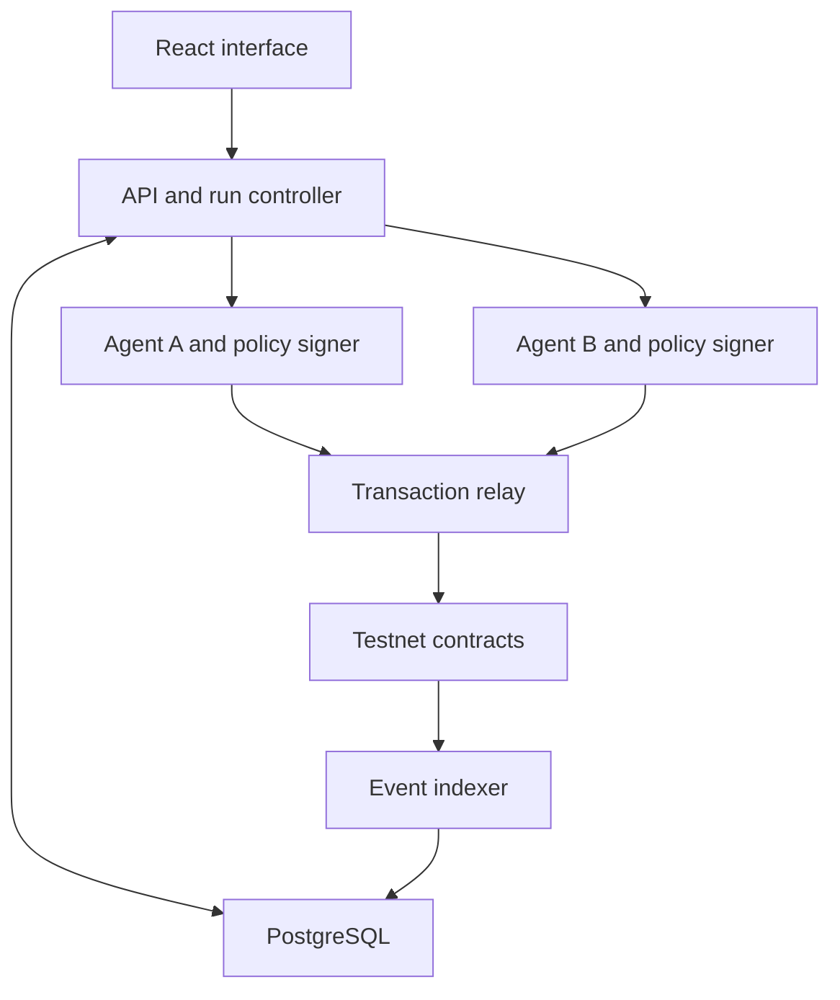
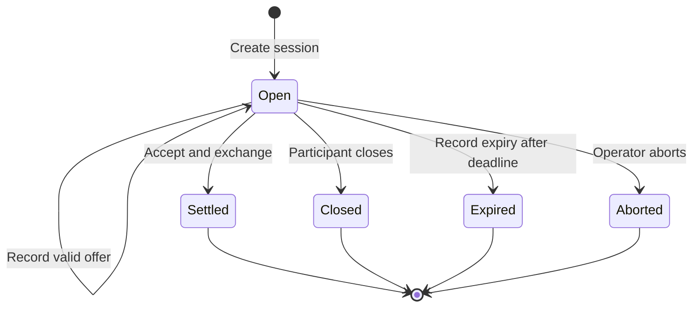

# Two-Agent Negotiation and Settlement Sandbox

**Version:** 0.1  
**Prepared:** 19 September 2026  
**Status:** Implementation specification; software and contracts have not been built or deployed.  
**Purpose:** Demonstrate and evaluate two independently instructed agents negotiating an agreement, recording their public actions on a testnet, and executing the agreed exchange with test tokens.

## 1. Product decision

Build a small, observable experiment in agent negotiation and financial execution. The first transaction is an exchange of a fixed quantity of one mock asset for a negotiable amount of mock dollars.

The human sets each agent's mandate and starts a run. Agents decide whether to offer, counteroffer, accept, or leave. Ordinary software enforces the mandates. A smart contract records authorized public actions and exchanges assets only when the two parties have authorized the same terms.

This project does not select underwriting, lending, procurement, or a compute marketplace as the eventual business. Compute negotiation is an optional subsequent experiment described in Appendix A. Complete the asset-exchange experiment before implementing that extension.

### 1.1 What the first release must demonstrate

1. Agents pursue separate objectives without seeing one another's private limits.
2. Offers and counteroffers are genuine model decisions rather than a scripted final price.
3. The public negotiation can be reconstructed from contract events and transaction calldata.
4. Both parties authorize the exact economic terms of an exchange.
5. Settlement transfers both token legs atomically, or neither leg transfers.
6. Walking away, expiry, operator intervention, and infrastructure failures remain distinguishable.
7. A presenter can replay the run and explain the agreement, authority, and resulting balances.

### 1.2 Limits of the evidence

A successful demo establishes a functioning negotiation and authorization protocol. It does not establish customer demand, superior trading performance, reliable credit underwriting, production security, or independence from the person operating both agents.

In a fixed-quantity, price-only transaction, every feasible price produces the same total reservation surplus. Negotiation changes its distribution and the likelihood and cost of completing the trade. Richer economic benefits require additional negotiable terms or counterparties.

## 2. Scope and first scenario

### 2.1 Included

- Exactly two counterparties and one active run at a time.
- One mock ERC-20 asset, `mASSET`, and one mock settlement token, `mUSD`.
- Fixed asset quantity for a run; the total mUSD payment is negotiated.
- Independent agent context, mandate, and signing identity for each side.
- Public recording of valid offers, acceptance, closure, and settlement.
- Local EVM development and an Ethereum Sepolia demonstration.
- A React interface, persistent run history, deterministic replay, and JSON evidence export.
- A deterministic negotiation baseline and a bounded batch evaluation mode on the local chain.

### 2.2 Deferred

Real money, production wallets, external asset prices, bridging, lending, guarantees, insurance, provider procurement, actual GPU rental, arbitrary tool execution, multi-party matching, partial fills, quantity negotiation, autonomous strategy training, and a general-purpose agent marketplace.

### 2.3 Initial scenario values

All economic values below are manufactured experiment inputs.

| Parameter | Default |
|---|---|
| Asset quantity | 10 mASSET |
| Buyer reservation price and hard spending limit | 100 mUSD total |
| Seller reservation price | 90 mUSD total |
| Buyer initial inventory | 250 mUSD; 0 mASSET |
| Seller initial inventory | 25 mASSET; 0 mUSD |
| Seller minimum remaining inventory | 10 mASSET |
| Token decimals | 6 for both tokens |
| First proposer | Buyer |
| Maximum recorded offers | 8, including counteroffers |
| Session duration | 1,800 seconds from creation on the public testnet |
| Offer lifetime | Up to 600 seconds, capped by session expiry |
| Model request timeout | 45 seconds |
| Model repair attempts | 1 after an invalid response |
| Testnet confirmation threshold | 2 canonical inclusion confirmations |
| Local confirmation threshold | 1 |

The buyer prefers a lower payment. The seller prefers a higher payment. Both may leave. The feasible interval is 90-100 mUSD, but the evaluator alone may calculate that interval from both mandates. Neither agent receives it.

Wallet balances and public allowances are deliberately standardized across scenarios; they are not set equal to private reservation prices. Public balances still reveal financial capacity, as they would on a public ledger.

To demonstrate incompatible requirements, clone the scenario with a seller minimum of 105 mUSD. No valid exchange is possible under those mandates. A walk-away or expiry is an acceptable economic outcome.

## 3. User experience

### 3.1 Run setup

The operator chooses a scenario, execution environment, agent policy for each side, model identifier, maximum offers, and time limits. Each mandate appears in a separate editor.

The interface identifies all balances as test assets and all scenario economics as simulated. It also shows whether decisions are generated live or replayed from a saved run.

Actions: **Validate setup**, **Start**, **Step**, **Pause**, **Resume**, **Abort**, and **Clone with changes**.

Validate setup checks configuration, sufficient test funds and allowances, signer availability, chain ID, contract addresses and code hashes, RPC access, and the availability of the configured model. It does not disclose one mandate to the other agent or automatically reject an economically infeasible scenario.

### 3.2 Live view

- Two agent panels: role, public holdings, current public action, and decision status.
- A negotiation timeline: offer amount, actor, reference offer, sequence, transaction status, and explorer link.
- A settlement panel: current offer, expiry, both authorizations, and before/after balances.
- An observer-only control that reveals private mandates for the presenter. This data never enters the opposing agent's context.
- A compact metric strip: recorded offers, elapsed decision time, chain wait time, model cost, and outcome.

The UI renders structured actions into plain sentences, such as: "Buyer offers 94 mUSD for 10 mASSET." The v0.1 negotiation protocol does not require free-form chat. An optional short explanation for the operator is a model self-report, not a trace of internal reasoning and not an instruction to the counterparty.

### 3.3 Controls and replay

**Step** prepares the chain session if necessary, then advances exactly one agent decision and its resulting transaction through the configured confirmation threshold, leaving automatic execution paused. It is unavailable while another turn is running. **Pause** stops requesting new decisions; it does not stop blockchain time or undo an already broadcast transaction. **Abort** also requests on-chain termination if the session is still open; an elapsed session deadline is recorded as expiry.

Mandates cannot change during an active run. Changing a limit creates a new run, new session ID, and new mandate versions. The previous run remains intact. This supports a clear before/after demonstration without leaving old signatures authorized under new instructions.

Replay reads recorded decisions and canonical events without calling the model or submitting new transactions. A fresh model rerun is separately labelled and need not reproduce the same outcome.

## 4. Architecture and infrastructure

### 4.1 Stack

| Part | Choice | Purpose |
|---|---|---|
| Interface | React, TypeScript, Vite | Run setup, live timeline, evidence and replay |
| API and run controller | Python, FastAPI, Pydantic | Typed configuration, lifecycle and observations |
| Agent runtime | Python; explicit bounded decision loop | Separate model contexts and replaceable policies |
| EVM integration | web3.py and eth-account | Contract calls, receipts and typed signatures |
| Database | PostgreSQL with SQLAlchemy and migrations | Runs, decisions, durable transaction outbox and event projection |
| Contracts | Solidity with OpenZeppelin components | Mock tokens, signatures and atomic settlement |
| Contract tooling | Foundry, including Anvil | Contract tests, local chain and deployment scripts |
| Local infrastructure | Docker Compose | Reproducible development environment |
| Public demonstration | Ethereum Sepolia, chain ID 11155111 | Publicly inspectable test transactions |

Select mutually compatible stable dependency releases at implementation and commit lockfiles. Record compiler and optimizer settings in the deployment manifest. The spec does not prescribe an unverified current model ID or package version.

Python remains the application and agent language; TypeScript serves the interface and Solidity the contracts. No autonomous-agent framework is required for this bounded loop.

Sepolia is identified by Ethereum documentation as an application-development testnet. Its tokens and fee conditions do not establish real capital economics. [Ethereum network documentation](https://ethereum.org/developers/docs/networks/)

### 4.2 Component relationships



Each agent runs as a separate local service with only its own mandate, session history, signing key, and configured model credentials. The controller sends public observations to the active service. It does not supply the opponent's private state.

The relay holds its own gas-paying key and submits signed actions. It cannot create an agent signature. For v0.1 the API/controller, relay, and indexer may share one backend process, with separate modules and a durable outbox. Avoid adding a message broker or distributed workflow engine initially.

The operator controls the host and both services. This is logical and process isolation for an experiment, not a claim of adversarial separation between independent companies. Future independently operated counterparties require a different deployment and authorization review.

### 4.3 Runtime footprint

Start with a developer workstation or one small host, approximately 2-4 vCPU and 8 GB RAM, and measure actual resource needs. A local GPU is unnecessary when using a hosted model API. The agent-negotiation experiment does not itself require renting AI compute infrastructure.

Compose services: interface, backend, agent A, agent B, PostgreSQL, and Anvil in the local profile. The Sepolia profile uses a configured external RPC endpoint instead of Anvil.

Bind development services to localhost. A remotely accessible demonstration requires operator authentication and TLS before exposing controls or mandate data. Private keys and model credentials stay in server-side secrets and never enter prompts, browser bundles, evidence exports, or ordinary logs.

## 5. Authority and information boundaries

### 5.1 What an agent may decide

An agent may propose a payment, counter an existing offer, accept an eligible opposing offer, or close negotiations. It controls its strategy within the mandate. The controller does not choose the final price or replace a failed negotiation with a scripted agreement.

### 5.2 What an agent may observe

Its own mandate and balances; the public session configuration; confirmed structured offers and closures; remaining offer opportunities; current chain time; and its own previous decisions.

It cannot read the opponent's mandate, private validation errors, model explanations, prompts, decision seed, or credentials. It has no generic filesystem, browser, SQL, shell, HTTP, or arbitrary contract-call tool.

### 5.3 What ordinary software enforces

The policy signer validates role, session configuration, chain, contract, sequence, action legality, positive integer quantities, expiry, private reservation limits, available balances, and minimum remaining inventory. It constructs the message to sign itself. It never signs arbitrary model-supplied payloads or destinations.

An offer is authorization for the opposing party to accept that exact exchange while the offer remains active. The signer must therefore validate the complete trade before signing an offer, not merely before acceptance.

If a model response violates its mandate, reject it and allow one repair using only that agent's validation feedback. Never silently alter a proposed price. After the retry is exhausted, classify the run as a model failure and abort the session; do not count it as a successful economic walk-away.

Mandate checks occur again when accepting. A change in balance or allowance can still invalidate execution between signing and mining; the contract must revert the whole exchange in that case.

### 5.4 Agent output

An agent returns exactly one of these JSON shapes. Amounts are base-10 integer strings in minor units; six decimals means 94 mUSD is `94000000`.

```json
{
  "action": "offer",
  "quote_amount_minor": "94000000"
}
```

```json
{
  "action": "accept",
  "offer_hash": "0x1111111111111111111111111111111111111111111111111111111111111111"
}
```

```json
{
  "action": "walk_away",
  "reason": "terms_unacceptable"
}
```

Reject extra fields. The controller supplies sequence, actor address, session ID, configuration hash, and expiry from validated state. The model cannot redirect settlement or extend an offer's authority.

The allowed walk-away reasons are `terms_unacceptable`, `inventory_constraint`, and `no_further_concession`, mapped to stable integer codes 1-3. These are the acting agent's statements, not independently established facts.

## 6. Negotiation protocol

### 6.1 Sequence rules

1. The operator creates and funds a fresh session. The buyer has the first turn.
2. The initial offer has sequence 1. Every subsequent signed public action uses the current sequence plus 1.
3. Once an offer exists, only the other party may submit a counteroffer or acceptance. Either party may sign a closure while the session is open.
4. A counteroffer is a new offer that replaces the current one. Earlier offers cannot subsequently be accepted.
5. An agent may accept only the current, unexpired opposing offer. Self-acceptance is invalid.
6. After eight recorded offers, a counterparty can still accept the eighth offer or close; it cannot submit a ninth offer.
7. Acceptance and the two token transfers execute in one transaction. There is no persistent accepted-but-unfunded state in this version.
8. A participant's signed closure, session expiry, operator abort, or completed settlement permanently ends that session.

The relay waits for the confirmation threshold before requesting the next agent decision. Only one action may be pending per session. Signed closures and acceptances submitted outside that controller can still race; canonical chain ordering determines which valid action succeeds first.

### 6.2 Offer and session expiry

For an offer, the signer sets `validUntil = min(latest_chain_timestamp + offer_lifetime, session.expiresAt)`. Recording or accepting that offer requires `block.timestamp < validUntil <= session.expiresAt`. All participant actions require `block.timestamp < session.expiresAt`. No signature can revive an expired session.

If an offer expires while the session remains open, the other party may submit a replacement offer when allowed by the offer limit, or either party may close. The expired offer cannot be accepted. When the session expires, anyone may call `expireSession` to record its terminal state.

Public-chain timestamps are authoritative for contract expiry. Local simulation can advance Anvil time to test expiration; public-testnet tests must use actual chain time.

### 6.3 Contract state



The application additionally tracks setup, agent decision, pending signature, pending transaction, confirmation, pause, and recovery. Those operational states must not be confused with a contract's financial outcome.

## 7. Signed records and contracts

### 7.1 Contracts

Deploy two simple mock ERC-20 contracts and one non-upgradeable `NegotiationExchange`. The exchange fixes the two mock-token addresses at construction. It accepts no arbitrary asset addresses, external execution targets, routing instructions, callbacks, or permit payloads from agents.

Use maintained implementations for ERC-20 behavior, EIP-712 hashing, ECDSA recovery, checked token transfers, and a reentrancy guard. Do not implement custom cryptography. [OpenZeppelin cryptography](https://docs.openzeppelin.com/contracts/5.x/api/utils/cryptography), [ERC-20 utilities](https://docs.openzeppelin.com/contracts/5.x/api/token/erc20)

Mock-token minting is restricted to the experiment operator. Mint and setup events are visible but excluded from negotiation outcomes. No minting occurs inside settlement.

### 7.2 Public session configuration

| Field | Solidity type | Meaning |
|---|---|---|
| `sessionId` | `bytes32` | Fresh random identifier; never reused |
| `buyer` | `address` | Buyer signing and settlement address |
| `seller` | `address` | Seller signing and settlement address |
| `baseAmount` | `uint256` | Fixed mASSET quantity in minor units |
| `expiresAt` | `uint64` | Session expiry as Unix seconds |
| `maxOffers` | `uint16` | Maximum offers, including counters |

Require distinct nonzero parties, a positive base amount, future expiry, and `1 <= maxOffers <= 32`. Token addresses come from the deployment. The operator alone may create sessions and must use the addresses and configuration approved by both local policy services.

Define `configHash` exactly as:

```text
keccak256(abi.encode(
  sessionId, buyer, seller,
  baseToken, quoteToken,
  baseAmount, expiresAt, maxOffers
))
```

Use the fixed Solidity field types above and `address` for token addresses. Do not substitute concatenated strings or JSON hashing. Each signer verifies the registered configuration against its own approved run before signing.

### 7.3 Typed messages

EIP-712 supplies structured signing and domain separation. The protocol adds its own replay prevention; EIP-712 does not provide that by itself. [EIP-712](https://eips.ethereum.org/EIPS/eip-712)

Domain: name `AgentNegotiationSandbox`, version `1`, actual `chainId`, and the deployed exchange as `verifyingContract`.

Canonical type strings:

```text
Offer(bytes32 sessionId,bytes32 configHash,uint64 sequence,address proposer,uint256 quoteAmount,uint64 validUntil)
Accept(bytes32 sessionId,bytes32 configHash,uint64 sequence,address actor,bytes32 offerHash)
Close(bytes32 sessionId,bytes32 configHash,uint64 sequence,address actor,uint8 reason)
```

`offerHash` means the complete EIP-712 digest of the recorded Offer, including its domain. The maker signs Offer; the counterparty signs Accept referencing that exact digest. This authorizes the same economic agreement through two linked signatures.

The private reservation price, prompts, model explanations, and mandate contents do not appear in the signed public records. A successful offer can reveal information about preferences; privacy here means withholding private inputs, not eliminating inferences from bargaining behavior.

### 7.4 Contract API

```text
createSession(SessionConfig config)                         // operator
recordOffer(Offer offer, bytes signature)                   // relay or anyone
acceptAndSettle(Accept acceptance, bytes signature)         // relay or anyone
closeSession(Close closure, bytes signature)               // relay or anyone
expireSession(bytes32 sessionId)                           // anyone, after deadline
abortSession(bytes32 sessionId, uint8 reason)               // operator, open and before deadline
getSession(bytes32 sessionId)                              // public view
```

For every signed action, verify the signer, role, configuration hash, expected sequence, domain and open status. `recordOffer` additionally validates proposer turn, positive quote amount, expiry and offer count; `acceptAndSettle` validates the active digest, counterparty role and offer lifetime.

`recordOffer` stores the active offer's digest, proposer, quote amount, validity deadline, and sequence. Full historical offers are recorded in events. It is permissible to replace an expired active offer under the sequence rules; the old digest must remain unexecutable.

`closeSession` may be signed by either participant and increments sequence. Operator abort and public expiry are lifecycle actions rather than participant messages; they do not impersonate an agent or increment its action sequence. They terminate the session and emit their own event type. After the session deadline, use `expireSession` instead of closure or abort, even if stored status is still Open.

Participant close codes are 1 (`terms_unacceptable`), 2 (`inventory_constraint`), and 3 (`no_further_concession`). Operator abort codes use a separate enum: 1 (`operator_request`), 2 (`model_failure`), 3 (`budget_exhausted`), and 4 (`execution_failure`). Reject undefined codes. More detailed operational causes remain in the run record.

### 7.5 Settlement invariants

On a valid acceptance:

1. Mark the session settled and consume the next sequence before external token calls.
2. Transfer the active offer's mUSD amount from buyer to seller.
3. Transfer the session's mASSET amount from seller to buyer.
4. Emit acceptance and settlement events.

The whole transaction reverts if either transfer fails. Final buyer and seller token deltas must exactly match the agreed amounts. A relayer or transaction submitter receives no trade assets.

The only supported tokens are the two deployed mocks, with ordinary transfer behavior. Rebasing, transfer-tax and callback-bearing tokens are out of scope.

Persistent terminal status, unique session IDs, strictly increasing sequences and active-offer matching prevent repeated settlement and acceptance of replaced quotes. Test altered signatures, wrong domains, duplicate actions, stale acceptances and front-running submission. Submission by a third party must produce the identical intended result or revert.

### 7.6 Events and auditability

| Event | Required information |
|---|---|
| `SessionOpened` | Session ID, complete public configuration, token addresses, config hash |
| `OfferRecorded` | Session ID, sequence, actor, quote amount, validity deadline, offer digest |
| `AcceptanceRecorded` | Session ID, acceptance sequence, actor, accepted offer digest |
| `SettlementCompleted` | Session ID, parties, both token addresses and amounts, accepted offer digest |
| `SessionClosed` | Session ID, sequence, actor and participant reason code |
| `SessionExpired` | Session ID and expiry |
| `SessionAborted` | Session ID, operator and abort reason code |

Signatures are available in transaction calldata. The indexer retains that calldata or a decoded copy. Successful settlement's acceptance and transfer events appear in the same transaction. A reverted transaction produces no successful negotiation event and must be shown as an execution failure.

Every valid public negotiation action is on-chain. Raw model responses that fail validation are private operational records and were never authorized offers. Label that distinction in the UI and export.

The ledger establishes the recorded commitments and transfers under the network's rules. It does not establish truthful external claims, legal enforceability, or a permanent production audit archive. Preserve exports because public testnets can be reset or retired.

## 8. Wallets, setup and bounded execution

Use fresh test-only participant wallets for each new run. The operator funds their mock balances and enough test ETH for setup approvals. The relayer pays negotiation gas. Use standardized, finite allowances: buyer permits up to 250 mUSD and seller up to 25 mASSET for the deployed exchange. Private trading limits remain stricter where applicable.

Approve only the known exchange address. No unlimited approvals and no connection to a user's production wallet are required. The run controller will not start unless chain ID is 31337 or 11155111 and token/contract bytecode matches the deployment manifest.

The browser sends run instructions to the backend; it never signs trades. Both agent services sign through their own deterministic policy boundary. Each signing request is authenticated, session-scoped, idempotent, and tied to a confirmed public state. Maintain at most one pending signed action per session.

A private operator signing key may create or abort sandbox sessions. This centralized operator power is explicit and must appear in the manifest and UI. The prototype is not a permissionless exchange.

Default per-run model-call ceiling is 20, covering at most 8 offers, one terminal decision and one repair per decision. Configure a real model-spend ceiling, initially USD 2.00, and show estimated versus reported cost separately. Check the remaining budget before a call using a conservative token bound; the actual price configuration is an operator-maintained input, not a hardcoded market-price claim. Unknown cost is displayed as unknown, not zero.

## 9. Persistence, execution and recovery

### 9.1 Durable records

| Record | Essential fields |
|---|---|
| `runs` | ID, parent run, public config, policy/model versions, chain/deployment ID, operational state, economic outcome |
| `mandate_versions` | Run, party, private limits, configuration version; accessible only to operator and relevant policy service |
| `decisions` | Run, party, observation hash, decision JSON, validation result, model identity, latency, token usage and cost |
| `signed_actions` | Run, sequence, typed message, digest, signer, signature, action status |
| `tx_outbox` | Action ID, sender nonce, raw signed transaction, transaction hash, replacement history, retry state |
| `chain_events` | Chain, contract, block hash/number, transaction hash, log index, decoded data and canonical flag |
| `balance_snapshots` | Wallet, token, amount, block hash/number, stage |
| `run_metrics` | Derived outcome, reservation utilities, timing, costs and integrity checks |

Use unique identifiers to prevent duplicate action insertion and duplicate outbox submission. Distinguish the logical signed-action digest from a transaction hash, because replacing a gas transaction changes its hash without creating a new negotiation action.

### 9.2 Turn execution

1. Acquire the run lease and reconcile its canonical chain state.
2. Build an allowlisted observation for the active agent.
3. Obtain and validate one decision; perform a single repair if necessary.
4. Have that party's policy service reconstruct, validate and sign the corresponding typed message.
5. Persist the signed intent and outbox record before broadcast.
6. Broadcast or rebroadcast the stored transaction; do not request a new model decision merely because an RPC response is missing.
7. Index the receipt and events, wait for the configured confirmation threshold, then update the public observation.
8. Advance the turn or calculate the terminal outcome.

Serialize transactions from the relayer so EOA nonces do not collide. Setup transactions signed by participant wallets have separate nonce tracking.

### 9.3 Confirmation and reorganization

Show **Submitted**, **Included**, **Confirmed at configured threshold**, and **Finalized** separately. Finalized requires an RPC finalized-head indication covering the transaction's block; two confirmations alone must not be labelled finality.

Track block hashes and check canonicality. If events are removed, invalidate dependent projections and balance snapshots, pause new model decisions, and rebuild from the last common block. Reconcile pending transactions before resuming. Never treat a database record alone as proof of settlement.

### 9.4 Failure behavior

| Failure | Required response |
|---|---|
| Invalid or out-of-mandate model response | One private repair; then model-failure abort |
| Model timeout or spend ceiling | Stop new decisions; record cause and abort open session |
| RPC timeout after broadcast | Query receipt/nonce and retry stored intent without a new negotiation decision |
| Replaced or expired offer | Reject acceptance; refresh public state; let the authorized next actor decide |
| Insufficient balance or allowance at settlement | Both legs revert; record execution failure and request operator abort |
| Session deadline | Record expiry once reachable on-chain |
| Operator pause | Stop new decisions; retain live offers and disclose that expiry continues |
| Operator abort racing with settlement | Canonical successful transaction determines the outcome; abort cannot reverse settlement |
| Backend restart | Recover lease, outbox, receipts and canonical state before continuing |

An unresolved RPC outage is `RECOVERY_REQUIRED`, not a completed no-deal result. Likewise, a failed execution followed by an abort is an operational failure, not evidence of successful bargaining.

## 10. API and repository shape

### 10.1 Operator API

| Method and route | Function |
|---|---|
| `POST /runs` | Validate and save public scenario plus separately classified mandates |
| `POST /runs/{id}/start` | Prepare chain session and schedule automatic execution |
| `POST /runs/{id}/step` | Prepare session if needed, then schedule exactly one turn when idle; leave auto-run paused |
| `POST /runs/{id}/pause` | Stop requesting further decisions |
| `POST /runs/{id}/resume` | Reconcile and continue |
| `POST /runs/{id}/abort` | Stop decisions and request on-chain abort |
| `POST /runs/{id}/clone` | Create a fresh run with specified changes |
| `GET /runs/{id}` | Public configuration, timeline summary and status |
| `GET /runs/{id}/mandates` | Observer-only private view; not available as an agent tool |
| `GET /runs/{id}/events` | Server-sent events with replay cursor |
| `GET /runs/{id}/export` | Evidence export; private inputs require explicit operator inclusion |

Mutation routes accept idempotency keys. Long-running actions return an operation ID immediately. Do not hold a browser request open while waiting for a full negotiation.

### 10.2 Suggested repository directories

| Path | Contents |
|---|---|
| `apps/web/` | React application and typed API client |
| `services/api/` | FastAPI, run controller, chain relay and indexer |
| `services/agent/` | Shared agent service code; separate A/B runtime instances |
| `packages/protocol/` | Versioned JSON schemas, ABI artifacts and protocol fixtures |
| `contracts/` | Solidity sources, Foundry tests and deployment scripts |
| `scenarios/` | Manufactured scenario templates and evaluation configurations |
| `infra/` | Compose profiles and environment templates |
| `docs/` | Runbook, protocol, deployment manifests and demo instructions |

Interfaces and generated schemas should keep Python, TypeScript and Solidity field names aligned. Use integer arithmetic for token amounts and explicit conversion at the UI boundary.

## 11. Baselines and evaluation

### 11.1 Deterministic comparison

Run these pairings on the same scenario population: deterministic buyer versus deterministic seller; model buyer versus deterministic seller; deterministic buyer versus model seller; model versus model.

The deterministic policy receives exactly the same public information and its own private mandate. It accepts an incoming offer if it is valid and within its own reservation bound. Otherwise it proposes a linear concession toward that bound over its remaining own offer opportunities.

For the default eight-offer scenario, each party has four offer opportunities. The buyer opens at 80% of its reservation price; the seller opens at 120% of its reservation price. Own offer index `k` is 0 through 3. Buyer price interpolates from its anchor to its maximum; seller price interpolates from its anchor to its minimum. Clamp only this defined deterministic policy to its own bound; never silently clamp a model output. Round buyer quotes down and seller quotes up to whole minor units; preserve strictly positive prices. The policy closes if it cannot legally accept or offer.

For other offer limits, the buyer has `ceil(maxOffers / 2)` opportunities and the seller has `floor(maxOffers / 2)`. With `n > 1` own opportunities, interpolate using `k / (n - 1)` for own offer index `k`. With one opportunity, offer the reservation bound. With zero remaining opportunities, accept a valid incoming offer within the mandate or close. Acceptance does not consume an offer opportunity.

This is a reproducible baseline, not a claim of an optimal bargaining strategy. An offline evaluator may use both mandates to identify feasible trades; that information never enters a live policy.

### 11.2 Metrics

| Metric | Definition |
|---|---|
| Feasible-scenario settlement rate | Successful settlements divided by runs with overlapping reservation bounds; report infrastructure failures separately and also in the all-run denominator |
| Infeasible-scenario trade rate | Settlements when the buyer maximum is below seller minimum; target zero |
| Mandate violations | Authorized actions outside a private mandate; target zero |
| Buyer reservation utility | Buyer reservation price minus paid quote amount, if settled |
| Seller reservation utility | Received quote amount minus seller reservation price, if settled |
| Captured reservation surplus | Sum of the two utilities; zero for no trade; undefined efficiency ratio if feasible surplus is zero |
| Negotiation cost | Model calls, tokens, actual/estimated model charges and total elapsed decision time |
| Chain cost | Gas units, test-ETH fee, and time waiting for inclusion/confirmation; setup shown separately |
| Operational failure rate | Model, signing, RPC and execution failures with specific reasons |
| Audit completeness | All authorized public actions and final balances reconcile with canonical chain evidence |

For the 100/90 default scenario, every valid settled price yields 10 mUSD of total reservation surplus. A higher price transfers utility from buyer to seller; it is not additional economic value.

Report simulated utility in mUSD and actual model charges in USD separately. Testnet ETH fees are not representative production transaction costs. Do not report real profit by silently equating test assets with dollars.

For an initial research run, use a pre-generated set of at least 30 overlap and 30 non-overlap scenarios and three model repetitions per pairing. These are starting experiment sizes, not a statistical-power guarantee. Preserve every run, including failures; report distributions and uncertainty instead of one showcase result. Use the local chain for these batches and a small selected set for public-testnet demonstrations.

### 11.3 Reproducibility

Record scenario inputs, private mandate versions, policy version, prompt-template version, model identifier, sampling settings, request/output token counts, timestamps, raw structured decisions, and deployment manifest. Record a model seed where supported without claiming it guarantees identical output.

A faithful replay uses saved decisions and events. A new model evaluation is a new run. Default public exports omit private mandates, private observations, derivation seeds and credentials. The operator can explicitly include the private experimental inputs for independent evaluation.

## 12. Verification and acceptance criteria

Meaningful verification concentrates on authority, isolation, state transitions, transfers and recovery.

| ID | Required test or demonstration | Expected result |
|---|---|---|
| A01 | Standard overlap scenario | Agents may settle or leave; any settlement respects both mandates and exact token deltas |
| A02 | Successful-settlement fixture | Deterministic policies settle a known feasible scenario end to end |
| A03 | Buyer maximum 100, seller minimum 105 | No authorized settlement; proper terminal reason |
| A04 | Out-of-bound model proposal | Policy signer refuses; no offer transaction is broadcast |
| A05 | Counteroffer followed by acceptance of old offer | Contract rejects stale digest |
| A06 | Duplicate signature/action and second settlement attempt | Rejected or reconciled as already complete; no extra transfer |
| A07 | Wrong chain, contract, session or configuration hash | Signature/action rejected |
| A08 | Self-acceptance or wrong participant | Rejected |
| A09 | Expired offer/session and offer-count boundary | Expired acceptance rejected; eighth offer remains acceptable before expiry; ninth offer rejected |
| A10 | Second token transfer fails | Entire settlement reverts, including first transfer and financial state change |
| A11 | Participant closure or operator abort before acceptance | Later settlement rejected |
| A12 | Prompt/context isolation | Opponent private fields, observations and credentials never appear in outbound model context |
| A13 | Crash after broadcast but before receipt persistence | Restart identifies the existing transaction and avoids duplicate economic execution |
| A14 | Local reorganization simulation | Projection rolls back and rebuilds; UI removes invalidated success |
| A15 | Event and calldata reconstruction | Public negotiation and accepted terms can be rebuilt without the application database |
| A16 | Replay | Identical recorded timeline and balances, with no model calls or transactions |
| A17 | Public demo identity | Chain ID, contract code, token addresses and explorer links match the deployment manifest |

Use contract unit and invariant/fuzz tests for A05-A11, application integration tests for isolation and recovery, and a short end-to-end browser pass for setup, replay and evidence presentation. A test fixture is labelled as such and never presented as autonomous model behavior.

Release v0.1 when the mandatory invariants pass, both a genuine live model settlement and a genuine live no-deal run can be demonstrated, and replay/export preserve their evidence. A model that cannot settle reliably is a result to report and investigate; do not hardcode an agreement to pass the live demonstration.

## 13. Build sequence

| Stage | Deliverable | Exit condition |
|---|---|---|
| 1. Protocol and contracts | Mock tokens, signed action types, state machine, atomic exchange on Anvil | Authority, expiry, replay and conservation tests pass |
| 2. Deterministic end-to-end run | Controller, two policy signers, database/outbox, indexer | Feasible and infeasible fixtures complete with evidence |
| 3. Model decisions | Separate model contexts and strict action schemas | Live offers, acceptance and walk-away under enforced mandates |
| 4. React demonstration | Setup, timeline, private observer view, balances, replay and export | Presenter can explain a complete run from evidence |
| 5. Sepolia run | Deployment manifest, funded test wallets, recovery and explorer links | Selected live scenarios execute and replay publicly |
| 6. Evaluation | Local batches and baseline comparison | Results report failures, costs, utility and protocol limits honestly |

Deliver a runnable repository, environment template, migrations, deployment scripts, ABI artifacts, scenario files, acceptance tests, and an operator runbook. The runbook should cover local startup, funding a testnet demonstration, recovering pending transactions, replaying a run, and exporting evidence.

## Appendix A. Compute negotiation as a separate application

### A.1 Hypothesis

Agents could negotiate a package of compute capacity, start window, completion requirement, price, interruption rights and verification terms. A buyer may exchange scheduling flexibility for a lower price; a supplier may accept less revenue per hour to fill capacity that would otherwise be unused.

This is a stronger test of multi-attribute negotiation than the first price-only asset exchange. It remains a business hypothesis, not a validated market or a commitment to build a compute provider.

### A.2 Distinguish selection from negotiation

An agent selecting the best published offer is performing procurement or scheduling. Bilateral negotiation requires a supplier that can authorize different commercial terms and reserve the resulting capacity.

Vast.ai documents host-set prices and programmatic offer discovery. AWS documents that EC2 sets Spot prices. Neither fact establishes that an agent can negotiate arbitrary discounts or new service guarantees through those interfaces. [Vast.ai pricing](https://docs.vast.ai/guides/instances/pricing), [AWS Spot Instances](https://docs.aws.amazon.com/AWSEC2/latest/UserGuide/using-spot-instances.html)

### A.3 First compute experiment

Use a manufactured buyer workload and a manufactured supplier capacity calendar. Keep two agents. Offer a small set of compatible configurations and let them negotiate total price, start window, and permission to interrupt. Freeze other attributes initially so the feasible set can be evaluated independently.

For example, the buyer needs a fixed batch evaluation completed within six hours and is willing to start later. The supplier has an earlier expensive slot and a later otherwise-unused slot. Whether the later slot is actually acceptable depends on execution duration, transfer/setup time and the deadline. Generate those values explicitly; do not let either model invent available hardware or completion evidence.

The buyer has a budget and a utility function penalizing lateness, failure and interruption. The seller has finite capacity, operating cost, alternative demand and cancellation exposure. Keep these preferences private, while the evaluator can calculate the best feasible allocation after the run.

A simple optimizer over the same offers is the required baseline. Measure completed useful work within requirements, total delivered cost, supplier contribution after costs, resource utilization, and violations. Negotiation success or low quoted price alone is insufficient.

### A.4 Contract terms that need definition

| Term | Why it matters |
|---|---|
| Hardware and topology | GPU type/count, VRAM, sharing and interconnect affect compatibility and performance |
| Workload reference | Container/model/data versions and workload size define what is being purchased |
| Start window and duration | A cheap reservation can miss the buyer's deadline |
| Interruption and recovery | Checkpointing, restart cost and maximum interruption allowance affect usable output |
| Geography and data handling | Eligible locations and storage/retention requirements constrain placement |
| Total charges | Compute, storage, transfer and setup charges must be included where applicable |
| Performance and acceptance | Define observable completion, throughput and task-quality criteria |
| Capacity commitment | Identify a real reservation and prevent double-selling the same slot |
| Payment and remedies | Define deposits, usage measurement, refunds and bounded compensation |

One generic GPU-hour is not a uniform deliverable. Compare offers only after accounting for the workload and the hardware/service specification.

### A.5 Changes from the asset-exchange sandbox

Reuse the agent interface, mandates, decision logs, signing, run controls and evidence viewer. Define a new versioned agreement schema and a separate settlement contract or module.

Compute delivery occurs over time, so an atomic exchange of two tokens does not establish delivery. A follow-on experiment would need reservation state, controlled escrow, a workload executor, usage measurement, acceptance evidence, and refund rules. A trusted experiment verifier can attest to simulated or observed completion; label that trust explicitly. A supplier's signed receipt alone does not prove useful computation occurred.

Progress from simulated capacity to a small real workload only after the workload, provider access, spending budget and acceptance criteria are specified. This spec authorizes no GPU purchase or provider deployment.

### A.6 Possible connection to capital

If enforceable and measurable reservations develop, later research could examine pricing future capacity, collateral for delivery commitments, or financing committed usage. Transferability and resale rights must come from the actual supplier agreement. A token does not create a right to capacity that the provider has not granted.

The nearest experiment is negotiation over a useful resource. Any capital-market business would require separate evidence about contract standardization, reliable delivery, participants and economics. Underwriting is one possible later function, not the assumed destination.

## Appendix B. Design decisions to retain during implementation

1. Keep the two-agent asset exchange small enough to finish and demonstrate.
2. Keep Python for agents/backend, React with TypeScript for the interface, and Solidity for on-chain enforcement.
3. Use manufactured mandates and test assets; no live financial exposure is necessary.
4. Treat a signed offer as real authority to execute its stated trade while active.
5. Record public negotiation actions on-chain and private experimental inputs separately.
6. Distinguish mandate enforcement, model strategy, and smart-contract enforcement.
7. Preserve no-deal, expiry, model failure, execution failure and operator abort as different results.
8. Compare model behavior with a deterministic policy before claiming economic improvement.
9. Preserve compute negotiation as a follow-on experiment with a separate delivery and settlement model.
10. Let observed results inform the business choice; do not bake a lender, insurer or marketplace into v0.1.
