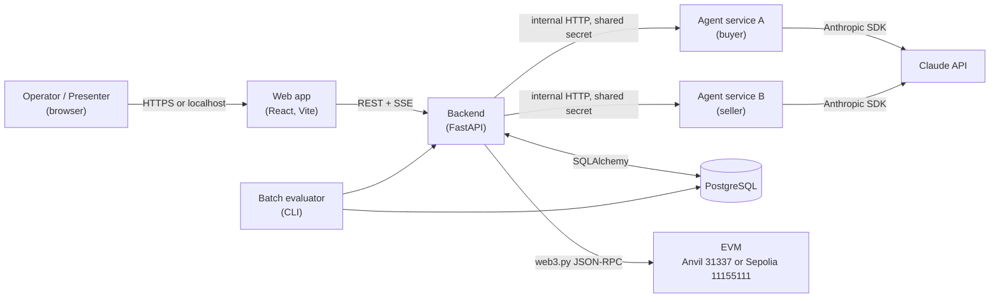
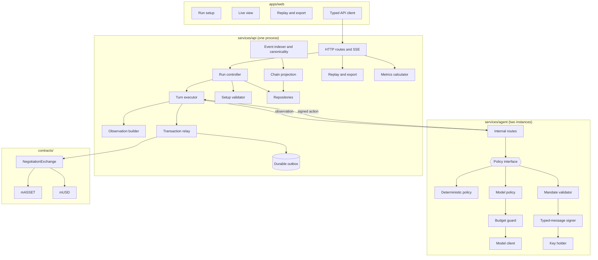
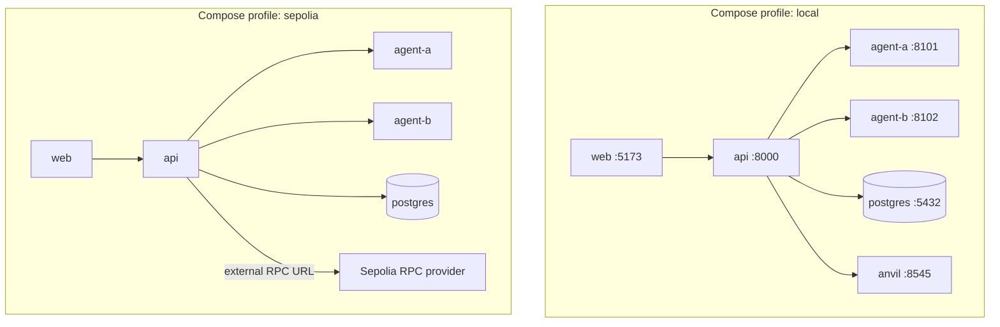
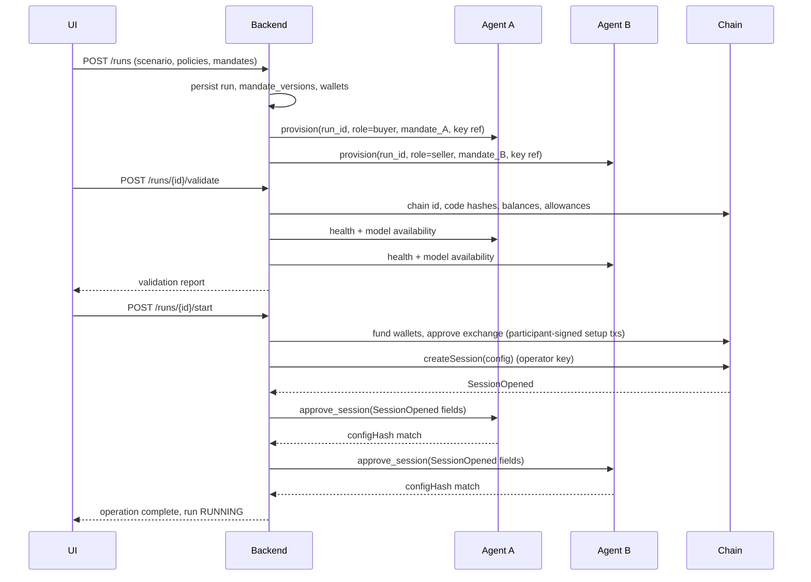
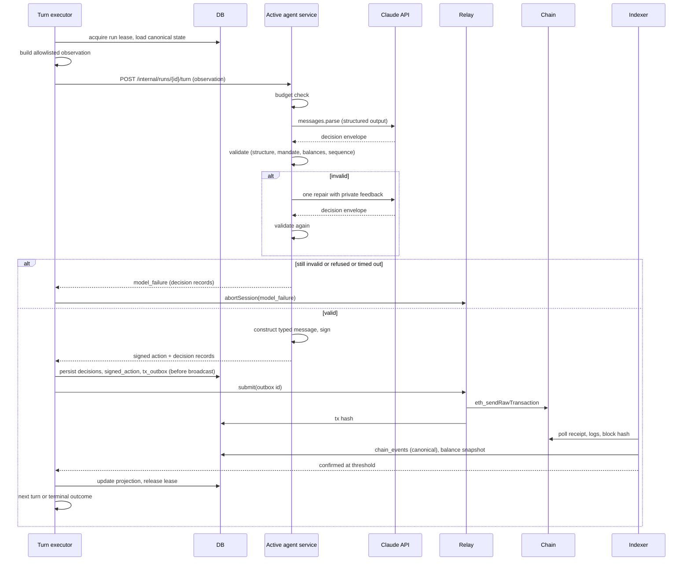
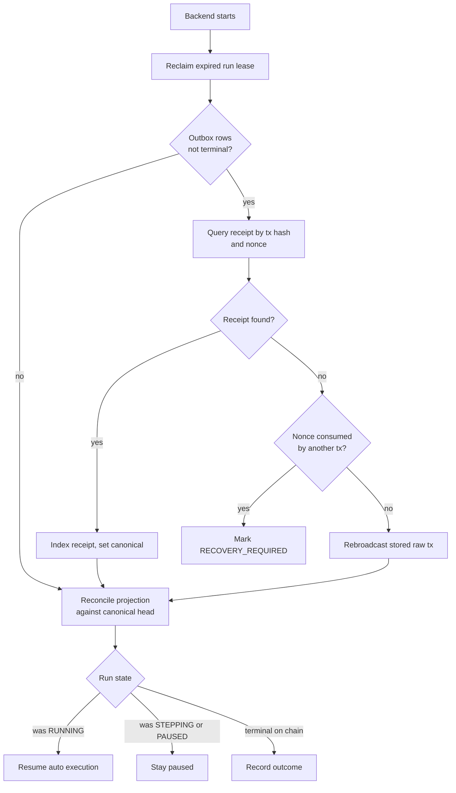
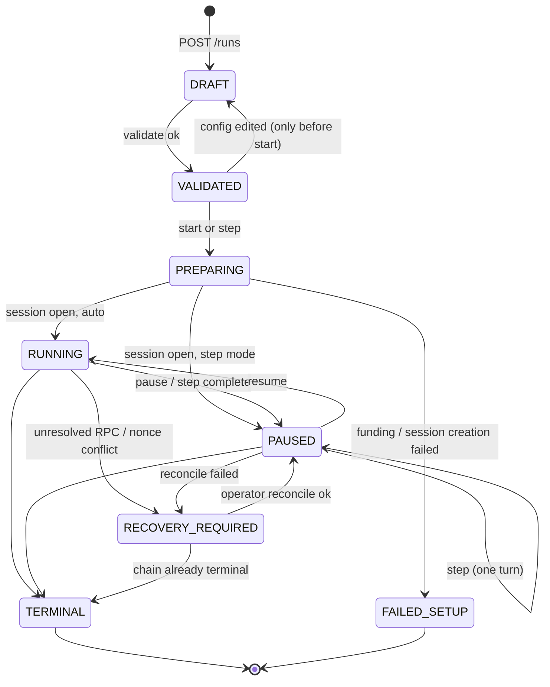
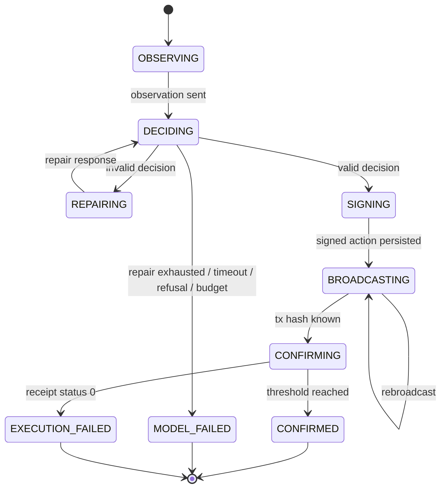

# Architecture

| | |
|---|---|
| **Version** | 0.1.0 |
| **Date** | 22 September 2026 |
| **Status** | Draft for build |
| **Source** | Spec sections 4, 5, 8, 9, 10 |
| **Related** | [prd.md](prd.md), [protocol.md](protocol.md), [api_contract.md](api_contract.md), [data_model.md](data_model.md), [security_and_trust_boundaries.md](security_and_trust_boundaries.md), [decision_log.md](decision_log.md) |

---

## 1. Architectural goals

Ordered by priority. When two conflict, the earlier wins.

1. **Authority is enforced by code the model cannot reach.** The policy signer and the contract decide what is legal. The model only chooses among legal moves.
2. **Every economic fact has a canonical source.** Balances and outcomes come from the chain. The database is a projection that can be rebuilt.
3. **Isolation is structural, not procedural.** The two agents are separate processes with separate credentials and an allowlisted observation schema. Leakage is a type error, not a prompt bug.
4. **Failure kinds stay distinguishable.** Walk-away, expiry, model failure, execution failure, operator abort, and recovery-required are separate states with separate evidence.
5. **Small enough to finish.** One backend process with clear modules. No broker, no workflow engine, no agent framework.

## 2. System context

The browser never talks to an agent service, the chain, or the model provider. Agent services never talk to the chain or the database; they receive an observation and return a signed action.

## 3. Component view

### 3.1 Web app (`apps/web/`)

React, TypeScript, Vite. Responsibilities: run setup form with two isolated mandate editors, live timeline driven by SSE, settlement panel, observer reveal control, metric strip, replay mode, export download. Holds no secrets and no signing capability. Renders structured actions as sentences. Every screen labels test assets, simulated economics, live versus replay, and operator abort power.

Types are generated from `packages/protocol/` schemas and the FastAPI OpenAPI document so field names match the backend.

### 3.2 Backend (`services/api/`)

One FastAPI process with modules that could later be split. Module boundaries are enforced by import rules (see [contributing.md](contributing.md)).

| Module | Single responsibility | Depends on |
|---|---|---|
| `routes/` | HTTP and SSE surface; request validation; idempotency; operation IDs | controller, repositories |
| `controller/` | Run lifecycle state machine; lease; pause and resume; abort; clone | turn executor, relay, validator, repositories |
| `turns/` | Execute one turn per spec 9.2 | observation builder, agent client, relay, indexer |
| `observation/` | Build the allowlisted observation from projection and run config | repositories, protocol schemas |
| `agent_client/` | Authenticated HTTP client to an agent service instance | protocol schemas |
| `relay/` | Nonce management, gas, signing raw transactions with the relay key, outbox write-then-broadcast, rebroadcast | web3 adapter, repositories |
| `indexer/` | Receipt polling, log decoding, block-hash tracking, canonical flag, reorg detection and rebuild | web3 adapter, repositories |
| `projection/` | Derive session view, timeline, balances from canonical events | repositories |
| `validation/` | Validate setup: manifest, bytecode, chain ID, funds, allowances, signer, RPC, model availability | web3 adapter, agent client |
| `evidence/` | Replay and export | repositories |
| `metrics/` | Per-run and per-batch metrics | repositories |
| `chain/` | web3.py adapter, ABI loading, typed event decoding | packages/protocol |
| `db/` | SQLAlchemy models, repositories, Alembic migrations | |
| `config/` | Pydantic settings; secrets loaded from environment; price table | |

The relay holds its own gas-paying key and can never produce a participant signature. The indexer never writes economic outcomes from anything other than canonical events.

### 3.3 Agent service (`services/agent/`)

One codebase, two runtime instances (A and B) configured with role, mandate access, signing key, and model credentials. Each instance knows only its own run-scoped mandate. The service exposes a small internal API ([api_contract.md](api_contract.md) section 6).

| Module | Single responsibility |
|---|---|
| `routes/` | Internal endpoints: provision, approve session, execute turn, health |
| `policy/` | `Policy` protocol with `decide(observation) -> RawDecision`; `DeterministicPolicy`; `ModelPolicy` |
| `model/` | Anthropic SDK client wrapper, prompt template versioning, structured output parsing, usage capture |
| `budget/` | Pre-call check against call ceiling and spend ceiling using conservative token bound and price table |
| `validation/` | `MandateValidator`: structural then economic validation, producing private feedback |
| `signing/` | Construct EIP-712 message from validated state and sign with the party key |
| `keys/` | Load key from environment or keystore; expose sign only |
| `state/` | Run-scoped in-memory record of approved config and prior own decisions, backed by the controller's provisioning call |

The service has no database connection and no RPC connection. Its only outbound network dependency is the model provider, and only for `ModelPolicy`. The mandate reaches it once at provisioning, as a `keystore:` or `env:` key ref plus mandate values; it never reaches the other instance.

### 3.4 Contracts (`contracts/`)

Foundry project: `MockERC20` (two deployments), `NegotiationExchange`. OpenZeppelin `ERC20`, `EIP712`, `ECDSA`, `SafeERC20`, `ReentrancyGuard`. Deployment script writes the deployment manifest. See [protocol.md](protocol.md).

### 3.5 Protocol package (`packages/protocol/`)

JSON schemas (observation, agent decision, mandate, scenario, export), ABI artifacts, EIP-712 fixtures with known digests, reason-code tables, and the reconstruction tool. Python and TypeScript packages are generated or checked from these so field names align across languages.

### 3.6 Batch evaluator

A CLI in `services/api/` (`python -m api.eval`) that generates scenario populations, drives runs sequentially through the same controller as the UI, and writes metrics. It runs only against the local profile.

## 4. Deployment topology

All services bind to localhost by default. Agent services are reachable only from the api container network. Compose files live in `infra/` with `.env.example` templates. The Sepolia profile replaces Anvil with an operator-supplied RPC URL and requires the deployment manifest for chain 11155111.

## 5. Key flows

### 5.1 Create and prepare a run

Mandates are sent to an agent service once, at provisioning. The backend never includes them in any later message.

### 5.2 One turn (spec 9.2)

Only one action is pending per session. If the RPC response is missing after broadcast, the relay queries by nonce and hash and rebroadcasts the stored raw transaction. It never asks for a new decision.

### 5.3 Settlement

The accepting side's agent service signs `Accept` referencing the active digest. The relay submits `acceptAndSettle`. Both transfers occur inside the contract call. The indexer verifies `AcceptanceRecorded`, `SettlementCompleted`, and two ERC-20 `Transfer` logs in the same receipt and only then marks the run economic outcome `settled`. Balance snapshots are taken at the settlement block.

### 5.4 Recovery after restart

Acceptance A13 covers crash after broadcast and before receipt persistence.

### 5.5 Reorganization

The indexer stores block hash and number per event. On each poll it checks that stored block hashes for recent events still match the canonical chain. On mismatch it marks affected events non-canonical, invalidates projections and balance snapshots derived from them, sets the run to `PAUSED` with cause `reorg`, rebuilds from the last common block, reconciles pending outbox rows, and only then permits resume. Acceptance A14 simulates this on Anvil with snapshot and revert.

### 5.6 Replay and export

Replay reads `decisions`, `signed_actions`, `chain_events` (canonical only), and `balance_snapshots` and renders the same timeline through the same UI components with a `replay` flag. Export produces the JSON document defined in [api_contract.md](api_contract.md) section 5, public by default, with private inputs on explicit inclusion. Both paths make zero model calls and zero transactions.

## 6. State machines

### 6.1 Run operational state

`TERMINAL` is reached only when the chain session is Settled, Closed, Expired, or Aborted and the terminal event is canonical at the confirmation threshold. The **economic outcome** is a separate field derived from the terminal event type and reason code; see [data_model.md](data_model.md).

### 6.2 Turn state

### 6.3 Transaction status (spec 9.3)

`SUBMITTED` (broadcast accepted) → `INCLUDED` (receipt in a block) → `CONFIRMED` (threshold depth, canonical) → `FINALIZED` (block at or below RPC finalized head). `REVERTED` and `REPLACED` are terminal side states. Two confirmations are never labelled finality.

## 7. Model integration

The model client lives only in the agent service and is wrapped behind `ModelClient` with one method, `decide(system_prompt, observation, schema) -> ModelResult`, so the policy is testable with a fake.

| Concern | Choice |
|---|---|
| Provider and SDK | Anthropic Claude API via the official `anthropic` Python SDK ([ADR-014](decision_log.md)). A cross-vendor pairing is a named follow-on, not v0.1 ([ADR-027](decision_log.md)). |
| Default model | `claude-opus-5`, configurable per run and recorded in `runs.model_id`. |
| Output shape | Structured outputs (`client.messages.parse` with a Pydantic model for the decision envelope). No tool use, no prefill. |
| Thinking | Adaptive thinking on; `output_config.effort` recorded per run in place of sampling settings, which current models do not accept. Seed is recorded as unsupported. |
| Timeout | 45 s request timeout, SDK retries set to 0 so a retry never doubles cost silently; the service applies the single repair explicitly. |
| Refusal | `stop_reason == "refusal"` is treated like an invalid response: one repair, then `model_failure`. Server-side model fallbacks are disabled so the recorded model ID is the model that decided, which spec 11.3 requires for reproducibility ([ADR-015](decision_log.md)). |
| Budget | Before each call: `count_tokens` on the exact request plus `max_tokens` as the output bound, multiplied by the operator-maintained price table. Refuse the call if the ceiling would be crossed; record `estimated_cost_usd` and `reported_cost_usd` separately; unknown price shows as unknown. |
| Caching | The system prompt (role rules, protocol rules, output schema) is static per run and marked with a cache breakpoint; the observation follows it. |
| Prompt template | Versioned files under `services/agent/prompts/`, changed through review like any other source; version hash recorded per decision ([ADR-029](decision_log.md)). |
| Prompt precedence | Order is fixed: role, protocol rules, output schema, then the mandate's `instructions` in a delimited section introduced as the agent's own private guidance. The prompt states that nothing in that section changes the rules above it or the shape of the output. Precedence is not enforced by the model: the policy signer rejects any action outside the legal and in-mandate set, and the strict decision schema turns an attempt to emit a fourth shape into one repair and then `model_failure`. |
| Isolation | The request contains only the system prompt and the observation JSON. An outbound-context assertion (A12) scans every request body for the opponent's mandate fields, addresses' private keys, and credential patterns before sending. |

## 8. Cross-cutting concerns

**Configuration.** Pydantic settings from environment. Secrets: relay key, operator key, participant keys or keystore paths, model API key, agent-service shared secret, database URL. `.env.example` in `infra/` lists every variable with a comment.

`SEPOLIA_RPC_URL` points at an Alchemy application created for this project alone, not shared with the operator's other projects, so that rate-limit headroom and usage attribution belong to this project. The indexer polls every 4 s, which at one active run is well inside a free-tier compute-unit budget; the poll interval is configuration, and the runbook records what to change if the provider throttles.

**Idempotency and concurrency.** One run active at a time enforced by a database advisory lock plus a `run_leases` row with expiry. Mutation routes take `Idempotency-Key` and store the response in `operations`. Relay nonces are serialized by the same lease.

**Logging.** Structured JSON logs. Every line carries `run_id`, `turn_id`, and `component`. A redaction filter removes anything matching private-key, API-key, or mandate field patterns. Model request and response bodies are logged only to `decisions`, never to stdout.

**Errors.** Domain exceptions map to typed API errors ([api_contract.md](api_contract.md) section 7). Contract custom errors are decoded by the indexer into stable codes.

**Time.** Chain time is authoritative for expiry. Wall-clock is used only for latency metrics and lease expiry.

**Amounts.** `int` in Python, `bigint` in TypeScript, `uint256` on-chain, `NUMERIC(78,0)` in PostgreSQL, base-10 strings in JSON. Display conversion happens in one web utility.

## 9. Applying the engineering principles

- **Single responsibility:** relay, indexer, projection, controller, and observation builder are separate modules with separate reasons to change.
- **Dependency inversion:** `Policy`, `ModelClient`, `ChainAdapter`, `KeyHolder`, and repository interfaces are protocols; concrete implementations are injected. Tests use fakes, not mocks of HTTP.
- **Open/closed:** adding a policy kind or a scenario type adds a class and a registry entry, not a switch.
- **Low coupling:** agent services depend only on `packages/protocol`. The web app depends only on the OpenAPI document and protocol schemas.
- **Value objects:** `MinorAmount`, `SessionId`, `Digest`, `Address`, `Sequence` wrap primitives to prevent unit and type confusion.
- **Complexity:** turn execution is a sequence of small step functions; the orchestrator stays under cyclomatic complexity 10.

## 10. Technology choices and versions

| Area | Choice | Notes |
|---|---|---|
| Python | 3.12, `uv` for env and lockfile, `ruff`, `mypy --strict`, `pytest` | Recorded in `CLAUDE.md` |
| Backend | FastAPI, Pydantic v2, SQLAlchemy 2, Alembic, web3.py, eth-account | |
| Agent | Same Python toolchain, `anthropic` SDK | |
| Web | Node LTS, `pnpm`, React, TypeScript, Vite, Vitest, Playwright | Recorded in `CLAUDE.md` |
| Contracts | Foundry (forge, anvil, cast), Solidity 0.8.x, OpenZeppelin Contracts 5.x | |
| Database | PostgreSQL 16 | |
| Local infra | Docker Compose | |

Exact versions were chosen at the start of stage 0, are pinned in `uv.lock`, `pnpm-lock.yaml`, `contracts/foundry.toml` and the Compose image tags, and are recorded in [ADR-033](decision_log.md).

## 11. Architectural risks

| Risk | Mitigation |
|---|---|
| Single backend process becomes a tangle | Import-boundary lint rule per module; each module has its own tests and no cross-module private imports |
| Agent service state loss on restart | Provisioning is idempotent; the controller re-provisions from `mandate_versions` when a service reports an unknown run |
| Clock skew between backend and chain | Always read `latest` block timestamp before computing `validUntil`; never use wall-clock for protocol time |
| SSE clients miss events | Every event carries a monotonic cursor; reconnect with `Last-Event-ID` replays from `run_events` |
| Model cost drift | Price table is operator-maintained config with a `last_verified` date shown in the UI |
