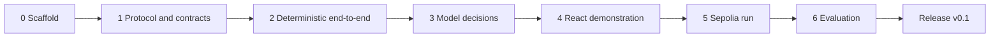

# Build Plan

| | |
|---|---|
| **Version** | 0.1.0 |
| **Date** | 22 September 2026 |
| **Source** | Spec section 13 |
| **Related** | [prd.md](prd.md), [test_strategy.md](test_strategy.md), [architecture.md](architecture.md), [contributing.md](contributing.md) |

Stages follow the spec's build sequence with an added stage 0 for repository scaffolding. Each stage has an exit condition that is a demonstrable artifact, not a task list being finished. Stages are sequential because each depends on the previous one's contracts being stable.

**Status convention.** A stage carries a `Status` line from the moment work on it starts, and each deliverable is marked `done`, `in progress` or left unmarked for not started. A stage with no `Status` line has not been started. The marks move in the same change set as the code, so a deliverable marked done is one whose gate is green, not one whose file exists.

---

## Stage 0: Scaffold

**Status: complete, 22 September 2026.**

**Deliverables**
- Git repository initialized (done, 21 September 2026); directory layout per spec 10.2 with a `src/` layout inside the three Python packages ([ADR-034](decision_log.md)); `.gitignore`, `.gitattributes`, `.editorconfig`, `infra/.env.example`.
- `LICENSE` (Apache-2.0) and `NOTICE` at the repository root (done, 21 September 2026); `SPDX-License-Identifier: Apache-2.0` as the first line of every `.sol` file from stage 1, enforced from now by `infra/scripts/check_spdx.py` in the pre-commit hook and the CI secret-scan job ([ADR-032](decision_log.md)).
- `infra/secrets/` git-ignored. Keystore handling is split, and only the first half is stage 0 work:
  - **Generation — complete.** `infra/scripts/generate_keys.py` produces `env:` refs for the local profile and encrypted web3 keystores for Sepolia ([ADR-023](decision_log.md)).
  - **Runtime loading through `KeyHolder` — intentionally deferred to stage 2**, under the same ADR, which already places the first exercise of the `keystore:` path in the stage 2 tests. `KeyHolder` lives in `services/agent/src/agent/keys/` and is built with the agent service it serves, not ahead of it. When it lands it holds the existing boundary: a signing key stays server-side inside the agent process and never reaches a model prompt, the browser bundle, an evidence export, an ordinary log line, or the other agent instance. Stage 0 has not delivered "generation and loading"; it has delivered generation.
- Toolchains pinned ([ADR-033](decision_log.md)): `uv` workspace for `services/api`, `services/agent`, `packages/protocol` (Python 3.12, one `uv.lock`); `pnpm` workspace for `apps/web` and the TypeScript side of `packages/protocol`; Foundry v1.8.3 for `contracts/`, Solidity 0.8.28.
- Docker Compose local profile with PostgreSQL 16.15 and Anvil on chain 31337; health checks on both; a second database for the integration suite. The stack is namespaced away from the operator's other projects: Compose project `agent_negotiation`, volume `agent_negotiation_postgres_data`, database and role `agent_negotiation`, and a published host port defaulting to 55432 rather than 5432. The container port stays 5432 and services inside the network use `postgres:5432`, so `POSTGRES_PORT` is a host-side default that no application code reads.
- CI pipeline skeleton (`.github/workflows/ci.yml`) with one job per gate in [test_strategy.md](test_strategy.md) section 10. Gates with nothing to check yet carry `if: false` and report as skipped, never as passed, each naming the stage that turns it on.
- Pre-commit hooks: format, lint, type check, secret scan, SPDX header.
- The import contract from [contributing.md](contributing.md) section 1.1 written out in `.importlinter`, active from stage 2.
- `docs/runbook.md` started, at the product owner's direction, with local startup, database isolation and the ports, and key generation. Q12 had placed it at stage 2; it still grows in every stage and is completed in stage 5.
- `CLAUDE.md` and `docs/README.md` index.

**Exit condition (met):** `docker compose --profile local up` starts PostgreSQL and Anvil, both reporting healthy; all stage 0 verification and repository gates pass with zero failures; each toolchain's test command runs green.

The earlier wording asked for "zero tests, zero failures", which read as though an empty suite were the goal. It was not: what stage 0 owed was a working gate in each toolchain, and a gate is only working if something has shown it failing. The bootstrap suite is **15 Python tests** over `secret_scan.py` and `check_spdx.py`, the two scripts stage 0 turns into merge gates. Writing them paid for itself before the first commit — they are what caught the scanner flagging its own fixtures and the mypy hook being invoked with no target. The TypeScript and Foundry suites are genuinely empty and pass, which is the correct state for them until stages 1 and 4.

## Stage 1: Protocol and contracts

**Status: complete, 24 September 2026.** Every deliverable below is done and its gate is green:
115 Foundry tests, 274 Python tests, 31 Vitest tests, `NegotiationExchange` at 100 percent of lines,
statements, branches and functions, and `make ci` — which now runs the gas-snapshot and coverage
gates as well as lint and test — green end to end. One question went to the product owner and was
answered: [Q17](open_questions.md), the same-token deployment guard
([ADR-037](decision_log.md)).

An adversarial review followed, on 24 September 2026, and its results are in the section below. The
first version of this status line claimed `make ci` was green end to end while `make ci` did not run
two of the gates this stage had just enabled — one of which was failing. That is recorded rather
than quietly corrected, because it is the mistake the status convention at the top of this document
exists to prevent: a deliverable is done when its gate is green, and a gate nobody runs is not
green, it is unobserved.

**Deliverables**

Contracts:
- **done** — `contracts/src/interfaces/INegotiationExchange.sol`: structs, the seven events and the twenty-**three** custom errors of [protocol.md](protocol.md) sections 3, 7, 8.3 and 9. Twenty-three rather than twenty-two: `InvalidTokenPair` was added under [ADR-037](decision_log.md).
- **done** — `contracts/src/MockERC20.sol`: 6 decimals, operator-only minting.
- **done** — `contracts/src/NegotiationExchange.sol`: the full state machine and verification order of [protocol.md](protocol.md) section 8, plus the Q17 constructor guard.
- **done** — Unit tests, 105 across twelve files, covering A05 to A11 plus the cross-language fixture replay. Dependencies pinned as submodules and recorded in a committed `contracts/foundry.lock`: forge-std v1.16.2, OpenZeppelin v5.7.0 ([ADR-033](decision_log.md)).
- **done** — Coverage on `NegotiationExchange`: 100 percent of lines, statements, branches and functions, meeting the gate in [test_strategy.md](test_strategy.md) section 10. The contract half of that gate is now enforced in CI rather than recorded here, at the product owner's direction.
- **done** — Adversarial review of the contracts and tests, 22 September 2026. It found no defect in the contract and four in the suite, all since closed, plus the Q17 question. The serious one: deleting the signature check from `acceptAndSettle`, the only function that moves tokens, left all 80 tests green, because every A07 and A08 case targeted `recordOffer` alone. Each fix is now confirmed by mutation. The lesson is recorded in [contributing.md](contributing.md) section 3: a passing suite is evidence only against the mutations it has been shown.
- **done** — Fuzz and invariant tests under `contracts/test/invariant/` per [test_strategy.md](test_strategy.md) section 4.2. All seven invariants, a ten-selector handler, nine stateless fuzz properties, **and eight mutations to `NegotiationExchange` each confirmed to fail the invariant suite on its own**. Three of those eight survived the first version of the suite; what closed them is written up in test_strategy 4.2, because the failures were in the handler's design rather than in the invariants. Two further mutations, found by the review, are caught by the unit suite instead, and test_strategy 4.2 now states plainly what the invariant suite cannot distinguish.
- **done** — Deployment script `contracts/script/Deploy.s.sol` writing the manifest ([ADR-038](decision_log.md)), and a committed `contracts/.gas-snapshot` over the deterministic unit tests.

Protocol package:
- **done** — `packages/protocol/schemas/`: observation, agent decision, mandate, scenario and export JSON schemas, plus `deployment_manifest.v1.json`, which the export embeds and the deploy script writes. `additionalProperties: false` at every level, with negative instances for each privacy failure the schema exists to catch.
- **done** — Reason-code tables in Python and TypeScript, both checked against `fixtures/reason_codes.v1.json` so a code added in one language alone fails the build.
- **done** — EIP-712 fixtures with known digests and signatures, generated by `tools/generate_eip712_fixtures.py` and checked by **four** independent implementations (the generator's own, `eth_account`'s, `viem`'s and OpenZeppelin's). The Foundry side replays the fixture's Offer and Accept with the fixture's own signatures and asserts the settlement, so the fixture is executable rather than merely consistent.
- **done** — Python, TypeScript and Foundry fixture tests confirming digests match. Committed ABI artefacts in `abi/`, with a regenerate-and-diff check.
- **done** — Reconstruction tool (`packages/protocol/tools/reconstruct.py`) reading only chain data and a manifest. Nineteen individually reported checks, including the negative ones: nothing besides the two legs moved, no log came from an address the manifest does not name, no signature recovers to the relay key, and a session that did not settle moved nothing at all.

Also delivered, because the schemas needed instances to be worth anything:
- `scenarios/default-overlap.json` and `scenarios/infeasible-clone.json`, the system spec's section 2.3 defaults and the 105 mUSD clone A03 needs, validated against the scenario schema in the suite. The schema and its gate would otherwise have been a gate that has never been shown working — the same mistake stage 0 corrected for itself.

CI:
- **done** — `test-contracts` and `lint-contracts` were already enabled in stage 0; this stage enabled `gas-snapshot` (with the 10 percent tolerance the test strategy names, over unit tests only) and added two jobs: `coverage-contracts`, asserting all four coverage figures at 100 percent, and `protocol-artefacts`, regenerating the committed ABIs and EIP-712 fixture and failing on any diff. `test-python` now installs Foundry, because the A15 reconstruction tests start their own Anvil.

**Exit condition (met):** Acceptance A05 through A11 pass in Foundry; fixture tests pass in all three languages; a deployment to Anvil produces a manifest that the reconstruction tool can read — exercised as an integration test that spawns Anvil, runs the real deploy script, drives a real negotiation and reconstructs it, for a settlement, a walk-away and an operator abort.

### The adversarial review, 24 September 2026

Five independent lenses over the whole change — protocol conformance, the privacy boundary, test
integrity, tooling correctness, and docs-code lockstep — each finding then handed to a separate
verifier told to refute it. Two findings were refuted and stayed refuted. **Twenty-two were
confirmed and all are fixed**, plus one the review missed that came out of verifying another. The
ones worth remembering:

- **A gate that had never been run the way CI runs it was broken two ways.** The committed gas
  snapshot predated `Fixtures.t.sol`, and `forge snapshot --check … --root contracts` resolves the
  snapshot path against the working directory rather than `--root`, so the job read a non-existent
  file at the repository root. `make ci` now runs every gate that exists.
- **The reconstruction tool checked the settlement against the event's own claim.** It compared the
  `Transfer` logs with `SettlementCompleted.quoteAmount` rather than with the amount the accepted
  offer was *signed* for, so a settlement moving an amount nobody authorised would have printed
  RECONSTRUCTED. This was the most consequential finding in the set: it defeated the tool's purpose
  while every test passed.
- **`Reconstruction.ok` was `all([])` over an empty list**, so a tool that recorded nothing reported
  success; and the integration tests asserted only that no check had *failed*, never that any had
  *run*. Seventeen of twenty checks could have been deleted silently.
- **The observation schema carried a field section 12 does not list.** No value-level test could
  find it, because nothing compared the schema's field names with the document. That comparison now
  exists, transcribed by hand from the document.
- **Both scenario descriptions stated each party's reservation price and the feasible interval** — in
  a field `GET /v1/scenarios` returns with no reveal header, beside a `feasibility_hint` the API
  contract promises is always null. The schema could not catch it; the leak was in the value of an
  allowed field.
- **The review damaged the working tree.** One lens deleted the `SessionDeadlinePassed` check from
  `_verifyCommon` to see whether the suite would catch it, and did not restore it; three A09 tests
  were failing while the later lenses ran. The tripwire the lenses were given —
  `git status --porcelain | md5sum` — lists *which* files changed and not their contents, so an edit
  to an already-modified file left the hash identical. A review that can silently modify what it
  reviews needs a content-level baseline, and the lens that noticed said so in its own coverage
  report rather than overwriting someone else's change.

**Five things learned here that the next session needs.**

1. `vm.expectRevert` must immediately precede the call under test: an external call in the argument list, including the `signOffer` and `hashOffer` helpers, consumes the expectation and the test fails as "next call did not revert". `vm.prank` is consumed the same way, so a `balanceOf` inside a pranked call's arguments silently redirects the call to the test contract.
2. Three Foundry lints are suppressed in `contracts/foundry.toml`, each with its reason written there: `block-timestamp`, because [protocol.md](protocol.md) section 6 makes chain time authoritative; `arbitrary-send-erc20`, because the `from` address is the participant by design; and `reentrancy-events`, which is contract-scoped and fires on two functions that make no external call at all. `forge lint` is otherwise clean, and `block.timestamp` read across a `vm.warp` is written as `vm.getBlockTimestamp()` to keep it that way.
3. **`vm.serializeJson(objectKey, value)` sets an object's whole contents rather than adding to them.** Composing the deployment manifest with it silently produced a one-key file that still validated as JSON. Nested objects and explicit nulls are written by key instead, with `vm.writeJson(value, path, ".key")`. The integration test that deploys for real is what caught it, which is the argument for testing the deploy script against a chain rather than a fake.
4. **An invariant suite can be green and unfalsifiable.** Three of eight mutations survived the first version, and in every case the fault was the handler's: a coin-flip actor choice meant runs never got deep enough to settle, following the chain for the ghost terminal status let the invariant compare the chain against itself, and a uniform `maxOffers = 8` put the offer limit out of reach. Mutation testing is how you find that out; coverage was already at 100 percent.
5. **web3 decodes a struct argument as a dict keyed by the Solidity field names, and `process_receipt` decodes logs by event signature regardless of emitting address.** The second one matters here because the two mock tokens are two deployments of the same contract, so every settlement appeared to have four transfers until the logs were filtered by address. Both were caught by checks in the reconstruction tool asserting something specific rather than something plausible.
6. **`bash -e` is not `bash -o pipefail`.** A GitHub Actions `run:` step gets the first and not the second, so `forge coverage | tee log` handed the step `tee`'s exit status. The same trap wastes time at the terminal: `cmd | tail -2; echo $?` reports `tail`'s status, which made two drift checks look like passes during this very review until they were re-run without the pipe.

## Stage 2: Deterministic end-to-end run

**Deliverables**
- Backend: database models and migrations, run controller state machine, turn executor, observation builder, relay with outbox, indexer with canonicality, projection, setup validator, operator API (all routes except export and metrics may be stubbed), SSE.
- Agent service: internal API, `DeterministicPolicy`, `MandateValidator`, signer, key holder, HMAC auth.
- Compose profile runs api, agent-a, agent-b.
- Integration test harness with Anvil and PostgreSQL.
- `docs/runbook.md` continues (started in stage 0): recovering pending transactions, and the `KeyHolder` loading procedure deferred from stage 0 under [ADR-023](decision_log.md). It grows in every subsequent stage and is completed in stage 5.

**Exit condition:** A02 (deterministic settlement) and A03 (infeasible no-deal) complete end to end via the API with evidence rows in every table; A06, A13, A14 integration tests pass; the export route produces a document that validates against the schema and the reconstruction tool agrees with it (A15).

## Stage 3: Model decisions

**Deliverables**
- `ModelPolicy`, `ModelClient` wrapper over the Anthropic SDK with structured outputs, prompt templates with versioning, `BudgetGuard`, price table config, repair loop, refusal and timeout handling.
- Outbound-context assertion and the isolation test suite.
- Decision records with usage and cost.

**Exit condition:** A04 and A12 pass; with live credentials, at least one genuine model-versus-model settlement and one genuine model-versus-model no-deal (on the infeasible clone) complete on Anvil, with exports saved under `docs/evidence/` and passing the invariant checker. No hardcoded agreement anywhere; grep test in place.

## Stage 4: React demonstration

**Deliverables**
- Setup screen with two isolated mandate editors, validation report, controls (Validate, Start, Step, Pause, Resume, Abort, Clone).
- Live view: agent panels, timeline with explorer links, settlement panel with before/after balances, observer reveal control, metric strip, disclosures.
- Replay mode and export download.
- Typed client generated from OpenAPI and protocol schemas.
- Playwright E2E.

**Exit condition:** A16 passes; a presenter can run the Stage 3 evidence as a replay and explain the agreement, authority chain, and balances from the screen alone. E2E passes on main.

## Stage 5: Sepolia run

**Deliverables**
- Sepolia deployment with manifest committed under `docs/deployments/`.
- Compose Sepolia profile; funding script for fresh test wallets. Keystore handling already exists from stage 0; this stage only supplies the Sepolia keystores and password.
- `SEPOLIA_RPC_URL` from an Alchemy application created for this project alone, so rate limits and usage are attributable to it; indexer poll interval 4 s, with the throttling response recorded in the runbook.
- Runbook completed: funding a testnet demonstration, recovery, replay, export.
- Confirmation threshold 2 and finalized-head tracking verified against a real RPC.
- Sepolia ENS names registered and pinned into the deployment manifest, display-only ([ADR-030](decision_log.md)). If registration is not ready, the deployment ships without names and they are added afterwards; stage 5 does not wait on them.

**Exit condition:** A17 passes; selected live scenarios (one settlement, one no-deal, one operator abort) execute on Sepolia, replay in the UI, and their exports are saved. Explorer links resolve to the manifest addresses.

## Stage 6: Evaluation

**Deliverables**
- Batch evaluator CLI: population generation from seed, four pairings, repetitions, sequential execution, per-run exports, invariant checker, report with distributions and bootstrap intervals.
- Metrics per spec 11.2 in the API and the report.
- Results document `docs/results-v0.1.md` reporting failures, costs, utility, and protocol limits honestly.

**Exit condition:** A01 evidence over the full population passes the invariant checker; the report separates simulated mUSD utility from real USD cost; infeasible-scenario trade rate is zero; mandate violations are zero; every run, including failures, is preserved.

## Release v0.1

Checklist from [prd.md](prd.md) section 9. Tag `v0.1.0`. Freeze protocol version 1.

---

## Working agreements for the build

- **One stage's contracts freeze before the next begins.** Changing a Stage 1 type string during Stage 3 is a decision-log entry and a protocol version bump.
- **Tests before implementation** for the contract, validator, signer, deterministic policy, and state machine. See the testing mindset in [engineering-principles.md](engineering-principles.md).
- **Small commits, green CI.** No merge with a red gate. Fixture-labelled runs only in CI.
- **No scripted agreement, ever.** If a live model does not settle, that is a result for Stage 6, not a bug to paper over.
- **Runbook grows with the code.** Every recovery procedure that a test exercises gets a runbook section in the same PR.

## Estimated effort

Rough, single developer with AI assistance, for planning only:

| Stage | Estimate |
|---|---|
| 0 | 1 to 2 days |
| 1 | 4 to 6 days |
| 2 | 8 to 12 days |
| 3 | 4 to 6 days |
| 4 | 6 to 9 days |
| 5 | 2 to 4 days plus testnet wait time |
| 6 | 3 to 5 days plus batch run time |

Stage 2 is the risk concentration: outbox, indexer, reorg, and recovery are where most subtle bugs live. Budget review time there.
