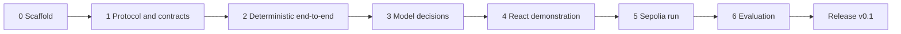
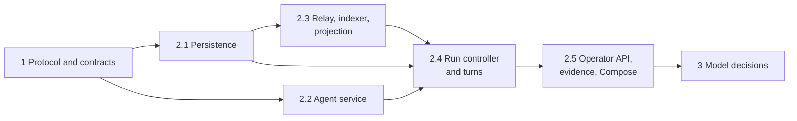

# Build Plan

| | |
|---|---|
| **Version** | 0.1.0 |
| **Date** | 22 September 2026 |
| **Source** | Spec section 13 |
| **Related** | [prd.md](prd.md), [test_strategy.md](test_strategy.md), [architecture.md](architecture.md), [contributing.md](contributing.md) |

Stages follow the spec's build sequence with an added stage 0 for repository scaffolding. Each stage has an exit condition that is a demonstrable artifact, not a task list being finished. Stages are sequential because each depends on the previous one's contracts being stable.

**Status convention.** A stage carries a `Status` line from the moment work on it starts, and each deliverable is marked `done`, `in progress` or left unmarked for not started. A stage with no `Status` line has not been started. The marks move in the same change set as the code, so a deliverable marked done is one whose gate is green, not one whose file exists.

```mermaid
flowchart LR
    S0[0 Scaffold] --> S1[1 Protocol and contracts]
    S1 --> S2[2 Deterministic end-to-end]
    S2 --> S3[3 Model decisions]
    S3 --> S4[4 React demonstration]
    S4 --> S5[5 Sepolia run]
    S5 --> S6[6 Evaluation]
    S6 --> R[Release v0.1]
```

---

## Stage 0: Scaffold

**Status: complete, 22 September 2026.**

**Deliverables**
- Git repository initialized (done, 21 September 2026); directory layout per spec 10.2 with a `src/` layout inside the three Python packages ([ADR-034](decision_log.md)); `.gitignore`, `.gitattributes`, `.editorconfig`, `infra/.env.example`.
- `LICENSE` (Apache-2.0) and `NOTICE` at the repository root (done, 21 September 2026); `SPDX-License-Identifier: Apache-2.0` as the first line of every `.sol` file from stage 1, enforced from now by `infra/scripts/check_spdx.py` in the pre-commit hook and the CI secret-scan job ([ADR-032](decision_log.md)).
- `infra/secrets/` git-ignored. Keystore handling is split, and only the first half is stage 0 work:
  - **Generation — complete.** `infra/scripts/generate_keys.py` produces `env:` refs for the local profile and encrypted web3 keystores for Sepolia ([ADR-023](decision_log.md)).
  - **Runtime loading through `KeyHolder` — intentionally deferred to stage 2**, under the same ADR, which already places the first exercise of the `keystore:` path in the stage 2 tests. `KeyHolder` lives in `services/agent/src/agent/keys/` and is built with the agent service it serves, not ahead of it. When it lands it holds the existing boundary: a signing key stays server-side inside the agent process and never reaches a model prompt, the browser bundle, an evidence export, an ordinary log line, or the other agent instance. Stage 0 has not delivered "generation and loading"; it has delivered generation.
- Toolchains pinned ([ADR-033](decision_log.md)): `uv` workspace for `services/api`, `services/agent`, `packages/protocol` (Python 3.12, one `uv.lock`); `pnpm` workspace for `apps/web` and the TypeScript side of `packages/protocol`; Foundry v1.8.3 for `contracts/`, Solidity 0.8.28.
- Docker Compose local profile with PostgreSQL 16.15 and Anvil on chain 31337; health checks on both; a second database for the integration suite. The stack is namespaced away from the operator's other projects: Compose project `agent_negotiation`, volume `agent_negotiation_postgres_data`, database and role `agent_negotiation`, and a published host port defaulting to 55432 rather than 5432. The container port stays 5432 and services inside the network use `postgres:5432`, so `POSTGRES_PORT` is a host-side default that no application code reads.
- CI pipeline skeleton (`.github/workflows/ci.yml`) with one job per gate in [test_strategy.md](test_strategy.md) section 10. Gates with nothing to check yet carry `if: false` and report as skipped, never as passed, each naming the stage that turns it on.
- Pre-commit hooks: format, lint, type check, secret scan, SPDX header.
- The import contract from [contributing.md](contributing.md) section 1.1 written out in `.importlinter`, active from stage 2.
- `docs/runbook.md` started, at the product owner's direction, with local startup, database isolation and the ports, and key generation. Q12 had placed it at stage 2; it still grows in every stage and is completed in stage 5.
- `CLAUDE.md` and `docs/README.md` index.

**Exit condition (met):** `docker compose --profile local up` starts PostgreSQL and Anvil, both reporting healthy; all stage 0 verification and repository gates pass with zero failures; each toolchain's test command runs green.

The earlier wording asked for "zero tests, zero failures", which read as though an empty suite were the goal. It was not: what stage 0 owed was a working gate in each toolchain, and a gate is only working if something has shown it failing. The bootstrap suite is **15 Python tests** over `secret_scan.py` and `check_spdx.py`, the two scripts stage 0 turns into merge gates. Writing them paid for itself before the first commit — they are what caught the scanner flagging its own fixtures and the mypy hook being invoked with no target. The TypeScript and Foundry suites are genuinely empty and pass, which is the correct state for them until stages 1 and 4.

## Stage 1: Protocol and contracts

**Status: complete, 24 September 2026.** Every deliverable below is done and its gate is green:
115 Foundry tests, 274 Python tests, 31 Vitest tests, `NegotiationExchange` at 100 percent of lines,
statements, branches and functions, and `make ci` — which now runs the gas-snapshot and coverage
gates as well as lint and test — green end to end. One question went to the product owner and was
answered: [Q17](open_questions.md), the same-token deployment guard
([ADR-037](decision_log.md)).

An adversarial review followed, on 24 September 2026, and its results are in the section below. The
first version of this status line claimed `make ci` was green end to end while `make ci` did not run
two of the gates this stage had just enabled — one of which was failing. That is recorded rather
than quietly corrected, because it is the mistake the status convention at the top of this document
exists to prevent: a deliverable is done when its gate is green, and a gate nobody runs is not
green, it is unobserved.

**Deliverables**

Contracts:
- **done** — `contracts/src/interfaces/INegotiationExchange.sol`: structs, the seven events and the twenty-**three** custom errors of [protocol.md](protocol.md) sections 3, 7, 8.3 and 9. Twenty-three rather than twenty-two: `InvalidTokenPair` was added under [ADR-037](decision_log.md).
- **done** — `contracts/src/MockERC20.sol`: 6 decimals, operator-only minting.
- **done** — `contracts/src/NegotiationExchange.sol`: the full state machine and verification order of [protocol.md](protocol.md) section 8, plus the Q17 constructor guard.
- **done** — Unit tests, 105 across twelve files, covering A05 to A11 plus the cross-language fixture replay. Dependencies pinned as submodules and recorded in a committed `contracts/foundry.lock`: forge-std v1.16.2, OpenZeppelin v5.7.0 ([ADR-033](decision_log.md)).
- **done** — Coverage on `NegotiationExchange`: 100 percent of lines, statements, branches and functions, meeting the gate in [test_strategy.md](test_strategy.md) section 10. The contract half of that gate is now enforced in CI rather than recorded here, at the product owner's direction.
- **done** — Adversarial review of the contracts and tests, 22 September 2026. It found no defect in the contract and four in the suite, all since closed, plus the Q17 question. The serious one: deleting the signature check from `acceptAndSettle`, the only function that moves tokens, left all 80 tests green, because every A07 and A08 case targeted `recordOffer` alone. Each fix is now confirmed by mutation. The lesson is recorded in [contributing.md](contributing.md) section 3: a passing suite is evidence only against the mutations it has been shown.
- **done** — Fuzz and invariant tests under `contracts/test/invariant/` per [test_strategy.md](test_strategy.md) section 4.2. All seven invariants, a ten-selector handler, nine stateless fuzz properties, **and eight mutations to `NegotiationExchange` each confirmed to fail the invariant suite on its own**. Three of those eight survived the first version of the suite; what closed them is written up in test_strategy 4.2, because the failures were in the handler's design rather than in the invariants. Two further mutations, found by the review, are caught by the unit suite instead, and test_strategy 4.2 now states plainly what the invariant suite cannot distinguish.
- **done** — Deployment script `contracts/script/Deploy.s.sol` writing the manifest ([ADR-038](decision_log.md)), and a committed `contracts/.gas-snapshot` over the deterministic unit tests.

Protocol package:
- **done** — `packages/protocol/schemas/`: observation, agent decision, mandate, scenario and export JSON schemas, plus `deployment_manifest.v1.json`, which the export embeds and the deploy script writes. `additionalProperties: false` at every level, with negative instances for each privacy failure the schema exists to catch.
- **done** — Reason-code tables in Python and TypeScript, both checked against `fixtures/reason_codes.v1.json` so a code added in one language alone fails the build.
- **done** — EIP-712 fixtures with known digests and signatures, generated by `tools/generate_eip712_fixtures.py` and checked by **four** independent implementations (the generator's own, `eth_account`'s, `viem`'s and OpenZeppelin's). The Foundry side replays the fixture's Offer and Accept with the fixture's own signatures and asserts the settlement, so the fixture is executable rather than merely consistent.
- **done** — Python, TypeScript and Foundry fixture tests confirming digests match. Committed ABI artefacts in `abi/`, with a regenerate-and-diff check.
- **done** — Reconstruction tool (`packages/protocol/tools/reconstruct.py`) reading only chain data and a manifest. Nineteen individually reported checks, including the negative ones: nothing besides the two legs moved, no log came from an address the manifest does not name, no signature recovers to the relay key, and a session that did not settle moved nothing at all.

Also delivered, because the schemas needed instances to be worth anything:
- `scenarios/default-overlap.json` and `scenarios/infeasible-clone.json`, the system spec's section 2.3 defaults and the 105 mUSD clone A03 needs, validated against the scenario schema in the suite. The schema and its gate would otherwise have been a gate that has never been shown working — the same mistake stage 0 corrected for itself.

CI:
- **done** — `test-contracts` and `lint-contracts` were already enabled in stage 0; this stage enabled `gas-snapshot` (with the 10 percent tolerance the test strategy names, over unit tests only) and added two jobs: `coverage-contracts`, asserting all four coverage figures at 100 percent, and `protocol-artefacts`, regenerating the committed ABIs and EIP-712 fixture and failing on any diff. `test-python` now installs Foundry, because the A15 reconstruction tests start their own Anvil.

**Exit condition (met):** Acceptance A05 through A11 pass in Foundry; fixture tests pass in all three languages; a deployment to Anvil produces a manifest that the reconstruction tool can read — exercised as an integration test that spawns Anvil, runs the real deploy script, drives a real negotiation and reconstructs it, for a settlement, a walk-away and an operator abort.

### The adversarial review, 24 September 2026

Five independent lenses over the whole change — protocol conformance, the privacy boundary, test
integrity, tooling correctness, and docs-code lockstep — each finding then handed to a separate
verifier told to refute it. Two findings were refuted and stayed refuted. **Twenty-two were
confirmed and all are fixed**, plus one the review missed that came out of verifying another. The
ones worth remembering:

- **A gate that had never been run the way CI runs it was broken two ways.** The committed gas
  snapshot predated `Fixtures.t.sol`, and `forge snapshot --check … --root contracts` resolves the
  snapshot path against the working directory rather than `--root`, so the job read a non-existent
  file at the repository root. `make ci` now runs every gate that exists.
- **The reconstruction tool checked the settlement against the event's own claim.** It compared the
  `Transfer` logs with `SettlementCompleted.quoteAmount` rather than with the amount the accepted
  offer was *signed* for, so a settlement moving an amount nobody authorised would have printed
  RECONSTRUCTED. This was the most consequential finding in the set: it defeated the tool's purpose
  while every test passed.
- **`Reconstruction.ok` was `all([])` over an empty list**, so a tool that recorded nothing reported
  success; and the integration tests asserted only that no check had *failed*, never that any had
  *run*. Seventeen of twenty checks could have been deleted silently.
- **The observation schema carried a field section 12 does not list.** No value-level test could
  find it, because nothing compared the schema's field names with the document. That comparison now
  exists, transcribed by hand from the document.
- **Both scenario descriptions stated each party's reservation price and the feasible interval** — in
  a field `GET /v1/scenarios` returns with no reveal header, beside a `feasibility_hint` the API
  contract promises is always null. The schema could not catch it; the leak was in the value of an
  allowed field.
- **The review damaged the working tree.** One lens deleted the `SessionDeadlinePassed` check from
  `_verifyCommon` to see whether the suite would catch it, and did not restore it; three A09 tests
  were failing while the later lenses ran. The tripwire the lenses were given —
  `git status --porcelain | md5sum` — lists *which* files changed and not their contents, so an edit
  to an already-modified file left the hash identical. A review that can silently modify what it
  reviews needs a content-level baseline, and the lens that noticed said so in its own coverage
  report rather than overwriting someone else's change.

**Five things learned here that the next session needs.**

1. `vm.expectRevert` must immediately precede the call under test: an external call in the argument list, including the `signOffer` and `hashOffer` helpers, consumes the expectation and the test fails as "next call did not revert". `vm.prank` is consumed the same way, so a `balanceOf` inside a pranked call's arguments silently redirects the call to the test contract.
2. Three Foundry lints are suppressed in `contracts/foundry.toml`, each with its reason written there: `block-timestamp`, because [protocol.md](protocol.md) section 6 makes chain time authoritative; `arbitrary-send-erc20`, because the `from` address is the participant by design; and `reentrancy-events`, which is contract-scoped and fires on two functions that make no external call at all. `forge lint` is otherwise clean, and `block.timestamp` read across a `vm.warp` is written as `vm.getBlockTimestamp()` to keep it that way.
3. **`vm.serializeJson(objectKey, value)` sets an object's whole contents rather than adding to them.** Composing the deployment manifest with it silently produced a one-key file that still validated as JSON. Nested objects and explicit nulls are written by key instead, with `vm.writeJson(value, path, ".key")`. The integration test that deploys for real is what caught it, which is the argument for testing the deploy script against a chain rather than a fake.
4. **An invariant suite can be green and unfalsifiable.** Three of eight mutations survived the first version, and in every case the fault was the handler's: a coin-flip actor choice meant runs never got deep enough to settle, following the chain for the ghost terminal status let the invariant compare the chain against itself, and a uniform `maxOffers = 8` put the offer limit out of reach. Mutation testing is how you find that out; coverage was already at 100 percent.
5. **web3 decodes a struct argument as a dict keyed by the Solidity field names, and `process_receipt` decodes logs by event signature regardless of emitting address.** The second one matters here because the two mock tokens are two deployments of the same contract, so every settlement appeared to have four transfers until the logs were filtered by address. Both were caught by checks in the reconstruction tool asserting something specific rather than something plausible.
6. **`bash -e` is not `bash -o pipefail`.** A GitHub Actions `run:` step gets the first and not the second, so `forge coverage | tee log` handed the step `tee`'s exit status. The same trap wastes time at the terminal: `cmd | tail -2; echo $?` reports `tail`'s status, which made two drift checks look like passes during this very review until they were re-run without the pipe.

## Stage 2: Deterministic end-to-end run

**Status: in progress, 25 September 2026.** Split into five sub-stages on 25 September 2026 at the
product owner's direction. As one change the stage was too large to build or to review well: its
estimate is 8 to 12 days, and this plan already names it the risk concentration, where the outbox,
indexer, reorg and recovery bugs live. Each sub-stage is one branch and one pull request and ends in
a demonstrable artefact of its own. The stage's exit condition is unchanged and is met at the end of
2.5.

```mermaid
flowchart LR
    S1[1 Protocol and contracts] --> P[2.1 Persistence]
    S1 --> AG[2.2 Agent service]
    P --> CH[2.3 Relay, indexer,<br/>projection]
    P --> RC[2.4 Run controller<br/>and turns]
    AG --> RC
    CH --> RC
    RC --> OP[2.5 Operator API,<br/>evidence, Compose]
    OP --> S3[3 Model decisions]
```

2.2 depends on nothing in 2.1 and could be built first; the numbering is the order they are being
built in.

Three questions this stage raised were put to the product owner before it started, and answered on
25 September 2026. Per-run participant keys are derived inside the agent service, domain-separated
by chain, role and run ([ADR-039](decision_log.md), Q18). A participant's setup `approve` is built
and signed by its own agent service ([ADR-040](decision_log.md), Q19). What happens when a reorg
deeper than the confirmation threshold removes a terminal event is deferred to stage 5
([Q20](open_questions.md)).

**Stage exit condition, met at the end of 2.5:** A02 (deterministic settlement) and A03 (infeasible
no-deal) complete end to end via the API with evidence rows in every table; A06, A13, A14
integration tests pass; the export route produces a document that validates against the schema and
the reconstruction tool agrees with it (A15).

`docs/runbook.md` continues in every sub-stage that introduces an operational procedure: the
`KeyHolder` loading procedure deferred from stage 0 under [ADR-023](decision_log.md) in 2.2, and
recovering pending transactions in 2.3 and 2.4.

### Stage 2.1: Persistence

**Status: complete, 26 September 2026**, on branch `feature/data-models`. Every deliverable below is
done and `make ci` — which runs every gate the way CI does, integration suite required — is green:
423 Python tests (149 of them new), 115 Foundry tests, 31 Vitest tests, `NegotiationExchange` still at
100 percent on all four measures, the backend at 99.1 percent of lines against its 85 percent gate,
and all six import contracts kept. One thing has not yet been observed: the CI workflow's new
PostgreSQL service container has not run on GitHub, and the pull request is where it first will.

**Deliverables**
- **done** — SQLAlchemy models for every table in [data_model.md](data_model.md) section 3 and every
  enum in section 4, including the derivation metadata `wallets` gains under ADR-039.
- **done** — The initial Alembic migration, with a downgrade: the constraints that make duplicate
  execution a database error rather than an application check (data model section 1, principle 4),
  and the immutability triggers of section 8. Migrations live in
  `services/api/src/api/db/migrations/`, so they ship inside the package that runs them, and apply
  with `make migrate` or `python -m api.db.migrate`.
- **done** — Repositories behind `typing.Protocol` interfaces with a unit of work, so that nothing
  outside `api.db` touches a SQLAlchemy session ([contributing.md](contributing.md) section 1.1). The
  chain-event and balance-snapshot repositories return canonical rows only; the one method that
  returns non-canonical rows is named for the export that needs them.
- **done** — The value objects `MinorAmount`, `Address`, `Digest`, `SessionId` and `Sequence`
  ([contributing.md](contributing.md) section 2.1), in the protocol package because both services
  pass them, and beside them the one canonical-JSON hash both services record.
- **done** — The PostgreSQL half of the integration harness: a migrated test database, cleaned
  between tests, that skips when PostgreSQL is down locally and fails instead in CI and under
  `make ci`.
- **done** — A package for every module `.importlinter` names, and the import-boundary gate turned
  on in CI and in `make lint`; each of its six contracts was first shown to break on a deliberate
  violation. The backend line-coverage gate (85 percent) is on, asserted by
  `infra/scripts/check_python_coverage.py`.

**Confirmed by mutation, not by coverage.** Eighteen deliberate breakages of the schema and the
repositories were applied one at a time — each uniqueness rule dropped, each NULL guard removed,
the canonical filter taken out of a projection read, the row lock taken off run-event appends, the
relay nonce made to ignore the chain, a takeover made to reset it, a trigger removed or weakened,
a constraint name left unwrapped — and every one turned the suite red, through the test aimed at it.
The tree was restored byte for byte and checked by content hash, not by `git status`.

**What building it found, which the next sub-stages need.**

1. **A CHECK constraint passes when its expression is NULL.** The first run-outcome constraints
   accepted a closed outcome with no reason code, and any outcome with no actor, because
   `'closed' AND NULL BETWEEN 1 AND 3` is NULL rather than false. Every clause now tests
   `IS NOT NULL` first, and the constraint tests include the NULL case for each.
2. **Alembic applies the naming convention to explicit names inside a migration**, so
   `name="ck_runs_x"` became `ck_runs_ck_runs_x`. Autogenerate's comparison cannot see it — it does
   not compare check constraints — and it was caught only because the constraint tests assert each
   refusal by name. Every name in a migration is now wrapped in `op.f()`.
3. **`export VAR` in a Makefile hands a recipe an empty string when `VAR` was never defined.** With
   no `infra/.env`, the integration harness received `TEST_DATABASE_URL=""` and every test errored.
   It passed when run directly and failed only under `make ci` — the stage 1 lesson about gates not
   run the way CI runs them, again, one layer down.
4. **Mutations need their own check.** Two of the first mutations "caught" were caught for the wrong
   reason: the edit left the SQL invalid, so the migration failed to apply and every test errored.
   A mutation counts only when the test aimed at it fails, not when the suite cannot start.

**Exit condition:** `alembic upgrade head` on an empty PostgreSQL 16 produces exactly the tables,
columns, enums and constraints data_model.md lists — asserted against a transcription of the
document, and against the models by Alembic's own autogenerate comparison — and `downgrade base`
removes all of it. Integration tests show the database itself refusing a duplicate action, a
duplicate outbox submission, a second live transaction for one signed action and a reused wallet
address; the immutability triggers refusing updates; and the chain-event repository never handing a
non-canonical row to a projection. `lint-imports` and the backend coverage threshold are green CI
gates.

### Stage 2.2: Agent service

**Status: complete, 30 September 2026**, on branch `feature/agent-service`, cut from
`feature/data-models`, and adversarially reviewed the same day (below). Every deliverable below is
done and `make ci` is green: 1,016 Python tests (593 of them new since 2.1, 564 in the agent service),
115 Foundry tests, 31 Vitest tests, the backend at 99.1 percent of lines, the agent's validator and
signer at 100 percent of branches, and all six import contracts kept. As with 2.1, the pipeline itself
has not yet run this branch on GitHub.

Eight questions the build and its review raised were put to the product owner and answered on 30
September 2026: the internal API's HMAC binds method, path and body ([ADR-041](decision_log.md), Q21);
the setup approval's gas bound is 100,000 and configurable ([ADR-042](decision_log.md), Q22) and its
worst-case cost is capped at 0.01 ETH ([ADR-047](decision_log.md), Q27); the deterministic policy
leaves with `inventory_constraint` when its own holdings stop it ([ADR-043](decision_log.md), Q23);
session approval checks an expiry window against the opening block's time ([ADR-044](decision_log.md),
Q24); a buyer's inventory floor is capital ([ADR-045](decision_log.md), Q25); a contradictory
observation is refused and the controller retries ([ADR-046](decision_log.md), Q26); and a release
cancels a signature in flight while a restart is recovered by re-provisioning and re-approving
([ADR-048](decision_log.md), Q28).

**Deliverables**
- **done** — `KeyHolder`: resolves the instance's root key from an `env:` or `keystore:` reference and
  derives each run's signing key under ADR-039. It exposes signing and never key material: its
  exact public surface is asserted, neither it nor a run signer can be pickled or copied, and no
  `repr` shows a key.
- **done** — `MandateValidator` (the sixteen codes of [protocol.md](protocol.md) section 11.1, each
  with private feedback), `DeterministicPolicy` ([protocol.md](protocol.md) section 13), and the
  typed-message signer that builds every message from validated state — the signer accepts only the
  types the validator produces, and refuses without an approved session, at the deadline, and with a
  key that is not the session's party.
- **done** — The internal API of [api_contract.md](api_contract.md) section 6 behind HMAC — health,
  provision, approve-session, setup-approval (ADR-040), turn and release — with run-scoped state and
  the service entry point, `python -m agent`. Section 6 now states every refusal, state and
  idempotency rule the implementation has.
- **done** — Runbook section 3, "Loading keys and running an agent", and `generate_keys.py` and
  `infra/.env.example` naming the two agents' secrets as roots, `BUYER_ROOT_KEY` and
  `SELLER_ROOT_KEY`, as ADR-039 said they would from this stage.
- **done** — Coverage gate: 100 percent of branches on the validator and the signer — every file in
  `agent/validation/` and `agent/signing/`, session approval and the setup approval included — in
  `make coverage-python` and the CI job.

**Confirmed by mutation, not by coverage.** Sixty-four deliberate breakages were applied one at a
time, and each turned the suite red through the test aimed at it; the tree was restored and checked by
content hash after each. The first thirty-nine, before the review: eleven of the validator's sixteen
rules removed or moved by one at their boundary; the signer's five refusals — no approved session,
past the deadline, a key that is not the session's party, `validUntil` left uncapped, the sequence
shifted; session approval's four — `configHash` recomputed from the event's tokens rather than the
provisioned ones, the expiry window left open above, its own slot unchecked, itself accepted as its
counterparty; the setup approval's three — the gas bound made inclusive, the token swapped, the
priority fee unchecked; the role dropped from the key derivation and an out-of-range candidate
accepted; and fourteen in the service, policy, executor and routes — the MAC reduced to the body, the
key reference and the stored address unchecked, the turn cache bypassed, a mandate accepted in a turn,
the observed session unchecked, the deadline left to the signer, the holdings reason dropped, the
buyer's rounding reversed, a repair sent without its feedback, a release that leaves no tombstone,
`instructions` let into the logs, the turn read from the active offer against ADR-016, and
authentication skipped. A fortieth — the key holder signing with the root itself — turned the Anvil
exit test red in five places. After the review, twenty-five more for what it changed: each of the
consistency check's rules, the buyer's capital floor, the cost cap, the key-reference grammar, the
non-UTF-8 keystore, release cancelling a turn in flight, value-object text kept out of error bodies,
deep JSON, trailing-slash redirects, `405`, objects logged by `repr`, the standard library bypassing
redaction, and the secret scan's shared-secret rule. One of those survived the first time — a missing
`status` on a history entry — and the test now covers all four optional offer fields.

**What building it found, which the next sub-stages need.**

1. **A MAC over the body alone was the same for every empty body.** `GET /internal/health` and
   `POST …/release` both have one, so a health check's MAC authorised the release of any run, and a
   provisioning body — which names no run — could be replayed against another run's path. The
   contract's own control did not cover the threat it was listed against; ADR-041 binds the method
   and the path. The backend's `agent_client` in 2.4 signs with the same function the agent verifies
   with, `negotiation_protocol.agent_auth`.
2. **`f"{amount}"` printed `MinorAmount(94000000)`.** `int` has no `__str__` of its own, so an `int`
   subclass that overrides `__repr__` is printed through it by `str()` and every f-string. The
   validator's first feedback texts said exactly that, and so would the timeline sentences of 2.3.
   `MinorAmount` and `Sequence` gained a `__str__`; the protocol package has a test.
3. **Python's `jsonschema` lets `$` match before a trailing newline**, because its `pattern` is
   `re.search`. `"94000000\n"` satisfies every amount pattern in the schemas. The agent parses every
   amount through its value object after the schema, which matches the whole string; the backend's
   observation builder and export should do the same.
4. **A validation error quotes its input.** Pydantic's message includes the rejected value, so a key
   pasted into `AGENT_ROOT_KEY_REF` was printed back by the start-up error. Settings, request bodies
   and schema failures now report the location and the rule, never the value, and tests check it.
5. **The secret scan did not know ADR-039's names.** Its key-context pattern matched `private_key`
   and `signing_key` but not `ROOT_KEY`, so `BUYER_ROOT_KEY: "0x…"` in a committed Compose file would
   have passed. It is extended, with a test shown failing first; 2.5's Compose file is where it would
   have mattered.
6. **Two service checks were invisible to a deterministic policy.** Refusing a turn after the
   deadline and answering a repeated turn from its cache both exist to keep a *model* from being
   called; with the baseline, removing either leaves every response the same, because the signer
   refuses the late turn identically and the baseline re-answers identically. Planning the
   mutations exposed it before any ran, and a policy that counts its calls now pins both.

#### The adversarial review, 30 September 2026

Six lenses over the change set — claims against reality, authority and signing against the contract,
the validator and policy against the spec, privacy and secrets, the internal API as the backend will
use it, and vacuity — each in its own copy of the tree with its own database, then two independent
refutation attempts per finding, one on truth and one on impact: 36 agents in all. 43 candidates
merged to 31 distinct; the 14 most severe were verified, and 6 survived both refutations, 8 were
refuted, and 17 were left open over the verification cap. All 23 confirmed or open findings are
fixed in this change set. The ones that mattered:

- **A root pasted after the prefix of its reference leaked.** `env:BUYER_ROOT_KEY=0x…` passed as a
  reference, failed to resolve, and was printed at start-up and returned in every provisioning
  refusal. Key references now have a grammar a key cannot satisfy ([ADR-049](decision_log.md)).
- **The test named for key exfiltration could not fail.** The in-process log scan was set up after
  the app had logged its start-up line, and the exit test's scan looked only for mandate values; an
  agent that logged its root passed both. Both scans now capture start-up and search for every secret
  each process was given.
- **The agent signed on self-contradictory observations**, and read the turn from the list order of a
  history whose order was unspecified. History is now ascending by sequence, an expired offer is null
  in `active_offer`, and the agent refuses a contradiction with `observation_inconsistent`
  ([ADR-046](decision_log.md)).
- Smaller, each with its test: a non-UTF-8 keystore crashed start-up instead of starting degraded;
  value objects' messages quoted rejected values in error bodies; the check order of protocol 11.1
  was pinned for one pair of eight; the buyer's inventory floor had been defined without the product
  owner ([ADR-045](decision_log.md)); the setup approval's fee was unbounded
  ([ADR-047](decision_log.md)); a turn in flight still signed after its run was released
  ([ADR-048](decision_log.md)); oversized integers and deep JSON gave 500s; a wrong method was
  `bad_request` and paths were redirected before authentication; log redaction did not reach object
  `repr`s or the standard library's records; the secret scan missed agent shared secrets; and the
  first version of this section named 34 of the 39 mutations it counted.
- **Found while setting the review up**, before any reviewer ran: `test_reconstruct.py`'s bare
  `from conftest import …` resolved to whichever conftest was loaded last, so the suite failed at
  collection in one order and passed in the other.

**Exit condition:** two agent instances, driven over their internal API by a test harness standing
in for the backend and the relay, negotiate `default-overlap` and `infeasible-clone` on Anvil
through the real contract. The deterministic pair settles at 93.333333 mUSD; the infeasible pair ends
in the buyer's signed Close with `terms_unacceptable`. Every signature recovers to that run's derived
address and none to a root, and each table-driven validator case asserts its feedback text and that
nothing was signed.

**Met**, by `services/agent/tests/integration/test_negotiation_on_anvil.py` and the validator table:
the two instances run as real processes through `python -m agent`, one on an `env:` root and one on
an encrypted `keystore:` root. The default pair goes 80, 108, 86.666666, 102, 93.333333 and the
seller accepts; the infeasible pair uses all eight offers — 80, 126, 86.666666, 119, 93.333333, 112,
100, 105 — and the buyer closes with reason 1. Beyond the condition, every digest equals the
contract's own `hashOffer`, `hashAccept` or `hashClose`, the setup approvals came from the derived
wallets, each run had fresh ones, and the A15 reconstruction tool agrees with both sessions. A third
run lets the buyer's 93.333333 expire before the seller acts: the seller counters at 96 and the buyer
accepts it, through an observation the agent checked for consistency.

### Stage 2.3: Relay, indexer and projection

**Deliverables**
- `chain`: the web3 adapter behind a thread executor, ABI loading, and decoding of the seven events
  and the twenty-three custom errors.
- `relay`: the durable outbox — persist before broadcast, serialized relay nonces, rebroadcast of
  the stored raw transaction, and gas replacement linked by `replaces_id`.
- `indexer`: receipt polling, a log scan from the manifest's `start_block`, confirmation depth, the
  finalized head, block-hash tracking, reorg detection, and rebuild from the last common block.
- `projection`: the session view, the timeline with each sentence rendered once and stored
  ([ADR-024](decision_log.md)), and balance snapshots.
- Runbook section 6, "Recovering pending transactions", for the relay.

**Exit condition:** against Anvil and PostgreSQL, signed actions submitted through the relay are
indexed as canonical events and projected into the session view and timeline. A relay stopped
between `send_raw_transaction` and receipt persistence recovers the transaction it sent and sends no
second one (A13 at the chain layer); a duplicate submission of a confirmed action reconciles as
already complete with no extra transfer (A06); and an `evm_snapshot`/`evm_revert` reorg at
confirmation threshold 2 marks the removed events non-canonical and rolls the projection back (A14
at the chain layer).

### Stage 2.4: Run controller and turns

**Deliverables**
- `observation`: the allowlisted observation of [protocol.md](protocol.md) section 12, built for the
  acting party only, with a test that it never reads the opponent's mandate row.
- `agent_client` with HMAC, and `validation`, the setup validator of spec section 3.1.
- `controller`: the run state machine of [architecture.md](architecture.md) section 6.1, the lease
  and the single active run, setup (funding, minting, agent-signed approvals, `createSession`, and
  session approval by both agents), pause, resume, abort, expiry, and recovery after a restart.
- `turns`: the turn executor of spec section 9.2.
- The obligations the agent service of 2.2 places on the controller: build `history` in ascending
  sequence order with `active_offer` null once its offer has expired ([ADR-046](decision_log.md));
  on `observation_inconsistent`, rebuild the observation from the chain and retry up to five times,
  then move the run to `RECOVERY_REQUIRED`; on `unprovisioned` after an agent restart, re-provision
  with the stored address, re-send approve-session from the canonical `SessionOpened` event and its
  block's timestamp, and retry ([ADR-048](decision_log.md)).
- Runbook section 6 extended to run-level recovery.

**Exit condition:** driven in-process through the controller, A02 settles and A03 ends in a close,
end to end on Anvil, with rows in every table a run touches. The A13 crash-recovery and A14 reorg
tests pass at the run level — one settlement and one transaction after a crash, a run paused with
cause `reorg` — and every transition in architecture 6.1 is exercised, illegal ones included.

### Stage 2.5: Operator API, evidence and Compose

**Deliverables**
- The operator API of [api_contract.md](api_contract.md) section 2 with idempotency keys, operation
  records and the operator token. The batch routes arrive with the evaluator in stage 6.
- SSE with `Last-Event-ID` replay from `run_events`.
- `evidence`, the export document, and `metrics`, the per-run metrics of spec section 11.2.
- The OpenAPI snapshot test of api_contract section 8.
- Dockerfiles and the Compose services `api`, `agent-a` and `agent-b`.

**Exit condition:** the stage 2 exit condition above, met through the HTTP API.

## Stage 3: Model decisions

**Deliverables**
- `ModelPolicy`, `ModelClient` wrapper over the Anthropic SDK with structured outputs, prompt templates with versioning, `BudgetGuard`, price table config, repair loop, refusal and timeout handling.
- Outbound-context assertion and the isolation test suite.
- Decision records with usage and cost.

**Exit condition:** A04 and A12 pass; with live credentials, at least one genuine model-versus-model settlement and one genuine model-versus-model no-deal (on the infeasible clone) complete on Anvil, with exports saved under `docs/evidence/` and passing the invariant checker. No hardcoded agreement anywhere; grep test in place.

## Stage 4: React demonstration

**Deliverables**
- Setup screen with two isolated mandate editors, validation report, controls (Validate, Start, Step, Pause, Resume, Abort, Clone).
- Live view: agent panels, timeline with explorer links, settlement panel with before/after balances, observer reveal control, metric strip, disclosures.
- Replay mode and export download.
- Typed client generated from OpenAPI and protocol schemas.
- Playwright E2E.

**Exit condition:** A16 passes; a presenter can run the Stage 3 evidence as a replay and explain the agreement, authority chain, and balances from the screen alone. E2E passes on main.

## Stage 5: Sepolia run

**Deliverables**
- Sepolia deployment with manifest committed under `docs/deployments/`.
- Compose Sepolia profile; funding script for fresh test wallets. Keystore handling already exists from stage 0; this stage only supplies the Sepolia keystores and password.
- `SEPOLIA_RPC_URL` from an Alchemy application created for this project alone, so rate limits and usage are attributable to it; indexer poll interval 4 s, with the throttling response recorded in the runbook.
- Runbook completed: funding a testnet demonstration, recovery, replay, export.
- Confirmation threshold 2 and finalized-head tracking verified against a real RPC.
- Sepolia ENS names registered and pinned into the deployment manifest, display-only ([ADR-030](decision_log.md)). If registration is not ready, the deployment ships without names and they are added afterwards; stage 5 does not wait on them.

**Exit condition:** A17 passes; selected live scenarios (one settlement, one no-deal, one operator abort) execute on Sepolia, replay in the UI, and their exports are saved. Explorer links resolve to the manifest addresses.

## Stage 6: Evaluation

**Deliverables**
- Batch evaluator CLI: population generation from seed, four pairings, repetitions, sequential execution, per-run exports, invariant checker, report with distributions and bootstrap intervals. The feasible interval takes each party's inventory floor into account as well as its reservation price — for the buyer, its quote balance less its floor caps what it can pay ([ADR-045](decision_log.md)).
- Metrics per spec 11.2 in the API and the report.
- Results document `docs/results-v0.1.md` reporting failures, costs, utility, and protocol limits honestly.

**Exit condition:** A01 evidence over the full population passes the invariant checker; the report separates simulated mUSD utility from real USD cost; infeasible-scenario trade rate is zero; mandate violations are zero; every run, including failures, is preserved.

## Release v0.1

Checklist from [prd.md](prd.md) section 9. Tag `v0.1.0`. Freeze protocol version 1.

---

## Working agreements for the build

- **One stage's contracts freeze before the next begins.** Changing a Stage 1 type string during Stage 3 is a decision-log entry and a protocol version bump.
- **Tests before implementation** for the contract, validator, signer, deterministic policy, and state machine. See the testing mindset in [engineering-principles.md](engineering-principles.md).
- **Small commits, green CI.** No merge with a red gate. Fixture-labelled runs only in CI.
- **No scripted agreement, ever.** If a live model does not settle, that is a result for Stage 6, not a bug to paper over.
- **Runbook grows with the code.** Every recovery procedure that a test exercises gets a runbook section in the same PR.

## Estimated effort

Rough, single developer with AI assistance, for planning only:

| Stage | Estimate |
|---|---|
| 0 | 1 to 2 days |
| 1 | 4 to 6 days |
| 2 | 8 to 12 days in total |
| 2.1 Persistence | 1 to 2 days |
| 2.2 Agent service | 2 days |
| 2.3 Relay, indexer, projection | 2 to 3 days |
| 2.4 Run controller and turns | 2 to 3 days |
| 2.5 Operator API, evidence, Compose | 2 days |
| 3 | 4 to 6 days |
| 4 | 6 to 9 days |
| 5 | 2 to 4 days plus testnet wait time |
| 6 | 3 to 5 days plus batch run time |

Stage 2 is the risk concentration: outbox, indexer, reorg, and recovery are where most subtle bugs live. Budget review time there — which is why it is built and reviewed as five sub-stages rather than one change, and why 2.3, where most of those four live, is on its own.
