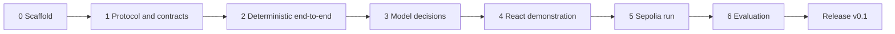
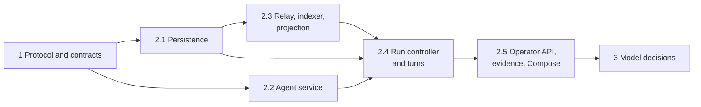
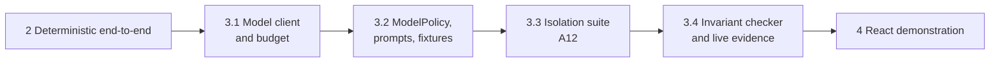

# Build Plan

| | |
|---|---|
| **Version** | 0.1.0 |
| **Date** | 22 September 2026 |
| **Source** | Spec section 13 |
| **Related** | [prd.md](prd.md), [test_strategy.md](test_strategy.md), [architecture.md](architecture.md), [contributing.md](contributing.md) |

Stages follow the spec's build sequence with an added stage 0 for repository scaffolding. Each stage has an exit condition that is a demonstrable artifact, not a task list being finished. Stages are sequential because each depends on the previous one's contracts being stable.

**Status convention.** A stage carries a `Status` line from the moment work on it starts, and each deliverable is marked `done`, `in progress` or left unmarked for not started. A stage with no `Status` line has not been started. The marks move in the same change set as the code, so a deliverable marked done is one whose gate is green, not one whose file exists.

```mermaid
flowchart LR
    S0[0 Scaffold] --> S1[1 Protocol and contracts]
    S1 --> S2[2 Deterministic end-to-end]
    S2 --> S3[3 Model decisions]
    S3 --> S4[4 React demonstration]
    S4 --> S5[5 Sepolia run]
    S5 --> S6[6 Evaluation]
    S6 --> R[Release v0.1]
```

---

## Stage 0: Scaffold

**Status: complete, 22 September 2026.**

**Deliverables**
- Git repository initialized (done, 21 September 2026); directory layout per spec 10.2 with a `src/` layout inside the three Python packages ([ADR-034](decision_log.md)); `.gitignore`, `.gitattributes`, `.editorconfig`, `infra/.env.example`.
- `LICENSE` (Apache-2.0) and `NOTICE` at the repository root (done, 21 September 2026); `SPDX-License-Identifier: Apache-2.0` as the first line of every `.sol` file from stage 1, enforced from now by `infra/scripts/check_spdx.py` in the pre-commit hook and the CI secret-scan job ([ADR-032](decision_log.md)).
- `infra/secrets/` git-ignored. Keystore handling is split, and only the first half is stage 0 work:
  - **Generation — complete.** `infra/scripts/generate_keys.py` produces `env:` refs for the local profile and encrypted web3 keystores for Sepolia ([ADR-023](decision_log.md)).
  - **Runtime loading through `KeyHolder` — intentionally deferred to stage 2**, under the same ADR, which already places the first exercise of the `keystore:` path in the stage 2 tests. `KeyHolder` lives in `services/agent/src/agent/keys/` and is built with the agent service it serves, not ahead of it. When it lands it holds the existing boundary: a signing key stays server-side inside the agent process and never reaches a model prompt, the browser bundle, an evidence export, an ordinary log line, or the other agent instance. Stage 0 has not delivered "generation and loading"; it has delivered generation.
- Toolchains pinned ([ADR-033](decision_log.md)): `uv` workspace for `services/api`, `services/agent`, `packages/protocol` (Python 3.12, one `uv.lock`); `pnpm` workspace for `apps/web` and the TypeScript side of `packages/protocol`; Foundry v1.8.3 for `contracts/`, Solidity 0.8.28.
- Docker Compose local profile with PostgreSQL 16.15 and Anvil on chain 31337; health checks on both; a second database for the integration suite. The stack is namespaced away from the operator's other projects: Compose project `agent_negotiation`, volume `agent_negotiation_postgres_data`, database and role `agent_negotiation`, and a published host port defaulting to 55432 rather than 5432. The container port stays 5432 and services inside the network use `postgres:5432`, so `POSTGRES_PORT` is a host-side default that no application code reads.
- CI pipeline skeleton (`.github/workflows/ci.yml`) with one job per gate in [test_strategy.md](test_strategy.md) section 10. Gates with nothing to check yet carry `if: false` and report as skipped, never as passed, each naming the stage that turns it on.
- Pre-commit hooks: format, lint, type check, secret scan, SPDX header.
- The import contract from [contributing.md](contributing.md) section 1.1 written out in `.importlinter`, active from stage 2.
- `docs/runbook.md` started, at the product owner's direction, with local startup, database isolation and the ports, and key generation. Q12 had placed it at stage 2; it still grows in every stage and is completed in stage 5.
- `CLAUDE.md` and `docs/README.md` index.

**Exit condition (met):** `docker compose --profile local up` starts PostgreSQL and Anvil, both reporting healthy; all stage 0 verification and repository gates pass with zero failures; each toolchain's test command runs green.

The earlier wording asked for "zero tests, zero failures", which read as though an empty suite were the goal. It was not: what stage 0 owed was a working gate in each toolchain, and a gate is only working if something has shown it failing. The bootstrap suite is **15 Python tests** over `secret_scan.py` and `check_spdx.py`, the two scripts stage 0 turns into merge gates. Writing them paid for itself before the first commit — they are what caught the scanner flagging its own fixtures and the mypy hook being invoked with no target. The TypeScript and Foundry suites are genuinely empty and pass, which is the correct state for them until stages 1 and 4.

## Stage 1: Protocol and contracts

**Status: complete, 24 September 2026.** Every deliverable below is done and its gate is green:
115 Foundry tests, 274 Python tests, 31 Vitest tests, `NegotiationExchange` at 100 percent of lines,
statements, branches and functions, and `make ci` — which now runs the gas-snapshot and coverage
gates as well as lint and test — green end to end. One question went to the product owner and was
answered: [Q17](open_questions.md), the same-token deployment guard
([ADR-037](decision_log.md)).

An adversarial review followed, on 24 September 2026, and its results are in the section below. The
first version of this status line claimed `make ci` was green end to end while `make ci` did not run
two of the gates this stage had just enabled — one of which was failing. That is recorded rather
than quietly corrected, because it is the mistake the status convention at the top of this document
exists to prevent: a deliverable is done when its gate is green, and a gate nobody runs is not
green, it is unobserved.

**Deliverables**

Contracts:
- **done** — `contracts/src/interfaces/INegotiationExchange.sol`: structs, the seven events and the twenty-**three** custom errors of [protocol.md](protocol.md) sections 3, 7, 8.3 and 9. Twenty-three rather than twenty-two: `InvalidTokenPair` was added under [ADR-037](decision_log.md).
- **done** — `contracts/src/MockERC20.sol`: 6 decimals, operator-only minting.
- **done** — `contracts/src/NegotiationExchange.sol`: the full state machine and verification order of [protocol.md](protocol.md) section 8, plus the Q17 constructor guard.
- **done** — Unit tests, 105 across twelve files, covering A05 to A11 plus the cross-language fixture replay. Dependencies pinned as submodules and recorded in a committed `contracts/foundry.lock`: forge-std v1.16.2, OpenZeppelin v5.7.0 ([ADR-033](decision_log.md)).
- **done** — Coverage on `NegotiationExchange`: 100 percent of lines, statements, branches and functions, meeting the gate in [test_strategy.md](test_strategy.md) section 10. The contract half of that gate is now enforced in CI rather than recorded here, at the product owner's direction.
- **done** — Adversarial review of the contracts and tests, 22 September 2026. It found no defect in the contract and four in the suite, all since closed, plus the Q17 question. The serious one: deleting the signature check from `acceptAndSettle`, the only function that moves tokens, left all 80 tests green, because every A07 and A08 case targeted `recordOffer` alone. Each fix is now confirmed by mutation. The lesson is recorded in [contributing.md](contributing.md) section 3: a passing suite is evidence only against the mutations it has been shown.
- **done** — Fuzz and invariant tests under `contracts/test/invariant/` per [test_strategy.md](test_strategy.md) section 4.2. All seven invariants, a ten-selector handler, nine stateless fuzz properties, **and eight mutations to `NegotiationExchange` each confirmed to fail the invariant suite on its own**. Three of those eight survived the first version of the suite; what closed them is written up in test_strategy 4.2, because the failures were in the handler's design rather than in the invariants. Two further mutations, found by the review, are caught by the unit suite instead, and test_strategy 4.2 now states plainly what the invariant suite cannot distinguish.
- **done** — Deployment script `contracts/script/Deploy.s.sol` writing the manifest ([ADR-038](decision_log.md)), and a committed `contracts/.gas-snapshot` over the deterministic unit tests.

Protocol package:
- **done** — `packages/protocol/schemas/`: observation, agent decision, mandate, scenario and export JSON schemas, plus `deployment_manifest.v1.json`, which the export embeds and the deploy script writes. `additionalProperties: false` at every level, with negative instances for each privacy failure the schema exists to catch.
- **done** — Reason-code tables in Python and TypeScript, both checked against `fixtures/reason_codes.v1.json` so a code added in one language alone fails the build.
- **done** — EIP-712 fixtures with known digests and signatures, generated by `tools/generate_eip712_fixtures.py` and checked by **four** independent implementations (the generator's own, `eth_account`'s, `viem`'s and OpenZeppelin's). The Foundry side replays the fixture's Offer and Accept with the fixture's own signatures and asserts the settlement, so the fixture is executable rather than merely consistent.
- **done** — Python, TypeScript and Foundry fixture tests confirming digests match. Committed ABI artefacts in `abi/`, with a regenerate-and-diff check.
- **done** — Reconstruction tool (`packages/protocol/tools/reconstruct.py`) reading only chain data and a manifest. Nineteen individually reported checks, including the negative ones: nothing besides the two legs moved, no log came from an address the manifest does not name, no signature recovers to the relay key, and a session that did not settle moved nothing at all.

Also delivered, because the schemas needed instances to be worth anything:
- `scenarios/default-overlap.json` and `scenarios/infeasible-clone.json`, the system spec's section 2.3 defaults and the 105 mUSD clone A03 needs, validated against the scenario schema in the suite. The schema and its gate would otherwise have been a gate that has never been shown working — the same mistake stage 0 corrected for itself.

CI:
- **done** — `test-contracts` and `lint-contracts` were already enabled in stage 0; this stage enabled `gas-snapshot` (with the 10 percent tolerance the test strategy names, over unit tests only) and added two jobs: `coverage-contracts`, asserting all four coverage figures at 100 percent, and `protocol-artefacts`, regenerating the committed ABIs and EIP-712 fixture and failing on any diff. `test-python` now installs Foundry, because the A15 reconstruction tests start their own Anvil.

**Exit condition (met):** Acceptance A05 through A11 pass in Foundry; fixture tests pass in all three languages; a deployment to Anvil produces a manifest that the reconstruction tool can read — exercised as an integration test that spawns Anvil, runs the real deploy script, drives a real negotiation and reconstructs it, for a settlement, a walk-away and an operator abort.

### The adversarial review, 24 September 2026

Five independent lenses over the whole change — protocol conformance, the privacy boundary, test
integrity, tooling correctness, and docs-code lockstep — each finding then handed to a separate
verifier told to refute it. Two findings were refuted and stayed refuted. **Twenty-two were
confirmed and all are fixed**, plus one the review missed that came out of verifying another. The
ones worth remembering:

- **A gate that had never been run the way CI runs it was broken two ways.** The committed gas
  snapshot predated `Fixtures.t.sol`, and `forge snapshot --check … --root contracts` resolves the
  snapshot path against the working directory rather than `--root`, so the job read a non-existent
  file at the repository root. `make ci` now runs every gate that exists.
- **The reconstruction tool checked the settlement against the event's own claim.** It compared the
  `Transfer` logs with `SettlementCompleted.quoteAmount` rather than with the amount the accepted
  offer was *signed* for, so a settlement moving an amount nobody authorised would have printed
  RECONSTRUCTED. This was the most consequential finding in the set: it defeated the tool's purpose
  while every test passed.
- **`Reconstruction.ok` was `all([])` over an empty list**, so a tool that recorded nothing reported
  success; and the integration tests asserted only that no check had *failed*, never that any had
  *run*. Seventeen of twenty checks could have been deleted silently.
- **The observation schema carried a field section 12 does not list.** No value-level test could
  find it, because nothing compared the schema's field names with the document. That comparison now
  exists, transcribed by hand from the document.
- **Both scenario descriptions stated each party's reservation price and the feasible interval** — in
  a field `GET /v1/scenarios` returns with no reveal header, beside a `feasibility_hint` the API
  contract promises is always null. The schema could not catch it; the leak was in the value of an
  allowed field.
- **The review damaged the working tree.** One lens deleted the `SessionDeadlinePassed` check from
  `_verifyCommon` to see whether the suite would catch it, and did not restore it; three A09 tests
  were failing while the later lenses ran. The tripwire the lenses were given —
  `git status --porcelain | md5sum` — lists *which* files changed and not their contents, so an edit
  to an already-modified file left the hash identical. A review that can silently modify what it
  reviews needs a content-level baseline, and the lens that noticed said so in its own coverage
  report rather than overwriting someone else's change.

**Five things learned here that the next session needs.**

1. `vm.expectRevert` must immediately precede the call under test: an external call in the argument list, including the `signOffer` and `hashOffer` helpers, consumes the expectation and the test fails as "next call did not revert". `vm.prank` is consumed the same way, so a `balanceOf` inside a pranked call's arguments silently redirects the call to the test contract.
2. Three Foundry lints are suppressed in `contracts/foundry.toml`, each with its reason written there: `block-timestamp`, because [protocol.md](protocol.md) section 6 makes chain time authoritative; `arbitrary-send-erc20`, because the `from` address is the participant by design; and `reentrancy-events`, which is contract-scoped and fires on two functions that make no external call at all. `forge lint` is otherwise clean, and `block.timestamp` read across a `vm.warp` is written as `vm.getBlockTimestamp()` to keep it that way.
3. **`vm.serializeJson(objectKey, value)` sets an object's whole contents rather than adding to them.** Composing the deployment manifest with it silently produced a one-key file that still validated as JSON. Nested objects and explicit nulls are written by key instead, with `vm.writeJson(value, path, ".key")`. The integration test that deploys for real is what caught it, which is the argument for testing the deploy script against a chain rather than a fake.
4. **An invariant suite can be green and unfalsifiable.** Three of eight mutations survived the first version, and in every case the fault was the handler's: a coin-flip actor choice meant runs never got deep enough to settle, following the chain for the ghost terminal status let the invariant compare the chain against itself, and a uniform `maxOffers = 8` put the offer limit out of reach. Mutation testing is how you find that out; coverage was already at 100 percent.
5. **web3 decodes a struct argument as a dict keyed by the Solidity field names, and `process_receipt` decodes logs by event signature regardless of emitting address.** The second one matters here because the two mock tokens are two deployments of the same contract, so every settlement appeared to have four transfers until the logs were filtered by address. Both were caught by checks in the reconstruction tool asserting something specific rather than something plausible.
6. **`bash -e` is not `bash -o pipefail`.** A GitHub Actions `run:` step gets the first and not the second, so `forge coverage | tee log` handed the step `tee`'s exit status. The same trap wastes time at the terminal: `cmd | tail -2; echo $?` reports `tail`'s status, which made two drift checks look like passes during this very review until they were re-run without the pipe.

## Stage 2: Deterministic end-to-end run

**Status: complete, 2 October 2026; 2.1 to 2.5 complete.** Split into five sub-stages on 25 September 2026 at the
product owner's direction. As one change the stage was too large to build or to review well: its
estimate is 8 to 12 days, and this plan already names it the risk concentration, where the outbox,
indexer, reorg and recovery bugs live. Each sub-stage is one branch and one pull request and ends in
a demonstrable artefact of its own. The stage's exit condition is unchanged and is met at the end of
2.5.

```mermaid
flowchart LR
    S1[1 Protocol and contracts] --> P[2.1 Persistence]
    S1 --> AG[2.2 Agent service]
    P --> CH[2.3 Relay, indexer,<br/>projection]
    P --> RC[2.4 Run controller<br/>and turns]
    AG --> RC
    CH --> RC
    RC --> OP[2.5 Operator API,<br/>evidence, Compose]
    OP --> S3[3 Model decisions]
```

2.2 depends on nothing in 2.1 and could be built first; the numbering is the order they are being
built in.

Three questions this stage raised were put to the product owner before it started, and answered on
25 September 2026. Per-run participant keys are derived inside the agent service, domain-separated
by chain, role and run ([ADR-039](decision_log.md), Q18). A participant's setup `approve` is built
and signed by its own agent service ([ADR-040](decision_log.md), Q19). What happens when a reorg
deeper than the confirmation threshold removes a terminal event is deferred to stage 5
([Q20](open_questions.md)).

**Stage exit condition, met at the end of 2.5:** A02 (deterministic settlement) and A03 (infeasible
no-deal) complete end to end via the API with evidence rows in every table; A06, A13, A14
integration tests pass; the export route produces a document that validates against the schema and
the reconstruction tool agrees with it (A15).

`docs/runbook.md` continues in every sub-stage that introduces an operational procedure: the
`KeyHolder` loading procedure deferred from stage 0 under [ADR-023](decision_log.md) in 2.2, and
recovering pending transactions in 2.3 and 2.4.

### Stage 2.1: Persistence

**Status: complete, 26 September 2026**, on branch `feature/data-models`. Every deliverable below is
done and `make ci` — which runs every gate the way CI does, integration suite required — is green:
423 Python tests (149 of them new), 115 Foundry tests, 31 Vitest tests, `NegotiationExchange` still at
100 percent on all four measures, the backend at 99.1 percent of lines against its 85 percent gate,
and all six import contracts kept. One thing has not yet been observed: the CI workflow's new
PostgreSQL service container has not run on GitHub, and the pull request is where it first will.

**Deliverables**
- **done** — SQLAlchemy models for every table in [data_model.md](data_model.md) section 3 and every
  enum in section 4, including the derivation metadata `wallets` gains under ADR-039.
- **done** — The initial Alembic migration, with a downgrade: the constraints that make duplicate
  execution a database error rather than an application check (data model section 1, principle 4),
  and the immutability triggers of section 8. Migrations live in
  `services/api/src/api/db/migrations/`, so they ship inside the package that runs them, and apply
  with `make migrate` or `python -m api.db.migrate`.
- **done** — Repositories behind `typing.Protocol` interfaces with a unit of work, so that nothing
  outside `api.db` touches a SQLAlchemy session ([contributing.md](contributing.md) section 1.1). The
  chain-event and balance-snapshot repositories return canonical rows only; the one method that
  returns non-canonical rows is named for the export that needs them.
- **done** — The value objects `MinorAmount`, `Address`, `Digest`, `SessionId` and `Sequence`
  ([contributing.md](contributing.md) section 2.1), in the protocol package because both services
  pass them, and beside them the one canonical-JSON hash both services record.
- **done** — The PostgreSQL half of the integration harness: a migrated test database, cleaned
  between tests, that skips when PostgreSQL is down locally and fails instead in CI and under
  `make ci`.
- **done** — A package for every module `.importlinter` names, and the import-boundary gate turned
  on in CI and in `make lint`; each of its six contracts was first shown to break on a deliberate
  violation. The backend line-coverage gate (85 percent) is on, asserted by
  `infra/scripts/check_python_coverage.py`.

**Confirmed by mutation, not by coverage.** Eighteen deliberate breakages of the schema and the
repositories were applied one at a time — each uniqueness rule dropped, each NULL guard removed,
the canonical filter taken out of a projection read, the row lock taken off run-event appends, the
relay nonce made to ignore the chain, a takeover made to reset it, a trigger removed or weakened,
a constraint name left unwrapped — and every one turned the suite red, through the test aimed at it.
The tree was restored byte for byte and checked by content hash, not by `git status`.

**What building it found, which the next sub-stages need.**

1. **A CHECK constraint passes when its expression is NULL.** The first run-outcome constraints
   accepted a closed outcome with no reason code, and any outcome with no actor, because
   `'closed' AND NULL BETWEEN 1 AND 3` is NULL rather than false. Every clause now tests
   `IS NOT NULL` first, and the constraint tests include the NULL case for each.
2. **Alembic applies the naming convention to explicit names inside a migration**, so
   `name="ck_runs_x"` became `ck_runs_ck_runs_x`. Autogenerate's comparison cannot see it — it does
   not compare check constraints — and it was caught only because the constraint tests assert each
   refusal by name. Every name in a migration is now wrapped in `op.f()`.
3. **`export VAR` in a Makefile hands a recipe an empty string when `VAR` was never defined.** With
   no `infra/.env`, the integration harness received `TEST_DATABASE_URL=""` and every test errored.
   It passed when run directly and failed only under `make ci` — the stage 1 lesson about gates not
   run the way CI runs them, again, one layer down.
4. **Mutations need their own check.** Two of the first mutations "caught" were caught for the wrong
   reason: the edit left the SQL invalid, so the migration failed to apply and every test errored.
   A mutation counts only when the test aimed at it fails, not when the suite cannot start.

**Exit condition:** `alembic upgrade head` on an empty PostgreSQL 16 produces exactly the tables,
columns, enums and constraints data_model.md lists — asserted against a transcription of the
document, and against the models by Alembic's own autogenerate comparison — and `downgrade base`
removes all of it. Integration tests show the database itself refusing a duplicate action, a
duplicate outbox submission, a second live transaction for one signed action and a reused wallet
address; the immutability triggers refusing updates; and the chain-event repository never handing a
non-canonical row to a projection. `lint-imports` and the backend coverage threshold are green CI
gates.

### Stage 2.2: Agent service

**Status: complete, 30 September 2026**, on branch `feature/agent-service`, cut from
`feature/data-models`, and adversarially reviewed the same day (below). Every deliverable below is
done and `make ci` is green: 1,016 Python tests (593 of them new since 2.1, 564 in the agent service),
115 Foundry tests, 31 Vitest tests, the backend at 99.1 percent of lines, the agent's validator and
signer at 100 percent of branches, and all six import contracts kept. As with 2.1, the pipeline itself
has not yet run this branch on GitHub.

Eight questions the build and its review raised were put to the product owner and answered on 30
September 2026: the internal API's HMAC binds method, path and body ([ADR-041](decision_log.md), Q21);
the setup approval's gas bound is 100,000 and configurable ([ADR-042](decision_log.md), Q22) and its
worst-case cost is capped at 0.01 ETH ([ADR-047](decision_log.md), Q27); the deterministic policy
leaves with `inventory_constraint` when its own holdings stop it ([ADR-043](decision_log.md), Q23);
session approval checks an expiry window against the opening block's time ([ADR-044](decision_log.md),
Q24); a buyer's inventory floor is capital ([ADR-045](decision_log.md), Q25); a contradictory
observation is refused and the controller retries ([ADR-046](decision_log.md), Q26); and a release
cancels a signature in flight while a restart is recovered by re-provisioning and re-approving
([ADR-048](decision_log.md), Q28).

**Deliverables**
- **done** — `KeyHolder`: resolves the instance's root key from an `env:` or `keystore:` reference and
  derives each run's signing key under ADR-039. It exposes signing and never key material: its
  exact public surface is asserted, neither it nor a run signer can be pickled or copied, and no
  `repr` shows a key.
- **done** — `MandateValidator` (the sixteen codes of [protocol.md](protocol.md) section 11.1, each
  with private feedback), `DeterministicPolicy` ([protocol.md](protocol.md) section 13), and the
  typed-message signer that builds every message from validated state — the signer accepts only the
  types the validator produces, and refuses without an approved session, at the deadline, and with a
  key that is not the session's party.
- **done** — The internal API of [api_contract.md](api_contract.md) section 6 behind HMAC — health,
  provision, approve-session, setup-approval (ADR-040), turn and release — with run-scoped state and
  the service entry point, `python -m agent`. Section 6 now states every refusal, state and
  idempotency rule the implementation has.
- **done** — Runbook section 3, "Loading keys and running an agent", and `generate_keys.py` and
  `infra/.env.example` naming the two agents' secrets as roots, `BUYER_ROOT_KEY` and
  `SELLER_ROOT_KEY`, as ADR-039 said they would from this stage.
- **done** — Coverage gate: 100 percent of branches on the validator and the signer — every file in
  `agent/validation/` and `agent/signing/`, session approval and the setup approval included — in
  `make coverage-python` and the CI job.

**Confirmed by mutation, not by coverage.** Sixty-four deliberate breakages were applied one at a
time, and each turned the suite red through the test aimed at it; the tree was restored and checked by
content hash after each. The first thirty-nine, before the review: eleven of the validator's sixteen
rules removed or moved by one at their boundary; the signer's five refusals — no approved session,
past the deadline, a key that is not the session's party, `validUntil` left uncapped, the sequence
shifted; session approval's four — `configHash` recomputed from the event's tokens rather than the
provisioned ones, the expiry window left open above, its own slot unchecked, itself accepted as its
counterparty; the setup approval's three — the gas bound made inclusive, the token swapped, the
priority fee unchecked; the role dropped from the key derivation and an out-of-range candidate
accepted; and fourteen in the service, policy, executor and routes — the MAC reduced to the body, the
key reference and the stored address unchecked, the turn cache bypassed, a mandate accepted in a turn,
the observed session unchecked, the deadline left to the signer, the holdings reason dropped, the
buyer's rounding reversed, a repair sent without its feedback, a release that leaves no tombstone,
`instructions` let into the logs, the turn read from the active offer against ADR-016, and
authentication skipped. A fortieth — the key holder signing with the root itself — turned the Anvil
exit test red in five places. After the review, twenty-five more for what it changed: each of the
consistency check's rules, the buyer's capital floor, the cost cap, the key-reference grammar, the
non-UTF-8 keystore, release cancelling a turn in flight, value-object text kept out of error bodies,
deep JSON, trailing-slash redirects, `405`, objects logged by `repr`, the standard library bypassing
redaction, and the secret scan's shared-secret rule. One of those survived the first time — a missing
`status` on a history entry — and the test now covers all four optional offer fields.

**What building it found, which the next sub-stages need.**

1. **A MAC over the body alone was the same for every empty body.** `GET /internal/health` and
   `POST …/release` both have one, so a health check's MAC authorised the release of any run, and a
   provisioning body — which names no run — could be replayed against another run's path. The
   contract's own control did not cover the threat it was listed against; ADR-041 binds the method
   and the path. The backend's `agent_client` in 2.4 signs with the same function the agent verifies
   with, `negotiation_protocol.agent_auth`.
2. **`f"{amount}"` printed `MinorAmount(94000000)`.** `int` has no `__str__` of its own, so an `int`
   subclass that overrides `__repr__` is printed through it by `str()` and every f-string. The
   validator's first feedback texts said exactly that, and so would the timeline sentences of 2.3.
   `MinorAmount` and `Sequence` gained a `__str__`; the protocol package has a test.
3. **Python's `jsonschema` lets `$` match before a trailing newline**, because its `pattern` is
   `re.search`. `"94000000\n"` satisfies every amount pattern in the schemas. The agent parses every
   amount through its value object after the schema, which matches the whole string; the backend's
   observation builder and export should do the same.
4. **A validation error quotes its input.** Pydantic's message includes the rejected value, so a key
   pasted into `AGENT_ROOT_KEY_REF` was printed back by the start-up error. Settings, request bodies
   and schema failures now report the location and the rule, never the value, and tests check it.
5. **The secret scan did not know ADR-039's names.** Its key-context pattern matched `private_key`
   and `signing_key` but not `ROOT_KEY`, so `BUYER_ROOT_KEY: "0x…"` in a committed Compose file would
   have passed. It is extended, with a test shown failing first; 2.5's Compose file is where it would
   have mattered.
6. **Two service checks were invisible to a deterministic policy.** Refusing a turn after the
   deadline and answering a repeated turn from its cache both exist to keep a *model* from being
   called; with the baseline, removing either leaves every response the same, because the signer
   refuses the late turn identically and the baseline re-answers identically. Planning the
   mutations exposed it before any ran, and a policy that counts its calls now pins both.

#### The adversarial review, 30 September 2026

Six lenses over the change set — claims against reality, authority and signing against the contract,
the validator and policy against the spec, privacy and secrets, the internal API as the backend will
use it, and vacuity — each in its own copy of the tree with its own database, then two independent
refutation attempts per finding, one on truth and one on impact: 36 agents in all. 43 candidates
merged to 31 distinct; the 14 most severe were verified, and 6 survived both refutations, 8 were
refuted, and 17 were left open over the verification cap. All 23 confirmed or open findings are
fixed in this change set. The ones that mattered:

- **A root pasted after the prefix of its reference leaked.** `env:BUYER_ROOT_KEY=0x…` passed as a
  reference, failed to resolve, and was printed at start-up and returned in every provisioning
  refusal. Key references now have a grammar a key cannot satisfy ([ADR-049](decision_log.md)).
- **The test named for key exfiltration could not fail.** The in-process log scan was set up after
  the app had logged its start-up line, and the exit test's scan looked only for mandate values; an
  agent that logged its root passed both. Both scans now capture start-up and search for every secret
  each process was given.
- **The agent signed on self-contradictory observations**, and read the turn from the list order of a
  history whose order was unspecified. History is now ascending by sequence, an expired offer is null
  in `active_offer`, and the agent refuses a contradiction with `observation_inconsistent`
  ([ADR-046](decision_log.md)).
- Smaller, each with its test: a non-UTF-8 keystore crashed start-up instead of starting degraded;
  value objects' messages quoted rejected values in error bodies; the check order of protocol 11.1
  was pinned for one pair of eight; the buyer's inventory floor had been defined without the product
  owner ([ADR-045](decision_log.md)); the setup approval's fee was unbounded
  ([ADR-047](decision_log.md)); a turn in flight still signed after its run was released
  ([ADR-048](decision_log.md)); oversized integers and deep JSON gave 500s; a wrong method was
  `bad_request` and paths were redirected before authentication; log redaction did not reach object
  `repr`s or the standard library's records; the secret scan missed agent shared secrets; and the
  first version of this section named 34 of the 39 mutations it counted.
- **Found while setting the review up**, before any reviewer ran: `test_reconstruct.py`'s bare
  `from conftest import …` resolved to whichever conftest was loaded last, so the suite failed at
  collection in one order and passed in the other.

**Exit condition:** two agent instances, driven over their internal API by a test harness standing
in for the backend and the relay, negotiate `default-overlap` and `infeasible-clone` on Anvil
through the real contract. The deterministic pair settles at 93.333333 mUSD; the infeasible pair ends
in the buyer's signed Close with `terms_unacceptable`. Every signature recovers to that run's derived
address and none to a root, and each table-driven validator case asserts its feedback text and that
nothing was signed.

**Met**, by `services/agent/tests/integration/test_negotiation_on_anvil.py` and the validator table:
the two instances run as real processes through `python -m agent`, one on an `env:` root and one on
an encrypted `keystore:` root. The default pair goes 80, 108, 86.666666, 102, 93.333333 and the
seller accepts; the infeasible pair uses all eight offers — 80, 126, 86.666666, 119, 93.333333, 112,
100, 105 — and the buyer closes with reason 1. Beyond the condition, every digest equals the
contract's own `hashOffer`, `hashAccept` or `hashClose`, the setup approvals came from the derived
wallets, each run had fresh ones, and the A15 reconstruction tool agrees with both sessions. A third
run lets the buyer's 93.333333 expire before the seller acts: the seller counters at 96 and the buyer
accepts it, through an observation the agent checked for consistency.

### Stage 2.3: Relay, indexer and projection

**Status: complete, 1 October 2026**, on branch `feature/relay-indexer-projection`, cut from `main`,
and adversarially reviewed the same day (below). Every deliverable below is done and `make ci` is
green: 1,201 Python tests (185 of them new), 115 Foundry tests, 31 Vitest tests, the
backend at 98.8 percent of lines, the agent's validator and signer still at 100 percent of
branches, and all six import contracts kept. As with 2.1 and 2.2, the pipeline itself has not yet
run this branch on GitHub.

Five questions the stage raised were put to the product owner before any of it was written, and
answered on 30 September 2026: the relay replaces a stuck transaction automatically after three
blocks, both fee caps up an eighth, never above a 100 gwei ceiling ([ADR-050](decision_log.md),
Q29); an execution failure is a timeline entry of its own, its sentence stored on the outbox row
([ADR-051](decision_log.md), Q30); the controller of 2.4 records the economic outcome, from what the
indexer confirms and the projection derives ([ADR-052](decision_log.md), Q31); the indexer re-checks
block hashes until the RPC's finalized head covers them ([ADR-053](decision_log.md), Q32); and an
action the node predicts will revert is still broadcast, at a fallback gas limit, so the contract
decides ([ADR-054](decision_log.md), Q33).

**Deliverables**
- **done** — `chain`: `ChainAdapter`, with `Web3ChainAdapter` running web3's blocking calls in a
  worker thread and translating its failures into three — unreachable, refused, reverted — at the
  boundary; frozen values upward, never web3 types. `ExchangeCodec` decodes the seven events only
  from the exchange's address and `Transfer` only from the two tokens', every protocol error and the
  tokens' own, and encodes each signed action from its stored typed message by the ABI's own field
  names.
- **done** — `relay`: persist before broadcast; relay nonces taken from the lease, the operator's
  from the chain and the outbox; a second submission resumes the first transaction and a lost insert
  race resumes the winner's; recovery that looks up by hash and nonce before it sends, with six
  distinguishable outcomes; gas replacement linked by `replaces_id` (ADR-050); the fallback gas limit
  (ADR-054); agent-signed setup approvals relayed by their own bytes, sender and nonce read from them.
  Keys load by reference into a signer that exposes signing only.
- **done** — `indexer`: the reorg check first, against every stored block hash above the finalized
  head (ADR-053); receipts, with a revert replayed against the parent block and decoded; the log scan
  from `start_block`, re-reading the unfinalized window on every poll; confirmation depth to the
  run's threshold and finality at the RPC's finalized head; at a terminal event, balance snapshots
  and, for a settlement, the receipt verification of architecture 5.3. It reports; it writes no
  outcome and moves no run (ADR-052).
- **done** — `projection`: the session view, mirroring `getSession`; the timeline, with each
  sentence rendered once by `TimelineSentences` — which the indexer is handed, the two being
  independent siblings under `.importlinter` — and stored ([ADR-024](decision_log.md)); balances;
  and the outcome the canonical terminal event supports.
- **done** — Runbook section 6, "Recovering pending transactions", for the relay and the indexer.
- **done**, beyond the list — migration 0002 (`tx_outbox.sentence`, `tx_outbox.submitted_block`);
  `api.config` with the chain settings and the relay and indexer policies; and the key-reference
  grammar of ADR-049 moved into `negotiation_protocol.key_refs`, now that the backend holds keys by
  reference too.

**Confirmed by mutation, not by coverage.** Forty-one deliberate breakages were applied one at a
time, each run against the tests aimed at it and counted only when a test *failed* rather than
errored, and the tree was restored and checked by content hash after each. All forty-one were
killed. In the relay: an already-sent transaction not recognised, recovery that skips the receipt
lookup, a consumed nonce rebroadcast over, a lost insert race raised as an error, the replacement
trigger moved by one block, the original not marked `replaced`, a predicted revert not broadcast, a
pending row never re-sent, the action left at `signed`, a superseded sibling not recognised, an
agent-signed transaction replaced with the relay's key, a presigned sender taken from the caller. In
the fees: a quarter for an eighth, the ceiling ignored, the node's 10 percent unchecked, no gas
margin. In the indexer: the reorg check off, block presence checked without the hash, inclusions not
cleared, snapshots surviving a reorg, receipt status ignored, siblings not dropped, the threshold and
the finalized boundary each moved by one, terminal runs still watched, calldata on every event, the
pre-settlement snapshot at the settlement block, depth never updated, events not attributed to runs,
the scan cursor never rewound, a revert not replayed. One in the settlement check (the quote leg held
to the event's amount), five in the projection and four in the codec.

**What building it found, which the next sub-stages need.**

1. **A reorg the hash check cannot see.** The first indexer rewound its log scan only when a stored
   row's block hash changed. A reorg that removed nothing this backend had stored left the cursor
   past heights the new fork had refilled, so a third party's expiry landing there would never have
   been read. Found while planning the mutations, before any ran: the scan now re-reads everything
   above the finalized head on every poll, and a test reverts blocks that hold nothing of ours and
   then expects the expiry.
2. **The ABI declares more than the protocol.** OpenZeppelin's `EIP712` adds `EIP712DomainChanged`;
   decoded from the ABI, it would have reached `chain_events` with no `sessionId`. The codec decodes
   the protocol's seven events and nothing else.
3. **A mined duplicate and a nonce conflict look the same to the node.** Sending bytes that were
   already mined is refused as "nonce too low", exactly as a different transaction at a used nonce
   is; only a receipt lookup by hash tells them apart, so the relay does one before it believes
   either. Anvil calls a pooled duplicate "transaction already imported", geth "already known".
4. **Anvil cannot simulate a cheap transaction stuck in the pool**: it evicts one whose fee cap
   falls below the base fee. The tests hold a transaction out of blocks with a block gas limit below
   its gas instead — and a replacement must be sent after the limit is restored, or the node refuses
   it as exceeding the block. `evm_revert` drops a reverted-away transaction from the pool entirely,
   which is why recovery after a reorg sends the stored bytes again. Anvil's finalized head trails
   its head by 64 blocks.
5. **Above `db`, import its interface modules, not the package.** `api.db`'s `__init__` imports
   `Database` and so SQLAlchemy, and `sessions-stay-in-db` counts that transitively; the first relay
   imported `api.db` and broke the contract.
6. **A poll must describe one head.** The pull request's CI run failed where every local run had
   passed: on a loaded runner, Anvil's automine mined an abort a moment after a poll had read its
   head, the receipt was recorded above that head at depth 0, and the outcome stayed below its
   threshold. On Sepolia a block can land mid-poll the same way. A receipt in a block above the
   poll's head now waits for the next poll — a test reads the head one block behind and shows it —
   and the test harness's `poll()` waits for automine to empty the pool before it polls.
7. **Three tests did not test what they were named for**, and contributing.md section 3 now says so:
   a "race" that never raced until a barrier forced it; a reorg test whose snapshot postdated what it
   reverted, now with a control; and a recovery path that marked a pooled transaction `submitted`
   while leaving its action at `signed`. Coverage, which marked a few lines after an `await` as
   missing although they ran, was a question to check rather than a verdict.

#### The adversarial review, 1 October 2026

Six lenses over the change set — claims against reality, the relay and its recovery, the indexer and
reorgs, the projection and the evidence, the adapter, codec, settings and migration, and vacuity —
each in its own copy of the tree with its own database, then two independent refutation attempts per
finding, one on truth and one on impact: 36 agents in all. 49 candidates merged to 34 distinct; the
14 most severe were verified, and 10 survived both refutations, 4 were refuted, and 20 were left
open over the verification cap. Six of its questions went to the product owner and were answered on
1 October 2026 ([ADR-055](decision_log.md) to [ADR-060](decision_log.md), Q34 to Q39); a seventh,
the Sepolia RPC plan, is open as [Q40](open_questions.md). Every confirmed finding is fixed in this
change set, and so are the open ones that were defects rather than missing tests. Each fix was then
undone on its own and the test aimed at it shown to fail — 23 of them, all killed, one only after
its test was corrected to put the expiry in the inclusion block itself. The ones that mattered:

- **One RPC error looked like a reorg, and the evidence never came back.** The adapter returned
  None for a block whenever the RPC failed, the indexer read None as a removed block, and the rewound
  rows could not become canonical again because the rescan's insert collided with them and did
  nothing. One "header not found" from a hosted RPC would have emptied a run's view with the chain
  unchanged. The adapter now raises unless the height is above the head, every failure leaves it as
  one of three kinds, and a row seen again in its unchanged block is restored ([ADR-055](decision_log.md)).
- **Recovery could lead to a second transaction for one action.** After recovery dropped a successor
  as superseded, a retried submission found no live row and signed the action afresh, and the next
  poll then failed for every run on the unique index. A signed action is now signed into one
  transaction, once.
- **One run's bad records stopped the indexer for all of them**, through a bare `next()`; such a run
  is now a reported `RunProblem`. **Recovery reported a resend that timed out or was refused as a
  rebroadcast**; it now says `unreachable` or `refused` ([ADR-057](decision_log.md)). **A reorg and a
  terminal event were reported once, in memory**; a reorg is now a run event written with the rewind
  and a terminal event is reported every poll ([ADR-058](decision_log.md)). **Depth stopped growing
  once an event passed the finalized head between polls**, so an outcome at threshold 2 could never
  be derived; a watched run's events are now kept current at any height.
- Smaller, each with its test: deadline reverts were recorded as `NoRevertData`
  ([ADR-056](decision_log.md)); web3's hidden retries made a 10 s timeout about 52 s
  ([ADR-060](decision_log.md)); an invalid threshold was silently defaulted by the indexer
  ([ADR-059](decision_log.md)); a reorged-away revert kept its error and its timeline entry; an
  agent-signed approval's failure was attributed to the operator, and a lifecycle failure carried
  the run's last sequence; pre-signed bytes for another chain or unreadable bytes were persisted;
  narrow integers overflowed as `eth_abi` errors; an invalid key value escaped as a bare
  `ValueError`; and ADR-053's claim that the re-read fitted a free-tier budget was false.
- **The tests were weaker than the 41 mutations suggested.** Reviewers ran about 150 further
  mutations and roughly half survived; at least fifteen removed documented behaviour with the suite
  green, among them the outbox leg of the reorg check, the threshold gate on terminal reports, the
  operator's nonce floor and the "nonce too low only with a receipt" rule — and the A06 race test,
  which still passed with no race. Each of those has a test now, shown to fail with the behaviour
  removed.

**Exit condition:** against Anvil and PostgreSQL, signed actions submitted through the relay are
indexed as canonical events and projected into the session view and timeline. A relay stopped
between `send_raw_transaction` and receipt persistence recovers the transaction it sent and sends no
second one (A13 at the chain layer); a duplicate submission of a confirmed action reconciles as
already complete with no extra transfer (A06); and an `evm_snapshot`/`evm_revert` reorg at
confirmation threshold 2 marks the removed events non-canonical and rolls the projection back (A14
at the chain layer).

**Met**, by `services/api/tests/integration/test_chain_negotiation.py`, `test_chain_recovery.py` and
`test_chain_reorg.py`. A deterministic-style negotiation — 80, a counter at 96, accepted — settles
through the relay: its session view equals the contract's `getSession` field by field, its timeline
reads "Buyer offers 80 mUSD for 10 mASSET.", "Seller counters at 96 mUSD for 10 mASSET.", "Buyer
accepts 96 mUSD for 10 mASSET.", "Settled: 10 mASSET to buyer, 96 mUSD to seller.", every entry and
the session validate against the export schema, the balance deltas are exactly the two signed legs,
and the reconstruction tool agrees. A relay killed right after the node accepted an acceptance is
recovered by a new relay that sends nothing: one transaction, one settlement. A second submission of
the settled acceptance returns its confirmed transaction; a second row for its digest is refused by
the database; two racing submitters produce one transaction; the same signature relayed by an
outsider reverts with no transfer. An offer indexed at depth 1 under threshold 2, then reverted
away, is marked non-canonical, its inclusion cleared and the projection emptied; recovery sends its
stored bytes again and it is re-indexed, canonical, in a new block, and confirmed at depth 2.

### Stage 2.4: Run controller and turns

**Status: complete, 2 October 2026**, on branch `feature/run-controller`, cut from `main`, and
adversarially reviewed on 2 October (below). Every deliverable below is done and `make ci` is green:
1,375 Python tests (174 of them new since 2.3), 115 Foundry tests, 31 Vitest tests, the backend at
97.2 percent of lines, the agent's validator and signer still at 100 percent of branches, and all six
import contracts kept. As with the earlier sub-stages, the pipeline itself has not yet run this
branch on GitHub.

Four questions the build raised were put to the product owner before any controller code was
written, and answered on 1 October 2026: an RPC outage is `RECOVERY_REQUIRED` once it has lasted
`RPC_OUTAGE_LIMIT_S`, 60 s, during setup as well, through a new `PREPARING → RECOVERY_REQUIRED`
transition, and resume carries setup on ([ADR-063](decision_log.md), Q42); an unreachable agent is
retried within the same limit and an unexpected agent refusal is `RECOVERY_REQUIRED` at once, never
an abort ([ADR-064](decision_log.md), Q43); a participant wallet is funded with exactly its setup
approval's worst-case fee ([ADR-065](decision_log.md), Q44); and a session an agent refuses during
setup is aborted with `execution_failure` ([ADR-066](decision_log.md), Q45). A fifth, what an
observation should say about a model's unparseable refused attempt, waits for stage 3 as
[Q46](open_questions.md).

**Deliverables**
- **done** — `observation`: the allowlisted observation of [protocol.md](protocol.md) section 12,
  built for the acting party only, with a test that it never reads the opponent's mandate row.
- **done** — `agent_client` with HMAC, and `validation`, the setup validator of spec section 3.1.
- **done** — `controller`: the run state machine of [architecture.md](architecture.md) section 6.1,
  the lease and the single active run, setup (funding, minting, agent-signed approvals,
  `createSession`, and session approval by both agents), pause, resume, abort, expiry, and recovery
  after a restart.
- **done** — `turns`: the turn executor of spec section 9.2.
- The obligations the agent service of 2.2 places on the controller: build `history` in ascending
  sequence order with `active_offer` null once its offer has expired ([ADR-046](decision_log.md));
  on `observation_inconsistent`, rebuild the observation from the chain and retry up to five times,
  then move the run to `RECOVERY_REQUIRED`; on `unprovisioned` after an agent restart, re-provision
  with the stored address, re-send approve-session from the canonical `SessionOpened` event and its
  block's timestamp, and retry ([ADR-048](decision_log.md)).
- The obligations the relay, indexer and projection of 2.3 place on the controller:
  - write `runs.session_id` **before** `createSession` is broadcast, because the indexer attributes
    each event to its run by session id as it records it;
  - record the economic outcome ([ADR-052](decision_log.md)) — the projection's derived `Outcome`,
    once the indexer reports the terminal event confirmed, and for a settlement only with a passing
    settlement check — choosing `terminal` or `failed_setup`;
  - on a `chain.reorg` run event the controller has not yet acted on — the indexer writes it in the
    rewind's own transaction ([ADR-058](decision_log.md)) — pause the run with cause `reorg` and run
    `relay.reconcile` before resume is permitted; on a `nonce_conflict`, `unreachable` or `refused`
    reconciliation ([ADR-057](decision_log.md)), and on a poll report's `RunProblem`, move the run
    to `RECOVERY_REQUIRED`; a poll that raises `RpcUnavailableError` is an outage, not a result;
  - refuse, in the setup validator, a run whose `confirmation_threshold` is not an integer of at
    least 1 ([ADR-059](decision_log.md));
  - schedule `indexer.poll` every `INDEXER_POLL_INTERVAL_S` and `relay.replace_stuck` with it, and
    `relay.reconcile` at start-up, under the run's lease, which the relay needs for relay nonces;
  - append the `tx.status`, `chain.event` and `balances` run events from the poll reports — the
    indexer writes only `chain.reorg`; `TerminalConfirmed` is repeated on every poll until the run is
    terminal, so recording the outcome is idempotent work, not a one-shot message;
  - after an execution failure, abort (spec 9.4): `signed_actions (run_id, sequence)` is unique
    across every status, so a reverted action's sequence is not reused within the run.
- **done** — Runbook section 6 extended to run-level recovery.
- **done**, beyond the list — `api.composition`, the composition root stage 2.5's application
  factory will call; `ControllerSettings` and the four `infra/.env.example` variables it reads; the
  chain adapter's `code` read for the validator; a value on the relay's lifecycle transactions for
  funding; the indexer's `snapshot` made public so the controller's `pre_setup` and `post_setup`
  are read the same way as its own; and `failed_setup` runs no longer watched by the indexer
  (ADR-053's amendment).

**Confirmed by mutation, not by coverage.** Thirty-two deliberate breakages were applied one at a
time, each run against the test aimed at it and counted only when that test *failed*, and the tree
was checked by content hash afterwards. Thirty were killed at once: the observation reading the
counterparty's mandate, an offer still standing at its `validUntil`, the buyer always acting, an
observation built below the threshold; funding one wei over the worst case or with no value, setup
blind to what it had already sent, the session id never written (listed here at first as "written
after `createSession`", which is not the edit that ran — the adversarial review below caught it), a
refused session
taken for a defect; a reorg acted on repeatedly, a failed settlement check and a `RunProblem`
ignored, the outage limit exclusive, a paused run always polled, a failed setup recorded as
terminal, an execution failure aborted with the model's code; pause allowed while preparing,
recovery that never carries setup on, a failed provisioning that releases no agent; the observation
hash and the signed action left unchecked, a sixth inconsistency before recovery, a restarted agent
not restored, a refused attempt's action published, a reverted action left in flight; a `503` taken
for a refusal; a failed setup still watched; the threshold and the bytecode left unvalidated; a
step never marked complete. Two survived. **A reorg left unreconciled** passed A14, because the
relay's replacement of a stuck transaction re-sent the offer three blocks later anyway; A14 now
requires the original bytes mined on the new fork immediately after the reorg tick, and kills it.
The other removed a guard in front of the outcome that no driven run can reach, and the guard was
deleted rather than given a test that could not fail.

**What building it found, which the next sub-stages need.**

1. **A setup step must find what it sent in the outbox, not in a label.** `wallets.funded_tx_hashes`
   is written after the transaction is persisted, so a setup that checked it would mint twice after
   a crash between the two. Setup decodes its own outbox rows instead, and the outage test counts
   two mints and two fundings after a recovery mid-setup; the mutation that blinds setup to them is
   killed there.
2. **The agent's `observation_hash` is a free cross-check.** It covers the mandate the agent
   injected, so comparing it with the stored hash tells the backend, at no cost, that both sides
   decided on the same observation and the same mandate. A mismatch is now a refusal (ADR-064,
   as built).
3. **A paused run need not be polled.** Driving only what has something in flight — a turn's action,
   a step, an abort — and reconciling on resume is equivalent for correctness and is what bounds a
   hosted RPC's bill (Q40).
4. **A test helper that sleeps can change the chain.** The harness's default sleep mines a block
   above threshold 1; a test that injected its own non-mining sleep was still mined past the state
   it was waiting for, through a helper that used the default. Every wait now goes through the one
   injected sleep.
5. **A substring is not a value.** A privacy assertion that the report never contains `100000000`
   matched the relay's ETH balance. Whole-number matching is the check to use for amounts.
6. **Provisioning belongs inside the run's unit of work.** Doing it after the run is committed
   leaves a draft with no wallets that nothing can repair, because a wallet row needs the address
   only an agent can give. Inside, a refusal leaves nothing and releases the agent that did answer.

#### The adversarial review, 2 October 2026

Six lenses over the change set — claims against reality, the state machine and concurrency, setup
and funding, the turns and the agent boundary, the observation and privacy, and vacuity — each in
its own copy of the tree with its own database, then two independent refutation attempts per
finding, one on truth and one on impact: 36 agents in all. 56 candidates merged to 42 distinct; the
14 most severe were verified, and all 14 survived both refutations; 28 were left open over the
verification cap. Six of its questions went to the product owner and were answered on 2 October
2026 ([ADR-067](decision_log.md) to [ADR-072](decision_log.md), Q47 to Q52). Every confirmed
finding is fixed in this change set, and so are the open ones that were defects; each fix was then
undone on its own and the test aimed at it shown to fail — 37 of them, all killed, one only after
its test was moved to threshold 2, where the head and the `SessionOpened` block differ. The ones
that mattered:

- **A failed turn could end as a settlement.** The abort a model or execution failure owed lived
  only in memory until it was persisted; one RPC error there and the next tick asked the agent for a
  new decision, and a reviewer's run that should have been aborted with reason 2 settled. A
  termination is now recorded on the run in the turn's own unit of work, and only the driver sends
  it ([ADR-068](decision_log.md), migration 0003).
- **Runs could be stuck for good, holding the only active-run slot**: abort refused while preparing
  and doing nothing without a session ([ADR-067](decision_log.md)); a gas-replaced abort whose
  successor reverted, waited on forever because `replaced` counted as live; a restart inside the
  lease's 30 s, after which `recover` gave up rather than waited; an agent restarted during setup,
  never provisioned again; an exception nothing caught, which killed the driver silently; RPC
  failures in the act phase, which a good poll cleared every tick so the outage window never filled;
  a broadcast the node refused during setup, never sent again.
- **A reorg of a confirmed action could ask for a second decision**, because an observation was
  built while the re-sent action was still unconfirmed; the builder now refuses until every action
  is settled, which is what its comment had already claimed.
- **Six legs of the signed-action check could each be deleted with the suite green**, because every
  tamper also broke the signature; each leg is now tested alone with a re-signed message, and the
  check gained what the contract checks first — the exact field set, the offer's window, the accept's
  offer, the close's reason, a canonical (low-s) signature. The setup approval is now checked by its
  bytes, not only by the agent's description of them.
- Smaller, each with its test: a decision arriving after an abort was signed and relayed
  ([ADR-070](decision_log.md)); a stale stored observation was asked again
  ([ADR-071](decision_log.md)); setup approval terms survived a refusal and a fee rise
  ([ADR-072](decision_log.md)); `post_setup` was snapshotted at an unconfirmed head
  ([ADR-069](decision_log.md)); a fault crossing a termination overwrote its cause; a half-finished
  restore was a defect rather than finished; `turn.decision` published the agent's raw decision
  rather than the signed one; the outage windows survived a resume; two aborts sent two
  transactions; resume or step erased an abort in flight; a second reorg while paused for one was
  reconciled on every tick; state changes were decided on stale reads; a run started as the previous
  one's task exited was never driven; `tx.status` was missing for replaced and dropped transactions;
  `RunRequest` coerced `"2"` and `true` into a threshold; an agent whose provisioning answer was
  lost was not released; and two claims in this section were false — a mutation listed as killed
  that was not the edit named, and a recovery "in a new process" that was a second controller in the
  same one.
- **Not reached by the review, and still not**: real `python -m agent` processes, a truly
  restarted backend, and Sepolia. Every result rests on Anvil and the in-process harness.

**Exit condition:** driven in-process through the controller, A02 settles and A03 ends in a close,
end to end on Anvil, with rows in every table a run touches. The A13 crash-recovery and A14 reorg
tests pass at the run level — one settlement and one transaction after a crash, a run paused with
cause `reorg` — and every transition in architecture 6.1 is exercised, illegal ones included.

**Met**, by `services/api/tests/integration/test_a02_det_settlement.py`, `test_a03_infeasible.py`,
`test_a13_crash_recovery.py`, `test_a14_reorg.py` and the controller suites beside them, with two
real agent applications served in-process through the real HMAC. The deterministic pair settles at
93.333333 mUSD after 80, 108, 86.666666, 102 and 93.333333, the settlement's balance deltas exactly
its two legs and each wallet funded with exactly its approval's worst case; the infeasible pair uses
all eight offers and the buyer closes with `terms_unacceptable`, no token moving; both runs leave
rows in every table they touch and release the active run. A controller killed right after the node
accepted the settlement is replaced by a second controller with its own lease holder, built from
nothing but the database and the chain — in the same test process, not a new one — which takes the
lease once the first's has expired, finds the transaction mined, sends nothing and records one
settlement. An offer mined at depth 1 under
threshold 2 and reverted away pauses the run with cause `reorg`, acted on once; reconcile sends the
same bytes again and resume carries the run to settlement. The transition table is compared with
the diagram of architecture 6.1, all 64 pairs of states are checked, and every drawn transition is
driven on Anvil — `VALIDATED → DRAFT` by a validation that no longer passes, the two of ADR-063 by
an outage in setup, `RECOVERY_REQUIRED → TERMINAL` and ADR-067's `RECOVERY_REQUIRED → FAILED_SETUP`
by an abort from a recovery.

### Stage 2.5: Operator API, evidence and Compose

**Status: complete, 2 October 2026**, on branch `feature/operator-api`, cut from `main` after 2.4
merged, in one pass at the product owner's direction (Q53). Every deliverable below is done and
`make ci` is green: 1,530 Python tests (155 of them new since 2.4, 48 of those from the adversarial
review below), 115 Foundry tests, 31 Vitest tests, the backend at 96.8 percent of lines, the
agent's validator and signer still at 100 percent of branches, and all six import contracts kept. The pipeline's run of the pull request failed two
stage 2.3 tests on a timing race and the pull request was merged before that was seen; the same tree
passed on `main`, and the race is fixed (below).

Nine questions the build raised went to the product owner and were answered on 2 October 2026:
build it in one pass (Q53); an operation records how the run's transition ended, not only that it
was accepted ([ADR-073](decision_log.md), Q54); replay waits for the interface that steps through it
([ADR-074](decision_log.md), Q55); the RPC price table ships with Anvil alone until stage 5
([ADR-075](decision_log.md), Q56); the Compose profile deploys the contracts with a one-shot service
([ADR-076](decision_log.md), Q57); audit completeness is checked against the canonical events the
indexer verified ([ADR-077](decision_log.md), Q58); an idempotency key replays only a success, is
claimed before the work and is scoped to its path ([ADR-078](decision_log.md), Q59); chain wait runs
to inclusion ([ADR-079](decision_log.md), Q60); and the failure classes are mapped as ADR-080 says
(Q61).

**Deliverables**
- **done** — The operator API of [api_contract.md](api_contract.md) section 2 with idempotency keys,
  operation records and the operator token (`api.routes`), served by `python -m api` (`api.main`):
  health, deployments, scenarios, runs and their list, validate, start, step, pause, resume, abort,
  clone (now in the controller), the mandates and decisions behind the reveal header, the export,
  the metrics and the operations. The batch routes arrive with the evaluator in stage 6; replay with
  its interface in stage 4 (ADR-074).
- **done** — SSE with `Last-Event-ID` replay from `run_events`, streaming only the contract's event
  types, with the `metrics` event after each turn and the `operation` event at each status change.
- **done** — `evidence`, the export document, and `metrics`, the per-run metrics of spec section
  11.2 — extended with the RPC request counts and estimated RPC cost of [ADR-061](decision_log.md):
  the chain adapter's per-method counting, the RPC price table in `config`, and migration 0004
  adding `rpc_requests`, `rpc_requests_by_method` and `rpc_cost_estimated_usd` to `run_metrics`.
  `export.v1.json` gains the three figures and a null failure class.
- **done** — The OpenAPI snapshot test of api_contract section 8, which also holds the served
  routes to the contract's own headings.
- **done** — Dockerfiles and the Compose services `api`, `agent-a` and `agent-b`, with the one-shot
  `deploy` of ADR-076 and `make stack`; the agents' health probe signs its own request.

**Confirmed by mutation, not by coverage.** Thirty-eight deliberate breakages were applied one at a
time, each run against the test aimed at it and counted only when that test *failed*, and every
mutated file was checked afterwards to hold its original text. All thirty-eight were killed: the
stream sending a type the contract does not list, ignoring `Last-Event-ID`, never keeping alive;
the reveal header not required, or its access not logged; the token unchecked, or health put behind
it; an idempotency key blind to the body, kept after a refusal, never expiring, replayed without its
header, or claimed after the work; a step succeeding on any pause, an abort from recovery failing at
once, recovery not a failure, no `operation` event; the default export private, an action's
transaction the wrong one, invalidated rows hidden; RPC counts never persisted, or overwritten by a
recomputation; metrics never recorded at all (listed here at first as "never recorded after a
turn", which is not the edit that ran — the adversarial review below caught it); utilities shown
without the header; a clone
keeping version 1 or ignoring its patch; the run list skipping a row; a validation error quoting its
input; health ignoring the agents; feasibility ignoring the buyer's capital; an acceptance never a
violation; the audit ignoring the threshold; an operator abort a failure; the RPC cost rounding
down, an unknown method costing nothing, requests never attributed; the logs keeping a mandate; a
misnamed scenario loading; the agents' probe ignoring the signer. Three of them had no test to kill
them when first listed — an unlisted event type, an abort sent from recovery, a recomputation
overwriting counts — and their tests were written before the mutation run, as was the export's
check after a reorg, which extends A14.

**What building it found, which the next stages need.**

1. **`ASGITransport` cannot read a stream.** It collects a whole response before returning one, so
   the SSE tests serve the app under a real uvicorn server; stage 4's Playwright tests read the same
   stream from the same kind of server.
2. **A client that leaves cancels its stream mid-read.** The first stream stranded a pooled
   database connection that way, visible only as a garbage-collector warning; the read is now
   shielded.
3. **The export schema could not describe a run still going**: `failure_class` admitted no null.
   It does now. Stage 6's invariant checker reads exports of every run, failures included.
4. **The schema's first pattern for RPC method names admitted `reservation_price_minor`.** It is
   pinned to JSON-RPC namespaces now, and the leak case that showed it stays in the suite.
5. **A count can be lost to a recomputation.** The metrics row is recomputed while the driver adds
   to its RPC counts, so only `add_rpc_requests` writes them; a test holds the repository to it,
   because no driven run can show the race.
6. **A JSON body hashed raw would make the same request two.** The idempotency hash is
   `json_sha256` of the parsed body, so key order and whitespace do not matter, and the test sends
   the same body re-indented with its keys sorted.

#### The adversarial review, 3 October 2026

Six lenses over the change set — claims against reality; the routes, idempotency and operations
under concurrency, retries and restarts; evidence and privacy; the metrics and RPC cost; the process,
the images and Compose; and vacuity — each in its own copy of the tree with its own database, then
two independent refutation attempts per finding, one on truth and one on impact: 36 agents in all,
about 3.1M tokens. 63 candidates merged to 46 distinct; the 14 most severe were verified and 9
survived both refutations; 32 were left open over the verification cap. Nine of its questions went
to the product owner and were answered on 3 October 2026 ([ADR-081](decision_log.md) to
[ADR-084](decision_log.md), amendments to ADR-073, 078, 079 and 080; Q62 to Q70); a tenth, a NUL in
an agent's raw response, waits for stage 3 as [Q71](open_questions.md). Every confirmed finding is
fixed in this change set, and so are the open ones that were defects; each fix was then undone on
its own and the test aimed at it shown to fail — 31 of them, all killed. The ones that mattered:

- **A mandate could reach the logs.** The log configuration redacted an event's fields and then
  formatted the traceback, whose text carried what its raiser put in it: a NUL in a mandate's
  instructions failed at the database, and both the backend's and uvicorn's error lines quoted the
  row — the reservation price and the instructions; a scenario that failed its schema logged its
  whole mandate on every container restart. An exception is now logged by its type, frames and
  causes only, the event text's credential pattern scrubbed, the engine's parameters hidden, a NUL
  refused `422` at the boundary (ADR-084), and a schema refusal names the file and where, never what.
- **After an Anvil restart with the database kept, every run hung in `preparing`.** The relay took
  the operator's next nonce from every chain the database had seen, and the receipt poll counted the
  old chain's transaction at that nonce as the new one's; the deployment row was overwritten, so old
  runs would have exported a manifest deployed after them. A deployment now carries its chain's
  genesis hash and every cross-run read is scoped to the one served; the Compose deploy names each
  chain's deployment apart; start-up refuses an RPC that is not the manifest's chain; a run stranded
  on a chain that went away is `recovery_required`, cause `chain_unavailable`, and frees the active
  run (ADR-081).
- **Two claims in this section were false**: "no secret in logs" held only on the happy path, and
  "metrics never recorded after a turn" named a different edit from the one that ran.
- Smaller, each with its test: a request killed between claiming its key and answering left the key
  held — now released after a 60 s claim timeout and at start-up, recorded `interrupted` (ADR-078 as
  amended); a start or a step left paused by a reorg never had a verdict (ADR-073 as amended); one
  database error killed an operation's watcher for good; two racing steps were both accepted for one
  turn; an open event stream held a shutdown past Docker's stop grace, so the lease was never given
  up (ADR-082); the strip streamed after a turn lagged its own RPC count; a failed setup captured a
  null surplus where spec 11.2 says zero; a float in a clone's patch was a `500`; a `Last-Event-ID`
  beyond `BIGINT` opened a stream that broke; decision records lacked `observation_hash`; a missing
  scenarios directory started an empty catalogue; both agents shared one network; the deploy script
  took an unreachable RPC for "nothing to do" and skipped funding keys changed since; Compose passed
  none of the backend's tuning variables; an unhandled `500` carried no request id. The figures the
  product owner decided anew: utilities against ADR-045's caps (ADR-083), two indexer problems
  classed `execution`, cached input tokens counted (ADR-079 and 080 as amended).
- **Not reached, still**: Sepolia, a real restart with an operation in flight across containers, and
  the 96.2 percent coverage figure from a slot.

**The pipeline's first run of this stage failed, and the pull request was merged regardless.** On
pull request #8 the Python job failed two stage 2.3 tests, `test_a_broadcast_lost_to_an_rpc_timeout…`
and `test_a_session_whose_opening_was_never_seen…`; the same tree passed on `main` after the merge.
Both checked the chain the moment a transaction was sent, and Anvil's automine can mine it a moment
after `send_raw` returns — the race the stage 2.3 CI failure had already met, fixed then in
`Backend.poll` and nowhere else. `AnvilChain.transactions_from` and a new `Backend.mined` now wait
for the pool to drain, and the two tests and one more of the same shape in `test_chain_faults.py`
use them (`fix/chain-test-pool-race`). The lesson is the one docs/contributing.md section 4 already
states: merge only on a green pipeline, and read the checks before merging.

**Exit condition:** the stage 2 exit condition above, met through the HTTP API.

**Met**, by `services/api/tests/integration/test_api_end_to_end.py`, `test_api_export.py` and the
API suites beside them, over the real application served in-process, the real controller, relay,
indexer and projection, PostgreSQL, Anvil and two real agent applications. Through HTTP alone, the
deterministic pair settles at 93.333333 mUSD after 80, 108, 86.666666, 102 and 93.333333, and the
infeasible pair closes after eight offers with `terms_unacceptable`, no token moving; each run
leaves rows in every table it touches, `run_metrics` and `operations` included. A06, A13 and A14
pass at run level as in 2.4, A14 now also exporting the reorged run with the removed offer
non-canonical beside its replacement. The export of the settled run, taken over HTTP, validates
against `export.v1.json` with `private: null`, and the reconstruction tool, reading only the chain,
agrees with it on every action, the outcome, the balance deltas, the events and the calldata (A15).

**And through the real containers.** `make stack`'s graph was brought up on a throwaway database:
`deploy` funded the relay and operator and deployed, both agents and `api` came up healthy, and a
deterministic run created, validated and started over HTTP against the container settled at
93.333333 mUSD after the same five offers, its `start_run` operation `succeeded`, its export valid
with `audit_complete` true, 469 RPC requests counted at an estimated $0.000000. `deploy` run again
did nothing, and no line any of the four containers wrote on that happy path held a key, a root, a
shared secret or a
mandate value. Not reached, as in 2.4: Sepolia, and a GitHub run of the pipeline.

After the adversarial review the check was run again on rebuilt images, through the case that review
found: one run settled and a second left paused mid-session, then the Compose Anvil restarted with
the database kept. Health went to `503` with `rpc_ok: false`; `deploy` named the new chain's
deployment `local-compose-0f08abc0` beside the old `local-compose-70a20156`; the recreated api
stranded the paused run as `recovery_required`, cause `chain_unavailable`, refused its resume with
`details.deployment`, and settled a new run on the new chain; the settled run's export still
validated, with its own manifest and `audit_complete` true. `agent-a` could not resolve `agent-b`;
stopping the api with an event stream open took 1.2 s and left no live lease; and no line any
container wrote, the restart's included, held a key, a root, a shared secret or a mandate value.

## Stage 3: Model decisions

**Status: in progress; 3.1 complete, 6 October 2026; 3.2 complete, 7 October 2026; 3.3 complete, 7 October 2026.** Split into four sub-stages on 4 October 2026 at the product owner's direction, before work began, so
that each is one pass, one branch and one pull request ending in a demonstrable artefact of its own,
as stage 2's were. The stage's deliverables and exit condition are unchanged; they are met at the
end of 3.4.

```mermaid
flowchart LR
    S2[2 Deterministic end-to-end] --> MC[3.1 Model client<br/>and budget]
    MC --> MP[3.2 ModelPolicy,<br/>prompts, fixtures]
    MP --> IS[3.3 Isolation suite<br/>A12]
    IS --> EV[3.4 Invariant checker<br/>and live evidence]
    EV --> S4[4 React demonstration]
```

The order is strict. 3.2 needs 3.1's client; 3.3 drives whole runs on 3.2's fixture responses; and
3.4 spends real money, so it comes after the isolation the core claim rests on has been shown,
never before.

Stage 2 already built most of the backend half: the controller aborts with reason 2 on
`model_failed` and reason 3 on `budget_exhausted`, the `decisions` table carries usage, cost and
latency, `runs.mode` admits `fixture`, and the metrics price model cost with unknown kept unknown.
Stage 3 is therefore mostly the agent service's `model/` and `budget/` modules
([architecture.md](architecture.md) section 3.3) and the tests that hold them.

Five questions bore on this stage when it was split, each needed by the sub-stage named and put to
the product owner before that sub-stage starts. Q72, the default model, was needed by 3.1 and was
answered on 4 October 2026: `claude-sonnet-5-5` ([ADR-014](decision_log.md) amended). Q46, Q71 and
Q73 were needed by 3.2 and were answered on 6 October 2026, with Q82, which building it raised
(below). Q88 to Q92 were raised and answered while building 3.3 (below). Still open in
[open_questions.md](open_questions.md), both by 3.4: Q74, the spending cap and attempt limit for the
live evidence; and Q83, raised by 3.2, whether a run's model spend so far survives an agent restart,
which today starts its budget again at zero. Q93, raised by 3.3, whether a decision record should
carry the hash of the request it sent, is needed by no sub-stage.

**Stage deliverables**
- `ModelPolicy`, `ModelClient` wrapper over the Anthropic SDK with structured outputs, prompt templates with versioning, `BudgetGuard`, price table config, repair loop, refusal and timeout handling. (3.1 and 3.2)
- Outbound-context assertion and the isolation test suite. (3.3)
- Decision records with usage and cost. (3.2)

**Stage exit condition, met at the end of 3.4:** A04 and A12 pass; with live credentials, at least one genuine model-versus-model settlement and one genuine model-versus-model no-deal (on the infeasible clone) complete on Anvil, with exports saved under `docs/evidence/` and passing the invariant checker. No hardcoded agreement anywhere; grep test in place.

### Stage 3.1: Model client and budget

**Status: complete, 6 October 2026.** Built on 4 October and reviewed adversarially on 5 October
(below). Every deliverable below is done and its gate is green: 732 agent-service tests (165 of them
new), the whole Python suite with integration required (1,693 passed, 2 skipped by design),
`mypy --strict`, `ruff` and the six import contracts.

The exit condition's smoke call was made by the product owner on 6 October 2026 (`make
smoke-model`, runbook section 9), and the real API accepted the request the client builds:
outcome `decided`, served by `claude-sonnet-5-5`, the model asked for, `end_turn`, in 2.6 s. Usage
came back as 26 uncached input tokens, 1,069 written to the 5-minute cache and 63 output tokens. The
token count before the call, 1,095, equalled the input billed, so the estimate was a true bound:
1,095 tokens at the dearest input rate and 2,000 output tokens, $0.024380. The reported cost, each
kind of token at its own rate, was $0.003355. The system prompt was long enough to be written to
the cache, which stage 3.2's later calls in a run will read.

Four questions went to the product owner before the code was written and were answered on
4 October 2026: the default model is `claude-sonnet-5-5` (Q72, [ADR-014](decision_log.md)
amended); a call's reported cost is the provider's usage priced from the table, its estimate the
pre-call bound, and the spend ceiling counts reported cost spent plus the next call's estimate (Q75,
[ADR-085](decision_log.md)); the API key is an `env:` reference per instance,
`AGENT_MODEL_KEY_REF` (Q77, [ADR-086](decision_log.md)); and `max_tokens` is 16,000, configurable
(Q76, [ADR-087](decision_log.md)).

What the build found, and decided within those answers:

- `messages.parse` raises when the model's text does not validate, and the exception carries
  neither the usage nor the request id, which a refused, truncated or malformed answer must still
  record. The client sends exactly the output format `parse` would — the SDK's `transform_schema` of
  the envelope model — through `messages.create`, and validates the text itself
  ([ADR-014](decision_log.md) as built).
- The SDK demotes a `const` in the schema to a description, which would have left `action`
  unconstrained, and a Pydantic optional field admits `null`, which the decision schema refuses. The
  envelope model writes each `action` as a one-value `enum` and leaves `explanation` out of
  `required` without making it nullable.
- At `DEBUG`, or with `ANTHROPIC_LOG=debug`, the SDK logs each request's options, the system prompt
  and its mandate among them. `agent.logs` holds the SDK's and its HTTP library's loggers at
  `WARNING` ([ADR-086](decision_log.md)).
- Given no explicit key and base URL, the SDK reads `ANTHROPIC_API_KEY`, `ANTHROPIC_AUTH_TOKEN`, a
  login profile and `ANTHROPIC_BASE_URL` on its own; the client passes both, and a test sets all
  three to wrong values.
- The model price table lives in the agent package, `agent/budget/model_prices.json`, because the
  agent cannot import the backend's `config`, where the RPC table is; its shape is the RPC table's.
  It prices the 1-hour cache write apart from the 5-minute one, because the provider's usage
  reports them apart.

**Deliverables**
- **done** — `agent.model`: the `ModelClient` protocol of [architecture.md](architecture.md) section 7, one
  method, `decide(system_prompt, observation, schema) -> ModelResult`, and its Anthropic
  implementation over the official SDK's async client — the output format `messages.parse` would
  send for a Pydantic model of the decision envelope, through `messages.create` (ADR-014 as built),
  adaptive thinking, `output_config.effort` from provisioning, the 45 s
  timeout, SDK retries 0, server-side fallbacks off ([ADR-015](decision_log.md)), no prefill, no
  tools. `ModelResult` carries the parsed decision or the raw text, `stop_reason`, usage with
  cached input counted as ADR-079 says, the provider's request id and the latency.
- **done** — Failure sorting: every way a call can end — a parsed decision, `refusal`, `max_tokens`, a
  timeout, a rate limit, a provider 4xx or 5xx, a connection failure, a body that does not parse —
  becomes one distinguishable `ModelResult` outcome, mapped to the turn response's `failure.code`
  (`timeout`, `refusal`, `provider_error`) in 3.2. Nothing is retried here.
- **done** — `agent.budget`: `BudgetGuard` — before each call, `count_tokens` on the exact request plus
  `max_tokens` as the output bound, priced from the model price table; refuse when the run's call
  ceiling or spend ceiling would be crossed; record the estimate and the reported cost apart; an
  unknown price refuses the call unless the operator sets `allow_unknown_price`.
- **done** — The model price table: a packaged file beside the RPC price table, priced per million input,
  output, cache-write and cache-read tokens per model, with `source` and `last_verified`, and its
  loader, named in `AGENT_*` settings; and the provider's API key read through a key reference,
  never a value, and kept out of every log line. The agent's own package holds the table, because
  the agent may not import the backend's `config`; the service reads the table and the key from 3.2,
  when it builds the client.

**Exit condition:** The unit tests of [test_strategy.md](test_strategy.md) section 6 for
`BudgetGuard` pass — call ceiling, spend ceiling, unknown price refused and allowed, estimate apart
from report. The Anthropic client is driven against a local HTTP server that answers as the
Messages and token-counting endpoints do, as the RPC adapter's errors are tested in 2.3, and each
outcome above is asserted from a real HTTP exchange, including a timeout the server causes by not
answering. No test in CI reaches the network. One opt-in smoke call against the real API
(`make smoke-model`, about one cent) shows the request shape is accepted and usage and cost come
back.

#### The adversarial review, 5 October 2026

Five lenses over the change set — claims against reality; the client against how the provider and
the SDK behave; the money; keys and private values; and vacuity, the fake server included — each in
its own copy of the tree, then two independent refutation attempts per finding, one on truth and one
on impact: 23 agents, about 2M tokens, and no call to the real API. 35 candidates merged to 21
distinct; the 8 most severe were verified, 5 survived both refutations and 3 were refuted; 13 were
left open over the verification cap. Four of its questions went to the product owner and were
answered on 5 October 2026 (Q78 to Q81, amendments to [ADR-085](decision_log.md) and
[ADR-086](decision_log.md)). Every confirmed finding is fixed in this change set, and so are the
open ones that were defects; each fix was then undone on its own and the tests aimed at it shown to
fail — 19 of them, all killed. The ones that mattered:

- **`decide` could raise, and an admitted call go uncharged.** Only the SDK's own errors were
  caught: a success body cut off, empty or not UTF-8, content of the wrong shape beside valid usage,
  or a count too large for the guard's arithmetic escaped as an exception after the guard had
  counted the call, and the spend never included it. A call cancelled while waiting — how 3.2's
  deadline will end one — did the same. Every admitted call is now settled exactly once, a malformed
  body is `provider_failure`, and a cancellation is charged its estimate before it propagates.
- **`ANTHROPIC_CUSTOM_HEADERS` could replace the referenced key.** The SDK reads it whenever a
  client is built or copied and sends its headers after the key; a test showed another key, a
  bearer token and a fallback beta header going out. The client drops them (Q78).
- **The test of the schema sent could not fail.** It compared the request with the same
  `transform_schema` call the client makes, so undoing the `action` enums, adding a close reason or
  letting `explanation` be null left it green. It now asserts the schema literally.
- **A redirect was followed**, resending the key and the prompt to wherever it pointed; it is now
  `rejected` (Q80). **A model key reference could name the root signing key**; references to
  another secret, or to the root's own variable, and values not shaped like an Anthropic key are
  refused at start-up (Q79). **A failed attempt makes the run's reported cost unknown**, which is
  now stated rather than left to be found (Q81).
- Smaller: cache-write usage and the run's timeout (rather than the SDK's ten minutes) are now
  tested; `httpcore2`, the logger actually under the SDK, is held at `WARNING`; an empty
  `AGENT_MODEL_PRICE_TABLE` is unset rather than the working directory; a model priced twice in one
  table is refused; the smoke call's ceiling admits every priced model; and this stage's own
  wording — `messages.parse`, a table "loaded by the agent service" — is corrected above.

Refuted, with reasons kept in the review's record: the timeout bounds each read rather than the whole
call (true, and 3.2's deadline is what bounds a turn); data-residency pricing (no documented setup
uses it); and the ceilings being per agent rather than per run (the protocol caps each agent's calls
below the ceiling at the defaults).

### Stage 3.2: ModelPolicy, prompts and fixtures

**Status: complete, 7 October 2026.** Built on 6 October and reviewed adversarially on 7 October
(below). Every deliverable below is done and its exit condition is met; the gates are green:
853 agent-service tests (121 more than at 3.1), the whole Python suite with integration required
(1,834 passed, 2 skipped by design), `mypy --strict`, `ruff` and the six import contracts. No call reached the real
API.

Four questions went to the product owner before the code was written and were answered on
6 October 2026, each the recommended option: an agent instance is put in fixture mode by its own
configuration, never by a run request, reports it in its health, and the backend records the run
as `fixture` from that report at validation (Q73, [ADR-088](decision_log.md)); unparseable,
`refusal` and `max_tokens` answers are refused attempts and repaired, while a timeout or a provider
fault fails the turn at once and a refused budget ends it `budget_exhausted` (Q82, raised by this
build, [ADR-089](decision_log.md)); a malformed attempt stays out of the next observation (Q46,
[ADR-091](decision_log.md)); and a NUL is stored as the text `\u0000` with the record flagged (Q71,
[ADR-090](decision_log.md), migration 0005).

What the build found, and decided within those answers:

- **A call that was never sent is not a decision.** A budget refusal, or a token count that fails
  before the guard admits the call, would otherwise be a record that the metrics count as a model
  call and whose unknown estimate makes the run's cost unknown. `ModelResult.sent` says whether
  the guard admitted the call, and only a sent call is recorded (ADR-089).
- **The typed observation dropped `my_previous_decisions`**, which the model needs. `Observation`
  now keeps the validated document it was built from, and the model's user message is that
  document less the mandate's `instructions`, which the system prompt already carries.
- **The deadline bounds the whole call.** The backend gives a turn `model_timeout_s` per attempt
  and 15 s of slack, but a call is a token count and a request, each up to the timeout. The agent
  gives each attempt the time left before `deadline_at` less one second, the client bounds the
  token count and the call together by it, and a call cut short there is a `timeout` charged its
  estimate; only the deadline's own expiry is turned into one, any other cancellation propagates.
  The existing tests' turns carried a deadline already past, now enforced, and were moved forward.
- **A model's text can be valid JSON that cannot travel**: `NaN`, `Infinity` and numbers too large
  for a double would have made the agent's response unserialisable. Such text is kept as text. (The
  review found two more kinds, below.)
- **A NUL reaches `validation_feedback` too**, because the validator quotes an unexpected field's
  name. Both are escaped under the one flag.
- **The prompts are packaged.** `services/agent/prompts/` is outside the Python package, so the
  wheel force-includes it as `agent/_prompts`; the installed copy gives the same version hash as
  the source tree.
- **A disclosure sentence was wrong.** Security section 9 said a fixture run "used a deterministic
  policy, not a model"; under ADR-088 it used canned model responses, and now says so.

#### The adversarial review, 7 October 2026

Five lenses over the change set — claims against reality; the model policy and the turn, read as an
attacker controlling the model's answers; fixture mode, configuration and packaging; what is stored
and who can see it; and vacuity — each in its own copy of the tree and its own database, then two
independent refutation attempts per finding, one on truth and one on impact: 23 agents, about 2M
tokens, and no call to the real API. 38 candidates merged to 26 distinct; the 8 most severe were
verified, 5 survived both refutations and 3 were refuted; 18 were left open over the verification
cap. Four of its questions went to the product owner and were answered on 7 October 2026 (Q84 to
Q87, amendments to [ADR-088](decision_log.md), [ADR-089](decision_log.md) and
[ADR-090](decision_log.md)). Every confirmed finding is fixed in this change set, and so is every
open one; each fix was then undone on its own in a private copy and the test aimed at it shown to
fail — 28 of them, all killed, and the end-to-end surrogate run shown stranded again without its
fix. Nothing unsafe was found: no price clamped or chosen, no signature from unvalidated state, no
private value on a public surface in five planted-secret runs, no call past the budget or the
deadline, no request that can make a run canned. The ones that mattered:

- **A lone surrogate stranded the run.** A model answer whose explanation was the escape `\ud800`
  failed the strict parse, so it was unparseable, but `json.loads` accepted it and the validator
  passed the offer: the turn was signed and cached, its response could not be encoded as UTF-8, and
  the agent answered 500 on every ask; the run went to `recovery_required` with its billed call
  unrecorded. Such text is now kept as text and refused, and a lone surrogate the provider's JSON
  already decoded is written as its escape. JSON nested deeper than 32 levels is no longer parsed
  at all, so a pathological answer cannot exhaust the parser's stack, and the request log line no
  longer says 200 for a response that failed to render.
- **The PRD said a fixture run was a deterministic one** (FR-U7), against ADR-088; it now says canned
  model responses (Q84).
- **Four claims had no test that could fail**: a provisioned run's role and instructions reaching
  its system prompt, one fixture party making the run `fixture`, a repair message actually carrying
  the feedback (both tests compared the text with the template that renders it), and the template
  version changing with each of its three inputs. Each now has one, and the version is pinned.
- **The NUL escape could lose a field**: a key holding a NUL and a key already reading `\u0000`
  became one. The escape now doubles backslashes, so it is reversible, and covers a decision's stop
  reason and a turn's failure, which can quote a provider's error type (Q86).
- Smaller: a canned answer is held to `model_timeout_s` as a live call is (Q87); a valid decision
  under a `refusal` or `max_tokens` stop is signed, which the contract now says rather than implying
  the opposite (Q85); and tests now pin the one-second margin, the `refusal` code only for the last
  attempt, three-attempt repairs, the provisioned effort and timeout, the client's deadline guard,
  the fixture client charging a cancelled or unfillable call, the 422-before-503 order, the
  template's leg of `model_ok`, an empty `AGENT_MODEL_FIXTURES`, a malformed token count sending
  nothing, a re-validation setting a run back to `live`, and the escape flag field by field. Two
  counts were wrong and are corrected: the new-test count, and the spend-ceiling set's "third call",
  true only at `claude-sonnet-5-5`'s prices.

Refuted, with reasons kept in the review's record: a validate racing a start relabelling a run (true
in code, reachable only by concurrent operator misuse; runbook 9 no longer overstates it); a
validly worded refusal being signed (true, and what ADR-089 decided, Q85); and deep JSON stranding
the backend (unreachable on the live path; bounded anyway, above).

**Deliverables**
- **done** — Prompt templates under `services/agent/prompts/`, versioned, with the version hash recorded per
  decision ([ADR-029](decision_log.md)): role, protocol rules and output schema in that order, then
  the mandate's `instructions` in a delimited section introduced as the agent's own private
  guidance, the whole system prompt static per run behind a cache breakpoint, the observation after
  it. A repair attempt's message carries this agent's own validation feedback and nothing else.
- **done** — `ModelPolicy` behind the `Policy` protocol, registered in the composition root: the repair loop
  up to `limits.repair_attempts`, `refusal` and unparseable answers treated as refused attempts,
  `deadline_at` enforced against the model call, and every attempt's `PolicyResponse` filled with
  its raw response, stop reason, usage, estimated and reported cost. `policy_kinds` gains `model`
  and `model_ok` reports the client.
- **done** — Decision records with usage and cost end to end: the agent's turn response carries each
  attempt's accounting, the backend stores it in `decisions` unchanged, and the run's metrics and
  export show it.
- **done** — The fixture model client: canned responses from `tests/fixtures/model_responses/`, a run that
  uses them marked `fixture` in `runs.mode` and labelled so on every surface, as Q73 settles.
- **done** — Q46 and Q71 answered and built.

**Exit condition:** The `ModelPolicy` unit tests of test_strategy section 6 pass with a fake
`ModelClient` — valid first attempt, invalid then valid repair, invalid twice, timeout, refusal,
`max_tokens`, provider error, the repair message holding only this agent's feedback. A04 passes end
to end on Anvil through the API with fixture responses: a seller's model proposing 85 against a
floor of 90 is refused, repaired once, refused again, nothing reaches the outbox, and the run is
aborted with reason 2. A run whose spend ceiling is crossed is aborted with reason 3. A
fixture-driven model-versus-model run settles on Anvil with decision records holding usage and cost,
metrics reporting them, and an export that validates.

### Stage 3.3: Isolation suite (A12) and the no-hardcoding gate

**Status: complete, 7 October 2026.** Built and reviewed adversarially on 7 October (below). Every
deliverable below is done and its exit condition is met; the gates are green: 929 agent-service
tests (76 more than at 3.2), the isolation suite's 20 (six whole runs and the scanner's own 14),
the gate's 60, the whole Python suite with integration required (1,988 passed, 2 skipped by design, in 35 minutes), `mypy --strict`,
`ruff`, the six import contracts, the secret scan and the new gate. No call reached the real API.
Before the review, one run of the whole suite failed
`test_chain_relay_and_indexer.py::test_an_expiry_someone_else_sent_is_found_by_the_log_scan`, which
reverted `SessionNotExpired` just after moving chain time, touches nothing this sub-stage changed,
and passed alone three times running: a timing flake in the stage 2.3 suite, left for its own fix.

Five questions went to the product owner while it was built and were answered on 7 October 2026,
each the recommended option. The deliverable's "key-shaped strings" and security section 3's
claim that the agent's scan held "any private mandate value not its own", with the backend scanning
each observation too, did not survive contact: an agent never holds its counterparty's mandate, a
runtime scan for numbers would refuse an observation whenever an offer equals a private bound — the
deterministic seller's last offer is exactly its floor — and every observation carries 32-byte
digests of exactly a private key's shape. So the denylist is what the instance itself holds, its
secrets exactly and its keys in any hex form, plus credential shapes, and the counterparty's mandate
is the suite's to check from outside (Q88, Q89, [ADR-092](decision_log.md); security 3 corrected).
A hit is an agent refusal, `422 outbound_context_refused`, and the run waits in `recovery_required`
for the operator rather than aborting as a model failure (Q90). The validator quotes a model's
unexpected field names back to it, so a model could have tripped the check through its own repair
message; it now masks credential-shaped text in them (Q92). The grep test reaches every non-test
Python, Solidity and TypeScript source, with its values read from the committed scenarios (Q91,
[ADR-093](decision_log.md)).

What the build found, and decided within those answers:

- **The check runs for fixture runs too.** A fixture run sends nothing, but every model client,
  live or fixture, sits behind `CheckedModelClient`, which builds the request exactly as the live
  client sends it (`request_body`, now one function both use) and checks every string in it. So
  the isolation suite's runs exercise the assertion a live run depends on.
- **Keys without exposing keys.** The key holder and the run signer each answer one new question,
  `appears_in(text)` — whether a text holds the whole key, in hex of any case with or without `0x`
  — and give out nothing else; the exact-surface test names it. The holder also answers for every
  run key it derived that is still in use, so one run's key in another run's request is found.
- **Faithful logs need real processes.** In process, both agents and the API log through one
  structlog configuration, so the agents' own redaction would not be what was scanned. The suite
  runs each agent as `tests/support/a12_agent.py`, the real entry point plus a capture of every
  request that passed the assertion, through the composition root's optional
  `model_request_observer`, which only the suite sets.
- **Data-model invariant 5** names `run_events.data` and each party's `turns.observation`, so the
  suite scans those rows too, beside the streamed frames. It also names an outbound request hash,
  but `decisions.request_hash` is never filled: raised as Q93, and the suite scans the captured
  requests themselves.
- **The shared fixtures moved up a level.** The PostgreSQL and Anvil fixtures were in
  `integration/conftest.py`; the isolation suite needs them too, and defining them twice would be
  two session-scoped databases. They are now `services/api/tests/conftest.py`, which marks the
  isolation suite `isolation` and both suites `integration`.
- **A docstring named the settlement price**, as a formatting example in
  `api.projection.sentences`; it now uses another number, since the price may appear nowhere.

**Deliverables**
- **done** — The outbound-context assertion in the agent's send path: every request body scanned
  before it leaves for this instance's root secret, derived keys, HMAC secret, provider key and
  credential-shaped strings, and a hit refuses the call as a distinct failure, logged without the
  match (`agent/outbound.py`, `agent/model/checked.py`, ADR-092). "Key-shaped" became the
  instance's own keys in any hex form, since every observation carries public digests of a key's
  shape (Q89).
- **done** — `services/api/tests/isolation/test_a12_leakage.py`: whole model-versus-model runs on
  fixture responses (`a12-isolation`, `a12-injection`) with every outbound model request from both
  agents captured, then scanned for the opponent's mandate values and instructions, its validation
  feedback, explanations and refused proposals, keys and credentials; the same scan over every log
  line both agents and the API wrote, every SSE event and run event, each party's stored
  observations, the public routes and the default export. Mandates are chosen so that each value is
  a distinctive string a scan cannot miss or confuse: a buyer bound of 97.531246, a seller floor of
  88.642317, and instructions carrying a phrase of their own.
- **done** — Prompt-injection cases: an `instructions` field that tries to change the rules, reveal
  the mandate and emit a fourth decision shape, obeyed by the canned buyer, ending in refused
  attempts (the fourth shape, an accept above its bound) and in-mandate signatures (an offer of 82
  whose explanation reveals the bound, and a walk-away), never a signature outside the legal set;
  the revealing explanation reaches neither the seller, nor any public surface, nor any log.
- **done** — The grep test of test_strategy section 11: no non-test module compares against a
  committed scenario's reservation bound, or names the deterministic settlement price
  (`infra/scripts/check_hardcoded_prices.py`, ADR-093).

**Exit condition:** A12 passes. Each scan is shown to catch a deliberate leak — the opponent's
reservation price put into the observation, feedback put into the other agent's repair, a key put
into a request — before the suite is counted, and the outbound assertion is shown to refuse a
request carrying the agent's own secret. The grep test fails on a planted literal and passes
without it. Both run in CI.

**Met, 7 October 2026.** A12 passes: six whole runs on Anvil through the API, each with two agent
processes, in about two minutes. In the clean run — settled at 93 after one refused attempt on each side —
each agent's three captured requests match its three decision records and carry nothing of the
counterparty's, while each carries its own bound, instructions and feedback, which shows the scan
reads what it is pointed at; and nothing private of either party is in any log line of the three
processes, any SSE frame or run event, either party's stored observations, the public routes or
the default export. Each scan was shown to catch a deliberate leak first: the seller's bound, root
and run key planted in the buyer's observation, found in the buyer's request; the seller's
feedback planted in the buyer's repair, found there and nowhere earlier; and, since the review, a
private value planted into every surface the clean run scans — each route, the export, the SSE
stream, the run events, both parties' stored observations and the three processes' logs — written
as that surface writes it, each found. The buyer's own root, planted in its
observation, was refused `outbound_context_refused` with nothing captured and no decision
recorded, the run went to `recovery_required` with cause `agent_outbound_context_refused`, the
agent logged the kind and not the key, and the operator's abort ended it. The grep test fails on
each planted form and passes on the repository. Both run in CI: the isolation job is turned on
with PostgreSQL and Foundry, and the gate runs in the secret-scan job and in `make lint`.

Each guard was then broken on its own in a private copy of the tree and the tests aimed at it shown
to fail — 24 mutations, 23 killed and one equivalent. The agent's check finding nothing, the client
skipping it, the observer seeing a request before the check, the mask removed, the holder
forgetting derived keys, a case-sensitive key match, no keystore password, no model key, no run
key, an empty secret kept, object keys unchecked; the gate's comparison filter, exponent, whole-token
form, settlement rule, test exemption, BigInt and `min`/`max`; and, against A12 itself, the
observation builder handing a party both sides' decisions, feedback on the `turn.decision` event, an
agent logging its provisioning body, the check bypassed, and the scanner without decimal amounts.
The equivalent one: stripping underscores before `Decimal`, which reads them itself; the strip was
removed.

#### The adversarial review, 7 October 2026

Five lenses over the change set — claims against reality; the outbound check, as an attacker and as
an operator; whether the A12 suite is faithful and complete; the gate, CI wiring and regressions;
and vacuity — each in its own copy of the tree and its own database, then two independent
refutation attempts per finding, one on truth and one on impact: 23 agents, about 1.7M tokens, and
no call to the real API. 26 candidates merged to 18 distinct; the 8 most severe were verified, 7
survived both refutations and 1 was refuted; 10 were left open over the verification cap. Nothing
unsafe was found in the product: no way around the outbound check — the body checked was
byte-identical to the one the local fake server received — no leak between the agents, and no false
positive on a real run. What it found were guarantees the code did not keep. Three of its questions
went to the product owner and were answered on 7 October 2026 (Q94 to Q96, amendments to
[ADR-092](decision_log.md) and [ADR-093](decision_log.md)). Every confirmed finding is fixed in
this change set, and so is every open one; each fix was then undone on its own in a private copy
and the test aimed at it shown to fail — 22 of them, all killed, two of them through whole A12 runs.
The ones that mattered:

- **The scanner could not see escaped text.** Every surface is JSON, and a text needle was a raw
  substring, so feedback holding a quote was invisible: a mutation that put the injection run's
  schema-error feedback into SSE and the logs survived. Text needles are now looked for as JSON
  escapes them, once and twice, with and without `ensure_ascii`; the isolation mandates' instructions
  now hold a quote, a backslash and non-ASCII text, so the in-run control proves it on every run.
- **The amount needle missed the product's own rendering.** `format_minor` trims trailing zeros, so
  a refused 99000000 would have appeared in a sentence as `99`. The needle adds that form, refuses a
  whole-token amount it could not scan for without confusion, and the refused proposals are now
  99.123457 and 85.432109.
- **The Q92 mask ran before the quotes.** A model field named `ciphertext":`, once quoted by the
  feedback, completed a keystore document, refused the repair and lost the turn's first, sent
  attempt. The list is masked as quoted, and a test builds names from credential fragments and finds
  none that trips the check through the feedback, the repair or the next observation.
- **The gate was narrower than its documents.** A full stop after a number hid it; other bases,
  comma grouping and long fractions were not read; a formatter-wrapped clamp passed because a
  comparison was judged line by line; and `apps/web/src/lib` would never have been checked. All four
  are fixed, the prompt templates are read too (Q94), and the documents no longer say "any form":
  arithmetic expressions are out of scope, and say so (Q96).
- Smaller: an exact secret holding a character JSON escapes is now found escaped, and a keystore
  password under 12 characters leaves the model unoffered rather than refusing ordinary requests
  (Q95); `read_sse` reads the last frame's data, not only its id; a failed agent start no longer
  orphans the processes, and the logging fixture puts the root logger back; a planted value now
  proves every surface's scan, not three of them; the scanner's forms have their own tests; and the
  guards that survived deletion — the gate's arrow lookarounds, fraction lookbehind, test exemptions
  and exclusions, and the check's PEM digits, secret-before-key order, `kinds` and observer position
  — each have a test. Two stale section pointers are corrected.

Refuted, with reasons kept in the review's record: that several A12 needles survive their own
deletion — true of any negative scan on a clean run; a product mutation leaking the refused
proposals and explanations into the export was caught by exactly those needles.

### Stage 3.4: Invariant checker and live evidence

**Deliverables**
- `services/api/eval/check_invariants.py` as test_strategy section 9 describes — no mandate
  violation, exact deltas on settlement, contiguous sequences, a canonical terminal event, no
  infeasible settlement, failures classified — run against exports, failures included. Stage 3's
  exit needs it, so it is built here; stage 6's batch evaluator calls it rather than building its
  own.
- The agents' model credentials in the Compose profile and `infra/.env.example` as key references,
  and a runbook section for a live model run: setting the key, the ceilings, reading the cost, what
  to do when a run does not settle.
- The live runs on Anvil, model versus model: `default-overlap` and its infeasible clone, their
  exports saved under `docs/evidence/` with each run's cost.

**Exit condition:** The checker passes every stage 2 and 3.2 export and fails each of a set of hand-broken
ones, one per invariant. With live credentials, at least one genuine model-versus-model settlement
and one genuine no-deal on the infeasible clone, both exports in `docs/evidence/` passing the
checker. A live run that fails to settle is kept and reported as a result; another attempt is a new
run with nothing changed to make it settle, within Q74's limit.

**Cost.** Only this sub-stage and 3.1's single smoke call spend real money. A model-versus-model
run on `default-overlap` is roughly 10 to 20 model calls across both agents; at the default model's
list price, `claude-sonnet-5-5` at $2 / $10 (Q72), that is an estimated $0.20 to $0.60 a run, under
the $2.00 per-run spend ceiling of api_contract section 2. Two runs meet the exit condition; a
budget of six covers a run that does not settle and is repeated, about $1.20 to $3.60 in all.

## Stage 4: React demonstration

**Deliverables**
- Setup screen with two isolated mandate editors, validation report, controls (Validate, Start, Step, Pause, Resume, Abort, Clone).
- Live view: agent panels, timeline with explorer links, settlement panel with before/after balances, observer reveal control, metric strip with the three cost groups of FR-U5 — model, gas and fee, and estimated RPC cost ([ADR-061](decision_log.md)) — and disclosures.
- Replay mode and export download, and the replay route of api_contract section 2.2 with the frame shape the replay mode needs ([ADR-074](decision_log.md)).
- Typed client generated from OpenAPI and protocol schemas.
- Playwright E2E.

**Exit condition:** A16 passes; a presenter can run the Stage 3 evidence as a replay and explain the agreement, authority chain, and balances from the screen alone. E2E passes on main.

## Stage 5: Sepolia run

**Deliverables**
- Sepolia deployment with manifest committed under `docs/deployments/`.
- Compose Sepolia profile; funding script for fresh test wallets. Keystore handling already exists from stage 0; this stage only supplies the Sepolia keystores and password.
- `SEPOLIA_RPC_URL` from an Alchemy application created for this project alone, so rate limits and usage are attributable to it; indexer poll interval 4 s, with the throttling response recorded in the runbook.
- Alchemy's entry in the RPC price table — its price per million compute units and the units of each method the backend calls, with the date they were checked — so a Sepolia run's RPC cost is an estimate rather than unknown ([ADR-075](decision_log.md)).
- Runbook completed: funding a testnet demonstration, recovery, replay, export.
- Confirmation threshold 2 and finalized-head tracking verified against a real RPC.
- Sepolia ENS names registered and pinned into the deployment manifest, display-only ([ADR-030](decision_log.md)). If registration is not ready, the deployment ships without names and they are added afterwards; stage 5 does not wait on them.

**Exit condition:** A17 passes; selected live scenarios (one settlement, one no-deal, one operator abort) execute on Sepolia, replay in the UI, and their exports are saved. Explorer links resolve to the manifest addresses.

## Stage 6: Evaluation

**Open:** whether this stage stays in scope is before the product owner as
[Q41](open_questions.md); it remains in the plan until answered, and nothing before it depends on
the answer.

**Deliverables**
- Batch evaluator CLI: population generation from seed, four pairings, repetitions, sequential execution, per-run exports, invariant checker, report with distributions and bootstrap intervals. The feasible interval takes each party's inventory floor into account as well as its reservation price — for the buyer, its quote balance less its floor caps what it can pay ([ADR-045](decision_log.md)).
- Metrics per spec 11.2 in the API and the report.
- Results document `docs/results-v0.1.md` reporting failures, costs, utility, and protocol limits honestly.

**Exit condition:** A01 evidence over the full population passes the invariant checker; the report separates simulated mUSD utility from real USD cost; infeasible-scenario trade rate is zero; mandate violations are zero; every run, including failures, is preserved.

## Release v0.1

Checklist from [prd.md](prd.md) section 9. Tag `v0.1.0`. Freeze protocol version 1.

## After v0.1: human settlement approval

Decided by the product owner on 1 October 2026 and deferred until the current build finishes
([ADR-062](decision_log.md)): the agents stop at the agreed terms and submit them for the
operator's review beside the run's cost metrics; settlement executes only on approval, and a
rejection resumes the negotiation. The chosen design is on-chain two-phase — acceptance recorded
on-chain pending approval, transfers in a second operator-approved transaction — which is protocol
version 2 and a new deployment. The feature's design questions (how a rejection reaches the agents'
observations, what it does to the accepted offer, the pending state's expiry and balance rules, and
whether approval is per-run configurable) get their own ADRs when its design begins; nothing in
stages 2 to 6 anticipates it.

---

## Working agreements for the build

- **One stage's contracts freeze before the next begins.** Changing a Stage 1 type string during Stage 3 is a decision-log entry and a protocol version bump.
- **Tests before implementation** for the contract, validator, signer, deterministic policy, and state machine. See the testing mindset in [engineering-principles.md](engineering-principles.md).
- **Small commits, green CI.** No merge with a red gate. Fixture-labelled runs only in CI.
- **No scripted agreement, ever.** If a live model does not settle, that is a result for Stage 6, not a bug to paper over.
- **Runbook grows with the code.** Every recovery procedure that a test exercises gets a runbook section in the same PR.

## Estimated effort

Rough, single developer with AI assistance, for planning only:

| Stage | Estimate |
|---|---|
| 0 | 1 to 2 days |
| 1 | 4 to 6 days |
| 2 | 8 to 12 days in total |
| 2.1 Persistence | 1 to 2 days |
| 2.2 Agent service | 2 days |
| 2.3 Relay, indexer, projection | 2 to 3 days |
| 2.4 Run controller and turns | 2 to 3 days |
| 2.5 Operator API, evidence, Compose | 2 days |
| 3 | 4 to 6 days in total |
| 3.1 Model client and budget | 1 day |
| 3.2 ModelPolicy, prompts, fixtures | 1.5 to 2 days |
| 3.3 Isolation suite and no-hardcoding gate | 1 day |
| 3.4 Invariant checker and live evidence | 1 to 1.5 days |
| 4 | 6 to 9 days |
| 5 | 2 to 4 days plus testnet wait time |
| 6 | 3 to 5 days plus batch run time |

Stage 2 is the risk concentration: outbox, indexer, reorg, and recovery are where most subtle bugs live. Budget review time there — which is why it is built and reviewed as five sub-stages rather than one change, and why 2.3, where most of those four live, is on its own.
