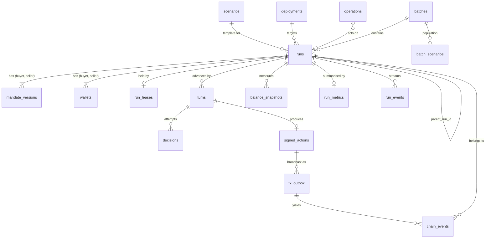

# Data Model

| | |
|---|---|
| **Version** | 0.1.0 |
| **Date** | 19 September 2026 |
| **Status** | Draft for build; Alembic migrations in `services/api/db/migrations/` are authoritative once they exist |
| **Source** | Spec sections 9.1, 9.3, 11.3 |
| **Related** | [protocol.md](protocol.md), [api_contract.md](api_contract.md), [architecture.md](architecture.md), [security_and_trust_boundaries.md](security_and_trust_boundaries.md) |

---

## 1. Principles

1. **The chain is canonical for economic facts.** Tables that mirror chain data carry `canonical` flags and block hashes so they can be invalidated and rebuilt. No table is proof of settlement on its own.
2. **Logical action identity is the EIP-712 digest, not the transaction hash.** A replaced gas transaction changes the hash, not the action.
3. **Private and public data are separate tables** with a documented classification so that export, SSE, and observation code can be reviewed for leakage table by table.
4. **Uniqueness constraints prevent double execution.** Duplicate action insertion and duplicate outbox submission are database errors, not application checks alone.
5. **Amounts are `NUMERIC(78,0)`.** Never float, never bigint (which overflows at 2^63).
6. **Enums are PostgreSQL enums** with values matching the API strings exactly.

## 2. Entity relationship diagram

## 3. Tables

Common columns unless stated: `id UUID PRIMARY KEY DEFAULT gen_random_uuid()`, `created_at TIMESTAMPTZ NOT NULL DEFAULT now()`, `updated_at TIMESTAMPTZ NOT NULL DEFAULT now()`.

### 3.1 `scenarios`

Loaded from `scenarios/*.json` at startup and upserted by `scenario_id`.

| Column | Type | Notes |
|---|---|---|
| `scenario_id` | `TEXT PK` | e.g. `default-overlap` |
| `name`, `description` | `TEXT` | |
| `public_config` | `JSONB` | base amount, max offers, durations, decimals |
| `buyer_template` | `JSONB` | initial balances, allowance, mandate (**private**) |
| `seller_template` | `JSONB` | same (**private**) |
| `source_hash` | `TEXT` | sha256 of the file |

### 3.2 `deployments`

One row per deployment manifest.

| Column | Type | Notes |
|---|---|---|
| `deployment_id` | `TEXT PK` | |
| `chain_id` | `BIGINT NOT NULL` | 31337 or 11155111 |
| `protocol_version` | `TEXT NOT NULL` | `1` |
| `exchange_address`, `base_token_address`, `quote_token_address`, `operator_address`, `relay_address` | `TEXT NOT NULL` | checksummed |
| `code_hashes` | `JSONB NOT NULL` | keccak of runtime bytecode per contract |
| `compiler` | `JSONB NOT NULL` | solc version, optimizer, runs, evm version |
| `explorer_base_url` | `TEXT NULL` | |
| `ens` | `JSONB NULL` | display names resolved once at deploy time: `{ "root": "…", "exchange": "…", "base_token": "…", "quote_token": "…", "resolved_at": "…" }`. Null where the chain has no ENS deployment or no names were registered. Never read by any identity check ([ADR-030](decision_log.md)) |
| `manifest` | `JSONB NOT NULL` | full manifest as written by the deploy script |
| `deployed_at` | `TIMESTAMPTZ NOT NULL` | |

Unique: `(chain_id, exchange_address)`.

### 3.3 `runs`

| Column | Type | Notes |
|---|---|---|
| `id` | `UUID PK` | `run_id` |
| `name` | `TEXT` | |
| `parent_run_id` | `UUID NULL FK runs` | set by clone |
| `batch_id` | `UUID NULL FK batches` | |
| `scenario_id` | `TEXT FK scenarios` | |
| `deployment_id` | `TEXT FK deployments` | |
| `public_config` | `JSONB NOT NULL` | the `public_config` block of the create request |
| `limits` | `JSONB NOT NULL` | call ceiling, spend ceiling, timeout, repair attempts |
| `buyer_policy`, `seller_policy` | `policy_kind NOT NULL` | |
| `buyer_model_id`, `seller_model_id` | `TEXT NULL` | |
| `buyer_effort`, `seller_effort` | `TEXT NULL` | |
| `policy_versions` | `JSONB` | reported by agent services at provisioning |
| `prompt_template_versions` | `JSONB` | |
| `software_version` | `TEXT NOT NULL` | `0.1.0+gitsha` |
| `state` | `run_state NOT NULL` | operational |
| `state_cause` | `TEXT NULL` | |
| `mode` | `run_mode NOT NULL DEFAULT 'live'` | `live` or `fixture` |
| `outcome_kind` | `outcome_kind NOT NULL DEFAULT 'pending'` | economic |
| `outcome_reason_code` | `SMALLINT NULL` | protocol code |
| `outcome_actor` | `party_or_operator NULL` | |
| `outcome_tx_hash` | `TEXT NULL` | terminal event tx |
| `session_id` | `TEXT NULL UNIQUE` | `0x` + 64 hex once prepared |
| `config_hash` | `TEXT NULL` | |
| `session_expires_at_ts` | `BIGINT NULL` | |
| `started_at`, `terminal_at` | `TIMESTAMPTZ NULL` | |

Indexes: `(state)`, `(batch_id)`, `(created_at DESC)`.

Constraint: `outcome_kind <> 'pending'` implies `state = 'terminal'` and `outcome_tx_hash IS NOT NULL` (except `failed_setup`). Enforced by a check constraint plus a repository-level test.

### 3.4 `mandate_versions` (**private**)

| Column | Type | Notes |
|---|---|---|
| `id` | `UUID PK` | `mandate_version_id` |
| `run_id` | `UUID FK runs` | |
| `party` | `party NOT NULL` | |
| `version` | `INTEGER NOT NULL` | 1 for a new run; clone increments from parent |
| `reservation_price_minor` | `NUMERIC(78,0) NOT NULL` | |
| `min_remaining_inventory_minor` | `NUMERIC(78,0) NOT NULL` | |
| `instructions` | `TEXT NOT NULL` | free-text strategy guidance |
| `extra` | `JSONB` | future fields, schema-validated |
| `mandate_hash` | `TEXT NOT NULL` | sha256 of canonical JSON, recorded in `decisions.observation_hash` inputs |

Unique: `(run_id, party)`. Rows are immutable after insert (trigger raises on `UPDATE`).

Storage is plaintext. Confidentiality comes from process isolation, the access rule below, and the classification in section 7, not from encryption at rest; the operator host is trusted. Column-level encryption was considered and declined for v0.1 ([ADR-031](decision_log.md)): encrypting the two `NUMERIC(78,0)` mandate fields makes them `BYTEA` and moves the feasible-interval and metrics computations out of SQL, while the decryption key would live in the same `.env` on the same host as the database, so it would defend only a stolen dump and would not touch the leakage threat that matters here.

Access: only the mandate repository used by provisioning, the observer route, the export route with `include_private`, and the metrics calculator may read this table. The observation builder imports the repository but is forbidden by an import-boundary test from touching the opponent's row; it is called with the acting party and receives only that row.

### 3.5 `wallets`

| Column | Type | Notes |
|---|---|---|
| `run_id` | `UUID FK runs` | |
| `party` | `party NOT NULL` | |
| `address` | `TEXT NOT NULL` | |
| `key_ref` | `TEXT NOT NULL` | `env:` or `keystore:` reference; **never the key** |
| `initial_base_minor`, `initial_quote_minor` | `NUMERIC(78,0)` | |
| `allowance_minor` | `NUMERIC(78,0)` | |
| `setup_nonce_next` | `BIGINT` | participant setup transaction nonce tracking |
| `funded_tx_hashes` | `JSONB` | mint and approve tx hashes |

Unique: `(run_id, party)`. Fresh wallets per run; addresses are never reused across runs.

### 3.6 `run_leases`

| Column | Type | Notes |
|---|---|---|
| `run_id` | `UUID PK FK runs` | |
| `holder` | `TEXT NOT NULL` | process instance id |
| `expires_at` | `TIMESTAMPTZ NOT NULL` | |
| `relay_nonce_next` | `BIGINT NOT NULL` | serialized relay nonce |

A partial unique index `ON run_leases ((true)) WHERE expires_at > now()` is not expressible; instead a single-row `active_run` table with `CHECK (id = 1)` holds the currently active `run_id`. Both together enforce one active run.

### 3.7 `turns`

| Column | Type | Notes |
|---|---|---|
| `id` | `UUID PK` | |
| `run_id` | `UUID FK runs` | |
| `turn` | `INTEGER NOT NULL` | 1-based |
| `party` | `party NOT NULL` | |
| `expected_sequence` | `BIGINT NOT NULL` | |
| `state` | `turn_state NOT NULL` | see architecture 6.2 |
| `observation` | `JSONB NOT NULL` | **private** (contains own mandate) |
| `observation_hash` | `TEXT NOT NULL` | sha256 of canonical JSON |
| `started_at`, `finished_at` | `TIMESTAMPTZ` | |
| `failure_code`, `failure_detail` | `TEXT NULL` | |

Unique: `(run_id, turn)`.

### 3.8 `decisions` (**private**)

| Column | Type | Notes |
|---|---|---|
| `id` | `UUID PK` | |
| `turn_id` | `UUID FK turns` | |
| `run_id` | `UUID FK runs` | denormalised for queries |
| `party` | `party NOT NULL` | |
| `attempt` | `SMALLINT NOT NULL` | 1 = first, 2 = repair |
| `policy` | `policy_kind NOT NULL` | |
| `model_id` | `TEXT NULL` | |
| `effort` | `TEXT NULL` | |
| `prompt_template_version` | `TEXT NULL` | |
| `request_hash` | `TEXT NULL` | sha256 of the outbound request body, for A12 audit |
| `raw_response` | `JSONB NOT NULL` | decision envelope as returned, or error text |
| `stop_reason` | `TEXT NULL` | `end_turn`, `refusal`, `max_tokens`, … |
| `validation_ok` | `BOOLEAN NOT NULL` | |
| `validation_code` | `TEXT NULL` | e.g. `below_reservation`, `stale_offer_hash`, `schema_error` |
| `validation_feedback` | `TEXT NULL` | the private feedback text sent back on repair |
| `usage` | `JSONB` | input, output, cache tokens |
| `cost_estimated_usd` | `NUMERIC(12,6) NULL` | from price table |
| `cost_reported_usd` | `NUMERIC(12,6) NULL` | if provider reports; else null, displayed as unknown |
| `latency_ms` | `INTEGER` | |
| `requested_at` | `TIMESTAMPTZ NOT NULL` | |
| `authorized` | `BOOLEAN NOT NULL DEFAULT false` | true only when this attempt became a signed action |

Unique: `(turn_id, attempt)`.

### 3.9 `signed_actions`

| Column | Type | Notes |
|---|---|---|
| `id` | `UUID PK` | |
| `run_id` | `UUID FK runs` | |
| `turn_id` | `UUID FK turns` | |
| `decision_id` | `UUID FK decisions` | the authorized attempt |
| `sequence` | `BIGINT NOT NULL` | |
| `kind` | `action_kind NOT NULL` | `offer`, `accept`, `close` |
| `typed_message` | `JSONB NOT NULL` | exact struct fields |
| `digest` | `TEXT NOT NULL` | EIP-712 digest |
| `signer` | `TEXT NOT NULL` | |
| `signature` | `TEXT NOT NULL` | |
| `status` | `action_status NOT NULL` | `signed`, `submitted`, `included`, `confirmed`, `finalized`, `reverted`, `superseded` |
| `revert_error` | `TEXT NULL` | decoded custom error name |

Unique: `(run_id, sequence)`, `(digest)`. The sequence uniqueness is what makes duplicate action insertion impossible.

### 3.10 `tx_outbox`

| Column | Type | Notes |
|---|---|---|
| `id` | `UUID PK` | |
| `run_id` | `UUID FK runs` | |
| `signed_action_id` | `UUID NULL FK signed_actions` | null for lifecycle txs (createSession, abort, expire, setup) |
| `kind` | `tx_kind NOT NULL` | `record_offer`, `accept_and_settle`, `close_session`, `expire_session`, `abort_session`, `create_session`, `mint`, `approve`, `fund_eth` |
| `sender` | `TEXT NOT NULL` | relay, operator, or participant address |
| `nonce` | `BIGINT NOT NULL` | |
| `raw_tx` | `BYTEA NOT NULL` | signed raw transaction |
| `tx_hash` | `TEXT NOT NULL` | hash of `raw_tx` |
| `replaces_id` | `UUID NULL FK tx_outbox` | gas replacement chain |
| `status` | `tx_status NOT NULL` | `pending`, `submitted`, `included`, `confirmed`, `finalized`, `reverted`, `replaced`, `dropped` |
| `attempts` | `INTEGER NOT NULL DEFAULT 0` | |
| `last_error` | `TEXT NULL` | |
| `block_number`, `block_hash` | `BIGINT`, `TEXT` | |
| `gas_used`, `effective_gas_price_wei` | `NUMERIC(78,0)` | |
| `submitted_at`, `included_at` | `TIMESTAMPTZ` | |

Unique: `(sender, nonce, tx_hash)`, `(tx_hash)`. A partial unique index `(signed_action_id) WHERE status NOT IN ('replaced','dropped','reverted')` guarantees at most one live transaction per signed action.

### 3.11 `chain_events`

| Column | Type | Notes |
|---|---|---|
| `id` | `UUID PK` | |
| `run_id` | `UUID NULL FK runs` | resolved via `session_id` |
| `chain_id` | `BIGINT NOT NULL` | |
| `contract_address` | `TEXT NOT NULL` | |
| `session_id` | `TEXT NULL` | |
| `block_number` | `BIGINT NOT NULL` | |
| `block_hash` | `TEXT NOT NULL` | |
| `tx_hash` | `TEXT NOT NULL` | |
| `log_index` | `INTEGER NOT NULL` | |
| `event_name` | `TEXT NOT NULL` | |
| `decoded` | `JSONB NOT NULL` | |
| `calldata` | `JSONB NULL` | `{ to, input, decoded_function, decoded_args }` stored once per tx |
| `canonical` | `BOOLEAN NOT NULL DEFAULT true` | |
| `invalidated_at` | `TIMESTAMPTZ NULL` | set on reorg |
| `confirmations_at_index` | `INTEGER` | |

Unique: `(block_hash, tx_hash, log_index)`. Note the key includes `block_hash`, so the same log re-indexed after a reorg in a different block is a new row and the old one is marked non-canonical.

### 3.12 `balance_snapshots`

| Column | Type | Notes |
|---|---|---|
| `run_id` | `UUID FK runs` | |
| `stage` | `snapshot_stage NOT NULL` | `pre_setup`, `post_setup`, `pre_settlement`, `post_settlement`, `terminal` |
| `party` | `party NOT NULL` | |
| `token` | `token_role NOT NULL` | `base`, `quote`, `eth` |
| `amount_minor` | `NUMERIC(78,0) NOT NULL` | |
| `block_number`, `block_hash` | `BIGINT`, `TEXT` | |
| `canonical` | `BOOLEAN NOT NULL DEFAULT true` | |

Unique: `(run_id, stage, party, token, block_hash)`.

### 3.13 `run_metrics`

One row per run, recomputed on every terminal transition and on demand.

| Column | Type | Notes |
|---|---|---|
| `run_id` | `UUID PK FK runs` | |
| `recorded_offers` | `INTEGER` | |
| `decision_time_ms`, `chain_wait_ms`, `setup_chain_wait_ms` | `BIGINT` | |
| `model_calls`, `input_tokens`, `output_tokens` | `INTEGER` | |
| `model_cost_estimated_usd`, `model_cost_reported_usd` | `NUMERIC(12,6) NULL` | |
| `gas_used_negotiation`, `gas_used_setup` | `NUMERIC(78,0)` | |
| `fee_wei_negotiation`, `fee_wei_setup` | `NUMERIC(78,0)` | |
| `settled_quote_minor` | `NUMERIC(78,0) NULL` | |
| `buyer_utility_minor`, `seller_utility_minor`, `captured_surplus_minor` | `NUMERIC(78,0) NULL` | **private** (needs mandates) |
| `feasible` | `BOOLEAN NULL` | **private** |
| `feasible_surplus_minor` | `NUMERIC(78,0) NULL` | **private** |
| `mandate_violations` | `INTEGER` | authorized actions outside mandate; target zero |
| `failure_class` | `TEXT NULL` | `model`, `signing`, `rpc`, `execution`, `none` |
| `audit_complete` | `BOOLEAN` | reconstruction matched projection |
| `computed_at` | `TIMESTAMPTZ` | |

### 3.14 `run_events`

The SSE log. Append-only.

| Column | Type | Notes |
|---|---|---|
| `run_id` | `UUID FK runs` | |
| `cursor` | `BIGINT NOT NULL` | per-run monotonic, from a per-run sequence |
| `event_type` | `TEXT NOT NULL` | |
| `data` | `JSONB NOT NULL` | already filtered to public content |
| `created_at` | `TIMESTAMPTZ` | |

Primary key `(run_id, cursor)`.

### 3.15 `operations`

| Column | Type | Notes |
|---|---|---|
| `id` | `UUID PK` | |
| `kind` | `TEXT NOT NULL` | |
| `run_id` | `UUID NULL FK runs` | |
| `batch_id` | `UUID NULL FK batches` | |
| `idempotency_key` | `TEXT NULL` | |
| `route` | `TEXT NOT NULL` | |
| `request_hash` | `TEXT NOT NULL` | |
| `status` | `operation_status NOT NULL` | |
| `result`, `error` | `JSONB NULL` | |

Unique: `(route, idempotency_key)`.

### 3.16 `batches` and `batch_scenarios`

`batches`: `id`, `name`, `population` (JSONB), `pairings` (TEXT[]), `repetitions`, `template_run` (JSONB), `status`, `report` (JSONB, **private** because it uses mandates).

`batch_scenarios`: `batch_id`, `index`, `feasible` (**private**), `buyer_mandate`, `seller_mandate` (**private**), `public_config`. Unique `(batch_id, index)`. Generated once from the seed so the population is reproducible.

## 4. Enumerations

| Enum | Values |
|---|---|
| `party` | `buyer`, `seller` |
| `party_or_operator` | `buyer`, `seller`, `operator`, `anyone` |
| `policy_kind` | `deterministic`, `model` |
| `run_mode` | `live`, `fixture` |
| `run_state` | `draft`, `validated`, `preparing`, `running`, `paused`, `recovery_required`, `terminal`, `failed_setup` |
| `outcome_kind` | `pending`, `settled`, `closed`, `expired`, `aborted` |
| `turn_state` | `observing`, `deciding`, `repairing`, `signing`, `broadcasting`, `confirming`, `confirmed`, `model_failed`, `execution_failed` |
| `action_kind` | `offer`, `accept`, `close` |
| `action_status` | `signed`, `submitted`, `included`, `confirmed`, `finalized`, `reverted`, `superseded` |
| `tx_kind` | `record_offer`, `accept_and_settle`, `close_session`, `expire_session`, `abort_session`, `create_session`, `mint`, `approve`, `fund_eth` |
| `tx_status` | `pending`, `submitted`, `included`, `confirmed`, `finalized`, `reverted`, `replaced`, `dropped` |
| `snapshot_stage` | `pre_setup`, `post_setup`, `pre_settlement`, `post_settlement`, `terminal` |
| `token_role` | `base`, `quote`, `eth` |
| `operation_status` | `pending`, `running`, `succeeded`, `failed` |

Reason codes are stored as `SMALLINT` and rendered to strings via the tables in [protocol.md](protocol.md) section 10.

## 5. Economic outcome derivation

`outcome_kind` and its reason are set only by the indexer from a canonical terminal event at the confirmation threshold:

| Terminal event | `outcome_kind` | `outcome_actor` | `outcome_reason_code` |
|---|---|---|---|
| `SettlementCompleted` | `settled` | accepting party | null |
| `SessionClosed` | `closed` | signing party | 1..3 |
| `SessionExpired` | `expired` | `anyone` | null |
| `SessionAborted` | `aborted` | `operator` | 1..4 |

A run in `recovery_required` or `failed_setup` keeps `outcome_kind = pending`. Model failure is recorded as `aborted` with reason 2 once the abort is canonical, and `run_metrics.failure_class = 'model'` distinguishes it from an operator request. An execution failure followed by abort is `aborted` with reason 4 and `failure_class = 'execution'`.

## 6. Invariants checked by tests

1. For every run with `outcome_kind = settled`, the two `Transfer` logs in `outcome_tx_hash` equal `public_config.base_amount_minor` and the accepted offer's `quoteAmount`, and `post_settlement` minus `pre_settlement` snapshots match exactly.
2. `signed_actions.sequence` for a run is contiguous from 1 with no gaps or duplicates among rows with status in `included`, `confirmed`, `finalized`.
3. Every `signed_actions` row has at most one `tx_outbox` row not in `replaced`, `dropped`, `reverted`.
4. Every `decisions` row with `authorized = true` has exactly one `signed_actions` row, and `validation_ok = true`.
5. No `run_events.data`, no `turns.observation` for party X, and no outbound request hash for party X contains any value from `mandate_versions` for the other party. Checked with a leakage scanner in the integration suite (A12).
6. `chain_events` with `canonical = false` are excluded from every projection query. Enforced by a repository method that always filters, with no raw query allowed elsewhere.
7. `runs.outcome_kind <> 'pending'` only when the terminal event's `chain_events` row is canonical with `confirmations_at_index >= threshold`.

## 7. Data classification

| Class | Tables or columns | Leaves the server via |
|---|---|---|
| **Public** | `runs` (except nothing; all columns public), `signed_actions`, `tx_outbox` (minus `raw_tx` bytes, which are public but large), `chain_events`, `balance_snapshots`, `run_events`, `operations`, `deployments`, `wallets.address` | `GET /runs/{id}`, SSE, default export |
| **Private experimental input** | `mandate_versions`, `scenarios.*_template`, `turns.observation`, `decisions.raw_response`, `decisions.validation_feedback`, `run_metrics` utility and feasibility columns, `batch_scenarios` mandates, `batches.report` | Only with `X-Observer-Reveal: true`; export with `include_private=true` |
| **Secret** | Private keys, keystore passwords, model API keys, agent shared secrets | Never stored in the database. `wallets.key_ref` is a reference, not a value. |

## 8. Migration policy

- Alembic, one migration per PR that touches the schema, autogenerate reviewed by hand.
- Enums are extended with `ALTER TYPE … ADD VALUE`; values are never removed in v0.x.
- Every migration has a downgrade.
- Immutable tables (`mandate_versions`, `signed_actions.typed_message`, `run_events`) have triggers that raise on `UPDATE` of protected columns.
- Migrations run automatically on backend start in the local profile and manually via the runbook on Sepolia hosts.
