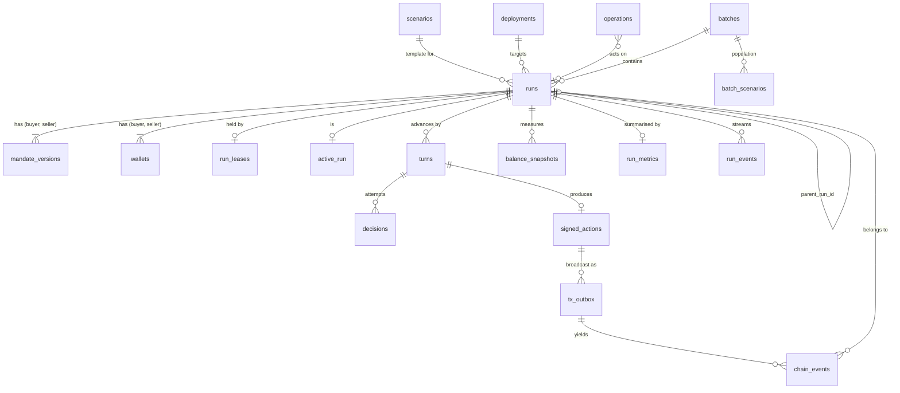

# Data Model

| | |
|---|---|
| **Version** | 0.1.0 |
| **Date** | 25 September 2026 |
| **Status** | Built in stage 2.1; migration 0002 added two `tx_outbox` columns in stage 2.3. The Alembic migrations in `services/api/src/api/db/migrations/` are authoritative, and this document is checked against them by `test_db_schema_matches_data_model.py` |
| **Source** | Spec sections 9.1, 9.3, 11.3 |
| **Related** | [protocol.md](protocol.md), [api_contract.md](api_contract.md), [architecture.md](architecture.md), [security_and_trust_boundaries.md](security_and_trust_boundaries.md) |

---

## 1. Principles

1. **The chain is canonical for economic facts.** Tables that mirror chain data carry `canonical` flags and block hashes so they can be invalidated and rebuilt. No table is proof of settlement on its own.
2. **Logical action identity is the EIP-712 digest, not the transaction hash.** A replaced gas transaction changes the hash, not the action.
3. **Private and public data are separate tables** with a documented classification so that export, SSE, and observation code can be reviewed for leakage table by table.
4. **Uniqueness constraints prevent double execution.** Duplicate action insertion and duplicate outbox submission are database errors, not application checks alone.
5. **Amounts are `NUMERIC(78,0)`.** Never float, never bigint (which overflows at 2^63).
6. **Enums are PostgreSQL enums** with values matching the API strings exactly.

## 2. Entity relationship diagram

```mermaid
erDiagram
    scenarios ||--o{ runs : "template for"
    deployments ||--o{ runs : "targets"
    runs ||--o| runs : "parent_run_id"
    runs ||--|{ mandate_versions : "has (buyer, seller)"
    runs ||--|{ wallets : "has (buyer, seller)"
    runs ||--o| run_leases : "held by"
    runs ||--o| active_run : "is"
    runs ||--o{ turns : "advances by"
    turns ||--o{ decisions : "attempts"
    turns ||--o| signed_actions : "produces"
    signed_actions ||--o{ tx_outbox : "broadcast as"
    tx_outbox ||--o{ chain_events : "yields"
    runs ||--o{ chain_events : "belongs to"
    runs ||--o{ balance_snapshots : "measures"
    runs ||--o| run_metrics : "summarised by"
    runs ||--o{ run_events : "streams"
    operations }o--o| runs : "acts on"
    batches ||--o{ runs : "contains"
    batches ||--o{ batch_scenarios : "population"
```

## 3. Tables

The schema is created by the Alembic migrations in `services/api/src/api/db/migrations/`, which are
authoritative. This section is checked against them: `test_db_schema_matches_data_model.py`
transcribes every table below — column names, types, nullability, unique and check constraints —
and compares the transcription with a freshly migrated database, so a column added to one and not
the other fails the build.

**Common columns.** Every table has `created_at TIMESTAMPTZ NOT NULL DEFAULT now()` and
`updated_at TIMESTAMPTZ NOT NULL DEFAULT now()`, except `run_events`, which is append-only and has
`created_at` alone. A table whose primary key is stated below has no `id`; every other table has
`id UUID PRIMARY KEY DEFAULT gen_random_uuid()`. The common columns are not repeated in the tables.

**Notation.** A type followed by `NOT NULL` is required; `NULL` means nullable. `FK t` is a foreign
key to table `t`'s primary key. Amounts are `NUMERIC(78,0)` and every one that cannot be negative
carries a `CHECK (column >= 0)`, named `ck_<table>_<column>_non_negative`. Constraint names follow
one convention — `uq_<table>_<columns>`, `ck_<table>_<name>`, `fk_<table>_<column>_<referred>` — so
an error from the database names the rule it enforced.

### 3.1 `scenarios`

Loaded from `scenarios/*.json` at startup and upserted by `scenario_id`.

| Column | Type | Notes |
|---|---|---|
| `scenario_id` | `TEXT PK` | e.g. `default-overlap` |
| `name` | `TEXT NOT NULL` | |
| `description` | `TEXT NOT NULL` | |
| `public_config` | `JSONB NOT NULL` | base amount, max offers, durations, decimals |
| `buyer_template` | `JSONB NOT NULL` | initial balances, allowance, mandate (**private**) |
| `seller_template` | `JSONB NOT NULL` | same (**private**) |
| `source_hash` | `TEXT NOT NULL` | sha256 of the file |

### 3.2 `deployments`

One row per deployment manifest.

| Column | Type | Notes |
|---|---|---|
| `deployment_id` | `TEXT PK` | |
| `chain_id` | `BIGINT NOT NULL` | 31337 or 11155111 |
| `protocol_version` | `TEXT NOT NULL` | `1` |
| `exchange_address`, `base_token_address`, `quote_token_address`, `operator_address`, `relay_address` | `TEXT NOT NULL` | checksummed |
| `code_hashes` | `JSONB NOT NULL` | keccak of runtime bytecode per contract |
| `compiler` | `JSONB NOT NULL` | solc version, optimizer, runs, evm version |
| `explorer_base_url` | `TEXT NULL` | |
| `ens` | `JSONB NULL` | display names resolved once at deploy time: `{ "root": "…", "exchange": "…", "base_token": "…", "quote_token": "…", "resolved_at": "…" }`. Null where the chain has no ENS deployment or no names were registered. Never read by any identity check ([ADR-030](decision_log.md)) |
| `manifest` | `JSONB NOT NULL` | full manifest as written by the deploy script |
| `start_block` | `BIGINT NOT NULL` | earliest block that can hold an event from this deployment; the indexer and the reconstruction tool scan from here. `CHECK >= 0` |
| `deployed_at` | `TIMESTAMPTZ NOT NULL` | rendered from the manifest's `deployed_at_ts` |

Unique: `(chain_id, exchange_address)`.

The manifest file is written by `contracts/script/Deploy.s.sol`, lives at
`docs/deployments/<deployment_id>.json`, and validates against
`packages/protocol/schemas/deployment_manifest.v1.json`. Three of its fields do not map one-to-one
onto the columns above, and [ADR-038](decision_log.md) has the reasoning:

- **`deployed_at_ts`, integer chain seconds**, is what the file records; `deployed_at` above is
  rendered from it. Chain time is authoritative everywhere else in this system
  ([protocol.md](protocol.md) section 6), and a manifest carrying the deploying machine's clock
  would be the one place it was not.
- **`start_block` is a lower bound**, not the deployment block. A `forge script` simulates against
  the current head and broadcasts afterwards, so the figure it can state is the head before the
  deployment transactions land. That is what a log scan needs; naming it `deployed_at_block` would
  have claimed a precision it does not have.
- **`explorer_base_url` and `ens` are written as explicit JSON `null`** when absent, never omitted.
  A consumer that reads a missing key as null cannot tell "this chain has no explorer" from "an
  older script did not write this field".

`manifest_version` versions the file's shape independently of `protocol_version`, because a new
optional manifest field is not a new protocol. Local manifests are git-ignored; Sepolia manifests
are committed.

### 3.3 `runs`

| Column | Type | Notes |
|---|---|---|
| `id` | `UUID PK` | `run_id` |
| `name` | `TEXT NOT NULL` | |
| `parent_run_id` | `UUID NULL FK runs` | set by clone |
| `batch_id` | `UUID NULL FK batches` | |
| `scenario_id` | `TEXT NULL FK scenarios` | null for a run not built from a scenario file; the export's `reproducibility.scenario_id` is nullable for the same reason |
| `deployment_id` | `TEXT NOT NULL FK deployments` | |
| `public_config` | `JSONB NOT NULL` | the `public_config` block of the create request |
| `limits` | `JSONB NOT NULL` | call ceiling, spend ceiling, timeout, repair attempts |
| `buyer_policy`, `seller_policy` | `policy_kind NOT NULL` | |
| `buyer_model_id`, `seller_model_id` | `TEXT NULL` | |
| `buyer_effort`, `seller_effort` | `TEXT NULL` | |
| `policy_versions` | `JSONB NOT NULL DEFAULT '{}'` | reported by agent services at provisioning |
| `prompt_template_versions` | `JSONB NOT NULL DEFAULT '{}'` | |
| `software_version` | `TEXT NOT NULL` | `0.1.0+gitsha` |
| `state` | `run_state NOT NULL` | operational |
| `state_cause` | `TEXT NULL` | |
| `mode` | `run_mode NOT NULL DEFAULT 'live'` | `live` or `fixture` |
| `outcome_kind` | `outcome_kind NOT NULL DEFAULT 'pending'` | economic |
| `outcome_reason_code` | `SMALLINT NULL` | protocol code |
| `outcome_actor` | `party_or_operator NULL` | |
| `outcome_tx_hash` | `TEXT NULL` | terminal event tx |
| `session_id` | `TEXT NULL UNIQUE` | `0x` + 64 hex once prepared |
| `config_hash` | `TEXT NULL` | |
| `session_expires_at_ts` | `BIGINT NULL` | `CHECK >= 0` |
| `started_at`, `terminal_at` | `TIMESTAMPTZ NULL` | |

Indexes: `(state)`, `(batch_id)`, `(created_at DESC)`.

Three check constraints make section 5 a property of the table rather than of the code that writes
it:

| Constraint | Rule |
|---|---|
| `ck_runs_outcome_requires_terminal_event` | `outcome_kind <> 'pending'` implies `state` is `terminal` or `failed_setup` and `outcome_tx_hash IS NOT NULL`. `failed_setup` is allowed because a session opened during setup and then refused by an agent is aborted, and that run's setup failed |
| `ck_runs_outcome_reason_matches_kind` | `pending`, `settled` and `expired` carry no reason code; `closed` carries 1 to 3; `aborted` carries 1 to 4 |
| `ck_runs_outcome_actor_matches_kind` | `pending` has no actor; `settled` and `closed` a party; `expired` `anyone`; `aborted` `operator` |

Each clause tests `IS NOT NULL` before it compares. That is not redundant: a CHECK is satisfied when
its expression is NULL, and `'closed' AND NULL BETWEEN 1 AND 3` is NULL, so the first version of
these constraints accepted a closed outcome with no reason code and any outcome with no actor. The
constraint tests found it.

### 3.4 `mandate_versions` (**private**)

| Column | Type | Notes |
|---|---|---|
| `id` | `UUID PK` | `mandate_version_id` |
| `run_id` | `UUID NOT NULL FK runs` | |
| `party` | `party NOT NULL` | |
| `version` | `INTEGER NOT NULL` | 1 for a new run; clone increments from parent. `CHECK >= 1` |
| `reservation_price_minor` | `NUMERIC(78,0) NOT NULL` | |
| `min_remaining_inventory_minor` | `NUMERIC(78,0) NOT NULL` | the least the party keeps, after settlement, of the token it gives up: base for the seller, quote for the buyer ([ADR-045](decision_log.md)) |
| `instructions` | `TEXT NOT NULL` | free-text strategy guidance |
| `extra` | `JSONB NOT NULL DEFAULT '{}'` | reserved for future fields, and **empty**: `mandate.v1.json` sets `additionalProperties: false`, because `observation.v1.json` embeds the mandate by `$ref` and an open object here would be an unconstrained payload inside the agent's allowlist. `CHECK (extra = '{}'::jsonb)` says the same thing in the database. Adding a field is a schema change, which is the point of the slot |
| `mandate_hash` | `TEXT NOT NULL` | `0x` + sha256 of the mandate's canonical JSON (`negotiation_protocol.json_sha256`), recorded in `decisions.observation_hash` inputs |

Unique: `(run_id, party)`. Rows are immutable after insert: a trigger refuses `UPDATE` and `DELETE`.

Storage is plaintext. Confidentiality comes from process isolation, the access rule below, and the classification in section 7, not from encryption at rest; the operator host is trusted. Column-level encryption was considered and declined for v0.1 ([ADR-031](decision_log.md)): encrypting the two `NUMERIC(78,0)` mandate fields makes them `BYTEA` and moves the feasible-interval and metrics computations out of SQL, while the decryption key would live in the same `.env` on the same host as the database, so it would defend only a stolen dump and would not touch the leakage threat that matters here.

Access: only the mandate repository used by provisioning, the observer route, the export route with `include_private`, and the metrics calculator may read this table. The observation builder imports the repository but is forbidden by an import-boundary test from touching the opponent's row; it is called with the acting party and receives only that row.

### 3.5 `wallets`

A run's two participant wallets. Each address is **derived per run inside that party's agent
service** from the instance's root secret, the chain ID, the role and the run ID
([ADR-039](decision_log.md)); the backend learns it from the provisioning response. This table holds
the address and how it was derived, and never a key of either kind.

| Column | Type | Notes |
|---|---|---|
| `run_id` | `UUID NOT NULL FK runs` | |
| `party` | `party NOT NULL` | |
| `address` | `TEXT NOT NULL UNIQUE` | checksummed. Unique across the whole table: an address is never reused across runs, and this is what makes that a database error |
| `key_ref` | `TEXT NOT NULL` | the agent instance's **root** reference, `env:` or `keystore:`; **never a key**. `CHECK (key_ref ~ '^(env\|keystore):.+')`, so a hex key pasted here by mistake is refused rather than stored |
| `key_derivation` | `JSONB NOT NULL` | the derivation metadata ADR-039 requires: `{ "scheme": "agent-negotiation-sandbox/participant-key/v1", "chain_id": 31337, "role": "buyer", "run_id": "…" }`. Public inputs only |
| `initial_base_minor`, `initial_quote_minor` | `NUMERIC(78,0) NOT NULL` | |
| `allowance_minor` | `NUMERIC(78,0) NOT NULL` | |
| `setup_nonce_next` | `BIGINT NOT NULL DEFAULT 0` | participant setup transaction nonce tracking; a freshly derived wallet starts at 0 |
| `funded_tx_hashes` | `JSONB NOT NULL DEFAULT '{}'` | mint, fund and approve tx hashes, by label |

Unique: `(run_id, party)`, `(address)`.

### 3.6 `run_leases` and `active_run`

`run_leases`:

| Column | Type | Notes |
|---|---|---|
| `run_id` | `UUID PK FK runs` | |
| `holder` | `TEXT NOT NULL` | process instance id |
| `expires_at` | `TIMESTAMPTZ NOT NULL` | |
| `relay_nonce_next` | `BIGINT NOT NULL` | serialized relay nonce. `CHECK >= 0` |

A partial unique index `ON run_leases ((true)) WHERE expires_at > now()` is not expressible, because
`now()` is not immutable. Instead a single-row `active_run` table holds the currently active run:

| Column | Type | Notes |
|---|---|---|
| `id` | `SMALLINT PK` | `CHECK (id = 1)`, which is what makes it a single row |
| `run_id` | `UUID NOT NULL UNIQUE FK runs` | |

Both together enforce one active run ([ADR-019](decision_log.md)): `active_run` says which run may
touch the chain, and the lease says which process is driving it, and expires, so a crashed process's
run can be reclaimed on restart (A13). The relay nonce is taken from the lease in one statement —
the larger of the stored value and the chain's pending nonce, then advanced — so only the holder can
take one and no two callers can take the same one.

### 3.7 `turns`

| Column | Type | Notes |
|---|---|---|
| `run_id` | `UUID NOT NULL FK runs` | |
| `turn` | `INTEGER NOT NULL` | 1-based. `CHECK >= 1` |
| `party` | `party NOT NULL` | |
| `expected_sequence` | `BIGINT NOT NULL` | `CHECK >= 1` |
| `state` | `turn_state NOT NULL` | see architecture 6.2 |
| `observation` | `JSONB NOT NULL` | **private** (contains own mandate) |
| `observation_hash` | `TEXT NOT NULL` | `0x` + sha256 of canonical JSON |
| `started_at` | `TIMESTAMPTZ NOT NULL DEFAULT now()` | |
| `finished_at` | `TIMESTAMPTZ NULL` | |
| `failure_code`, `failure_detail` | `TEXT NULL` | |

Unique: `(run_id, turn)`.

### 3.8 `decisions` (**private**)

| Column | Type | Notes |
|---|---|---|
| `turn_id` | `UUID NOT NULL FK turns` | |
| `run_id` | `UUID NOT NULL FK runs` | denormalised for queries |
| `party` | `party NOT NULL` | |
| `attempt` | `SMALLINT NOT NULL` | 1 = first, 2 = repair. `CHECK >= 1` |
| `policy` | `policy_kind NOT NULL` | |
| `model_id` | `TEXT NULL` | |
| `effort` | `TEXT NULL` | |
| `prompt_template_version` | `TEXT NULL` | |
| `request_hash` | `TEXT NULL` | sha256 of the outbound request body, for A12 audit |
| `raw_response` | `JSONB NOT NULL` | decision envelope as returned, or error text |
| `stop_reason` | `TEXT NULL` | `end_turn`, `refusal`, `max_tokens`, … |
| `validation_ok` | `BOOLEAN NOT NULL` | |
| `validation_code` | `TEXT NULL` | one of the closed set in [protocol.md](protocol.md) section 11.1, e.g. `below_reservation`, `stale_offer_hash`, `schema_error`; null when the attempt passed |
| `validation_feedback` | `TEXT NULL` | the private feedback text sent back on repair |
| `usage` | `JSONB NULL` | input, output, cache tokens |
| `cost_estimated_usd` | `NUMERIC(12,6) NULL` | from price table |
| `cost_reported_usd` | `NUMERIC(12,6) NULL` | if provider reports; else null, displayed as unknown |
| `latency_ms` | `INTEGER NULL` | `CHECK >= 0` |
| `requested_at` | `TIMESTAMPTZ NOT NULL` | |
| `authorized` | `BOOLEAN NOT NULL DEFAULT false` | true only when this attempt became a signed action. `CHECK (NOT authorized OR validation_ok)`: an attempt that failed validation can never be the one that authorised an action (invariant 4) |

Unique: `(turn_id, attempt)`. Index: `(run_id)`.

### 3.9 `signed_actions`

| Column | Type | Notes |
|---|---|---|
| `run_id` | `UUID NOT NULL FK runs` | |
| `turn_id` | `UUID NOT NULL FK turns` | |
| `decision_id` | `UUID NOT NULL FK decisions` | the authorized attempt |
| `sequence` | `BIGINT NOT NULL` | `CHECK >= 1` |
| `kind` | `action_kind NOT NULL` | `offer`, `accept`, `close` |
| `typed_message` | `JSONB NOT NULL` | exact struct fields |
| `digest` | `TEXT NOT NULL` | EIP-712 digest |
| `signer` | `TEXT NOT NULL` | |
| `signature` | `TEXT NOT NULL` | |
| `status` | `action_status NOT NULL` | `signed`, `submitted`, `included`, `confirmed`, `finalized`, `reverted`, `superseded` |
| `revert_error` | `TEXT NULL` | decoded custom error name |

Unique: `(run_id, sequence)`, `(digest)`, `(decision_id)`, `(turn_id)`. The sequence uniqueness is
what makes duplicate action insertion impossible; the last two say a decision authorises at most one
action and a turn produces at most one (invariant 4, and the `turns ||--o| signed_actions` edge in
section 2). A trigger refuses any `UPDATE` that changes a column identifying the action — `run_id`,
`turn_id`, `decision_id`, `sequence`, `kind`, `typed_message`, `digest`, `signer`, `signature` — so
only `status` and `revert_error` move.

### 3.10 `tx_outbox`

| Column | Type | Notes |
|---|---|---|
| `run_id` | `UUID NOT NULL FK runs` | |
| `signed_action_id` | `UUID NULL FK signed_actions` | null for lifecycle txs (createSession, abort, expire, setup) |
| `kind` | `tx_kind NOT NULL` | `record_offer`, `accept_and_settle`, `close_session`, `expire_session`, `abort_session`, `create_session`, `mint`, `approve`, `fund_eth` |
| `sender` | `TEXT NOT NULL` | relay, operator, or participant address |
| `nonce` | `BIGINT NOT NULL` | `CHECK >= 0` |
| `raw_tx` | `BYTEA NOT NULL` | signed raw transaction |
| `tx_hash` | `TEXT NOT NULL` | hash of `raw_tx` |
| `replaces_id` | `UUID NULL FK tx_outbox` | gas replacement chain |
| `status` | `tx_status NOT NULL` | `pending`, `submitted`, `included`, `confirmed`, `finalized`, `reverted`, `replaced`, `dropped` |
| `attempts` | `INTEGER NOT NULL DEFAULT 0` | `CHECK >= 0` |
| `last_error` | `TEXT NULL` | |
| `block_number` | `BIGINT NULL` | `CHECK >= 0` |
| `block_hash` | `TEXT NULL` | |
| `gas_used`, `effective_gas_price_wei` | `NUMERIC(78,0) NULL` | |
| `submitted_at`, `included_at` | `TIMESTAMPTZ NULL` | |
| `submitted_block` | `BIGINT NULL` | the chain head when the transaction was first broadcast; the relay's replacement trigger counts blocks from it ([ADR-050](decision_log.md)). `CHECK >= 0`. Migration 0002 |
| `sentence` | `TEXT NULL` | an execution failure's timeline sentence, rendered once when the indexer records the status-0 receipt; the decoded error name is `last_error` ([ADR-051](decision_log.md)). Migration 0002 |

Unique: `(sender, nonce, tx_hash)`, `(tx_hash)`. A partial unique index `(signed_action_id) WHERE status NOT IN ('replaced','dropped','reverted')` guarantees at most one live transaction per signed action; a gas replacement marks the original `replaced` before its successor is inserted, so the two are never live together. If the original is mined after all, the indexer drops the successor first and then records the original `included`. A transaction that reverted and is then removed by a reorg goes back to `submitted` with its `last_error` and `sentence` cleared, and its signed action back to `submitted` with no `revert_error`: they were facts about the removed block. Indexes: `(run_id)`, `(status)`.

### 3.11 `chain_events`

| Column | Type | Notes |
|---|---|---|
| `run_id` | `UUID NULL FK runs` | resolved via `session_id` |
| `chain_id` | `BIGINT NOT NULL` | |
| `contract_address` | `TEXT NOT NULL` | |
| `session_id` | `TEXT NULL` | |
| `block_number` | `BIGINT NOT NULL` | `CHECK >= 0` |
| `block_hash` | `TEXT NOT NULL` | |
| `tx_hash` | `TEXT NOT NULL` | |
| `log_index` | `INTEGER NOT NULL` | `CHECK >= 0` |
| `event_name` | `TEXT NOT NULL` | |
| `decoded` | `JSONB NOT NULL` | |
| `calldata` | `JSONB NULL` | `{ to, input, decoded_function, decoded_args }` stored once per tx |
| `canonical` | `BOOLEAN NOT NULL DEFAULT true` | |
| `invalidated_at` | `TIMESTAMPTZ NULL` | set on reorg |
| `confirmations_at_index` | `INTEGER NULL` | `CHECK >= 0` |
| `sentence` | `TEXT NULL` | the timeline sentence, rendered once when the event is indexed and stored, so the live view, replay and export tell the same story ([ADR-024](decision_log.md), [api_contract.md](api_contract.md) section 4). The indexer renders it with the projection's renderer, which it is handed by the composition root; null for `SessionOpened`, which is not a timeline entry, and for an event whose session's opening the indexer never saw |

Unique: `(block_hash, tx_hash, log_index)`. Note the key includes `block_hash`, so the same log re-indexed after a reorg in a different block is a new row and the old one is marked non-canonical. The same log seen again in the *same* block — a reorg that flipped back, a rewind that should not have happened — is the same row, made canonical again ([ADR-055](decision_log.md)); a rewind invalidates exactly the rows whose block hash the chain no longer has. `CHECK (canonical = (invalidated_at IS NULL))`: a row is canonical exactly when it has not been invalidated. A trigger refuses any `UPDATE` of the columns that are the evidence — `chain_id`, `contract_address`, `block_number`, `block_hash`, `tx_hash`, `log_index`, `event_name`, `decoded`. Indexes: `(run_id)`, `(session_id)`.

### 3.12 `balance_snapshots`

| Column | Type | Notes |
|---|---|---|
| `run_id` | `UUID NOT NULL FK runs` | |
| `stage` | `snapshot_stage NOT NULL` | `pre_setup`, `post_setup`, `pre_settlement`, `post_settlement`, `terminal` |
| `party` | `party NOT NULL` | |
| `token` | `token_role NOT NULL` | `base`, `quote`, `eth` |
| `amount_minor` | `NUMERIC(78,0) NOT NULL` | `CHECK >= 0` |
| `block_number` | `BIGINT NOT NULL` | `CHECK >= 0` |
| `block_hash` | `TEXT NOT NULL` | |
| `canonical` | `BOOLEAN NOT NULL DEFAULT true` | |

Unique: `(run_id, stage, party, token, block_hash)`.

The indexer takes the stages that follow a terminal event when that event reaches the run's
confirmation threshold, reading each party's base, quote and ETH balance at a block: `terminal` at
the terminal event's block for every outcome, and for a settlement also `post_settlement` at the
settlement block and `pre_settlement` at the block before it, so the difference between the two is
exactly the settlement's effect. A reorg invalidates every snapshot in a block the chain no longer
has; one at a block the reorg did not reach stays canonical, and one whose block comes back is made
canonical again ([ADR-055](decision_log.md)). `pre_setup` and `post_setup` are the
controller's, in stage 2.4.

### 3.13 `run_metrics`

One row per run, recomputed on every terminal transition and on demand.

| Column | Type | Notes |
|---|---|---|
| `run_id` | `UUID PK FK runs` | |
| `recorded_offers` | `INTEGER NOT NULL DEFAULT 0` | |
| `decision_time_ms`, `chain_wait_ms`, `setup_chain_wait_ms` | `BIGINT NOT NULL DEFAULT 0` | |
| `model_calls`, `input_tokens`, `output_tokens` | `INTEGER NOT NULL DEFAULT 0` | |
| `model_cost_estimated_usd`, `model_cost_reported_usd` | `NUMERIC(12,6) NULL` | |
| `gas_used_negotiation`, `gas_used_setup` | `NUMERIC(78,0) NOT NULL DEFAULT 0` | |
| `fee_wei_negotiation`, `fee_wei_setup` | `NUMERIC(78,0) NOT NULL DEFAULT 0` | |
| `settled_quote_minor` | `NUMERIC(78,0) NULL` | |
| `buyer_utility_minor`, `seller_utility_minor`, `captured_surplus_minor` | `NUMERIC(78,0) NULL` | **private** (needs mandates). Signed: a utility is negative after a mandate violation, so these carry no non-negative check |
| `feasible` | `BOOLEAN NULL` | **private** |
| `feasible_surplus_minor` | `NUMERIC(78,0) NULL` | **private**; signed, for the same reason |
| `mandate_violations` | `INTEGER NOT NULL DEFAULT 0` | authorized actions outside mandate; target zero |
| `failure_class` | `TEXT NULL` | `model`, `signing`, `rpc`, `execution`, `none`; `CHECK` refuses any other value |
| `audit_complete` | `BOOLEAN NOT NULL DEFAULT false` | reconstruction matched projection |
| `computed_at` | `TIMESTAMPTZ NOT NULL` | |

The counters carry non-negative checks.

Stage 2.5 adds, by migration and to the table above when it lands ([ADR-061](decision_log.md)):
`rpc_requests INTEGER NOT NULL DEFAULT 0` (`CHECK >= 0`), `rpc_requests_by_method JSONB NOT NULL
DEFAULT '{}'`, and `rpc_cost_estimated_usd NUMERIC(12,6) NULL` — the chain adapter's request counts
for the run, priced from the operator-maintained RPC price table. There is no reported column: no
provider reports a per-request cost, and a null estimate is displayed as unknown, never zero.

### 3.14 `run_events`

The SSE log. Append-only: a trigger refuses `UPDATE` and `DELETE`. The controller appends most of it (stage 2.4); the indexer appends `chain.reorg` itself, in the same transaction as the rewind it describes, so a reorg is never lost with a process ([ADR-058](decision_log.md)).

| Column | Type | Notes |
|---|---|---|
| `run_id` | `UUID NOT NULL FK runs` | |
| `cursor` | `BIGINT NOT NULL` | per-run monotonic and gapless, from 1. `CHECK >= 1`. Assigned as one more than the run's highest, with the run's row locked `FOR NO KEY UPDATE` so two appends cannot take the same cursor |
| `event_type` | `TEXT NOT NULL` | |
| `data` | `JSONB NOT NULL` | already filtered to public content |

Primary key `(run_id, cursor)`. `created_at` only; there is no `updated_at` on an append-only table.

### 3.15 `operations`

| Column | Type | Notes |
|---|---|---|
| `kind` | `TEXT NOT NULL` | |
| `run_id` | `UUID NULL FK runs` | |
| `batch_id` | `UUID NULL FK batches` | |
| `idempotency_key` | `TEXT NULL` | |
| `route` | `TEXT NOT NULL` | |
| `request_hash` | `TEXT NOT NULL` | |
| `status` | `operation_status NOT NULL` | |
| `result`, `error` | `JSONB NULL` | |

Unique: `(route, idempotency_key)`. Index: `(run_id)`.

### 3.16 `batches` and `batch_scenarios`

Populated by the evaluator in stage 6. The tables exist from the first migration because
`runs.batch_id` and `operations.batch_id` refer to `batches`.

`batches`:

| Column | Type | Notes |
|---|---|---|
| `name` | `TEXT NOT NULL` | |
| `population` | `JSONB NOT NULL` | |
| `pairings` | `TEXT[] NOT NULL` | |
| `repetitions` | `INTEGER NOT NULL` | `CHECK >= 0` |
| `template_run` | `JSONB NOT NULL` | |
| `status` | `TEXT NOT NULL` | its values are stage 6's to define |
| `report` | `JSONB NULL` | **private**, because it uses mandates |

`batch_scenarios`:

| Column | Type | Notes |
|---|---|---|
| `batch_id` | `UUID NOT NULL FK batches` | |
| `index` | `INTEGER NOT NULL` | `CHECK >= 0` |
| `feasible` | `BOOLEAN NOT NULL` | **private** |
| `buyer_mandate`, `seller_mandate` | `JSONB NOT NULL` | **private** |
| `public_config` | `JSONB NOT NULL` | |

Unique `(batch_id, index)`. Generated once from the seed so the population is reproducible.

## 4. Enumerations

| Enum | Values |
|---|---|
| `party` | `buyer`, `seller` |
| `party_or_operator` | `buyer`, `seller`, `operator`, `anyone` |
| `policy_kind` | `deterministic`, `model` |
| `run_mode` | `live`, `fixture` |
| `run_state` | `draft`, `validated`, `preparing`, `running`, `paused`, `recovery_required`, `terminal`, `failed_setup` |
| `outcome_kind` | `pending`, `settled`, `closed`, `expired`, `aborted` |
| `turn_state` | `observing`, `deciding`, `repairing`, `signing`, `broadcasting`, `confirming`, `confirmed`, `model_failed`, `execution_failed` |
| `action_kind` | `offer`, `accept`, `close` |
| `action_status` | `signed`, `submitted`, `included`, `confirmed`, `finalized`, `reverted`, `superseded` |
| `tx_kind` | `record_offer`, `accept_and_settle`, `close_session`, `expire_session`, `abort_session`, `create_session`, `mint`, `approve`, `fund_eth` |
| `tx_status` | `pending`, `submitted`, `included`, `confirmed`, `finalized`, `reverted`, `replaced`, `dropped` |
| `snapshot_stage` | `pre_setup`, `post_setup`, `pre_settlement`, `post_settlement`, `terminal` |
| `token_role` | `base`, `quote`, `eth` |
| `operation_status` | `pending`, `running`, `succeeded`, `failed` |

Reason codes are stored as `SMALLINT` and rendered to strings via the tables in [protocol.md](protocol.md) section 10.

## 5. Economic outcome derivation

`outcome_kind` and its reason are set only from a canonical terminal event at the run's confirmation threshold. Three modules share the work ([ADR-052](decision_log.md)): the indexer confirms the terminal event at the threshold, snapshots the balances at its block and, for a settlement, verifies the receipt ([architecture.md](architecture.md) section 5.3); the projection derives the outcome below from canonical events; and the controller records it, with the run state it chooses — `terminal`, or `failed_setup` for a session aborted during setup — because the check constraints of section 3.3 couple the two:

| Terminal event | `outcome_kind` | `outcome_actor` | `outcome_reason_code` |
|---|---|---|---|
| `SettlementCompleted` | `settled` | accepting party | null |
| `SessionClosed` | `closed` | signing party | 1..3 |
| `SessionExpired` | `expired` | `anyone` | null |
| `SessionAborted` | `aborted` | `operator` | 1..4 |

A run in `recovery_required` or `failed_setup` keeps `outcome_kind = pending`. Model failure is recorded as `aborted` with reason 2 once the abort is canonical, and `run_metrics.failure_class = 'model'` distinguishes it from an operator request. An execution failure followed by abort is `aborted` with reason 4 and `failure_class = 'execution'`.

## 6. Invariants checked by tests

1. For every run with `outcome_kind = settled`, the two `Transfer` logs in `outcome_tx_hash` equal `public_config.base_amount_minor` and the accepted offer's `quoteAmount`, and `post_settlement` minus `pre_settlement` snapshots match exactly.
2. `signed_actions.sequence` for a run is contiguous from 1 with no gaps or duplicates among rows with status in `included`, `confirmed`, `finalized`.
3. Every `signed_actions` row has at most one `tx_outbox` row not in `replaced`, `dropped`, `reverted`.
4. Every `decisions` row with `authorized = true` has exactly one `signed_actions` row, and `validation_ok = true`.
5. No `run_events.data`, no `turns.observation` for party X, and no outbound request hash for party X contains any value from `mandate_versions` for the other party. Checked with a leakage scanner in the integration suite (A12).
6. `chain_events` with `canonical = false` are excluded from every projection query. Enforced by a repository method that always filters, with no raw query allowed elsewhere.
7. `runs.outcome_kind <> 'pending'` only when the terminal event's `chain_events` row is canonical with `confirmations_at_index >= threshold`. The indexer keeps `confirmations_at_index` current for every event above the finalized head ([ADR-053](decision_log.md)), so the comparison is with the event's depth, not its depth when first seen.

## 7. Data classification

| Class | Tables or columns | Leaves the server via |
|---|---|---|
| **Public** | `runs` (except nothing; all columns public), `signed_actions`, `tx_outbox` (minus `raw_tx` bytes, which are public but large), `chain_events`, `balance_snapshots`, `run_events`, `operations`, `deployments`, `wallets.address` | `GET /runs/{id}`, SSE, default export |
| **Private experimental input** | `mandate_versions`, `scenarios.*_template`, `turns.observation`, `decisions.raw_response`, `decisions.validation_feedback`, `run_metrics` utility and feasibility columns, `batch_scenarios` mandates, `batches.report` | Only with `X-Observer-Reveal: true`; export with `include_private=true` |
| **Secret** | Private keys, keystore passwords, model API keys, agent shared secrets | Never stored in the database. `wallets.key_ref` is a reference, not a value. |

## 8. Migration policy

- Alembic, one migration per PR that touches the schema, autogenerate reviewed by hand. Migrations live in `services/api/src/api/db/migrations/versions/`, inside the package that runs them, and are applied with `python -m api.db.migrate upgrade` ([runbook.md](runbook.md) section 2).
- Enums are extended with `ALTER TYPE … ADD VALUE`; values are never removed in v0.x.
- Every migration has a downgrade, and the downgrade is tested: `downgrade base` must leave no table, enum type or function behind.
- A migration imports nothing from the application. It describes the schema as it was when it was written; importing today's column types would let a later change rewrite history.
- Every constraint and index name in a migration is wrapped in `op.f()`. Inside a migration Alembic applies the metadata's naming convention to explicit names too, and the check-constraint convention embeds the constraint's own name, so a bare `name="ck_runs_x"` is created as `ck_runs_ck_runs_x`. Autogenerate cannot see that, because it does not compare check constraints; the constraint tests, which assert each refusal by name, did.
- Immutability is enforced by triggers that raise SQLSTATE `23001` (`restrict_violation`), which the repositories translate into `ImmutableRowError`:

  | Trigger | Table | Refuses |
  |---|---|---|
  | `mandate_versions_immutable` | `mandate_versions` | every `UPDATE` and `DELETE` |
  | `run_events_append_only` | `run_events` | every `UPDATE` and `DELETE` |
  | `signed_actions_identity_immutable` | `signed_actions` | an `UPDATE` of any column but `status` and `revert_error` |
  | `chain_events_evidence_immutable` | `chain_events` | an `UPDATE` of the evidence columns listed in section 3.11 |

  `TRUNCATE` fires none of them, which is what lets the test suite start each test from an empty schema without switching the protections off.
- Migrations run automatically on backend start in the local profile and manually via the runbook on Sepolia hosts.
