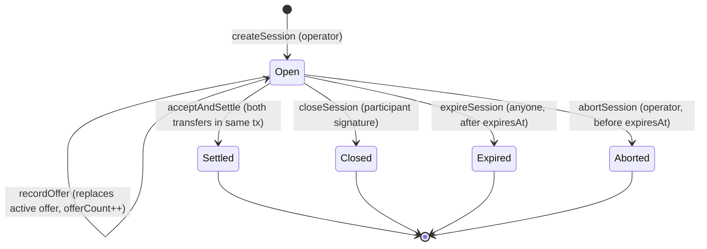

# Negotiation Protocol Specification

| | |
|---|---|
| **Version** | 1 (EIP-712 domain version `1`) |
| **Status** | Normative for v0.1 |
| **Source** | Spec sections 5.4, 6, 7, 8 |
| **Audience** | Contract, backend, and agent-service implementers; anyone reconstructing a run from chain data |

This document is the single source of truth for everything three languages must agree on: typed messages, hashing, sequence rules, contract interface, state machine, events, and reason codes. `packages/protocol/` holds the machine-readable versions (JSON schemas, ABI artifacts, fixtures) generated from or checked against this document.

Field names below are canonical. Python uses them in snake_case, TypeScript in camelCase, Solidity as written. The mapping is mechanical and is enforced by a fixture test in `packages/protocol/`.

---

## 1. Actors and roles

| Actor | Key | May sign | May call |
|---|---|---|---|
| **Buyer** | Fresh test wallet per run | Offer, Accept, Close | ERC-20 `approve` during setup only |
| **Seller** | Fresh test wallet per run | Offer, Accept, Close | ERC-20 `approve` during setup only |
| **Operator** | Private operator key | Nothing typed | `createSession`, `abortSession`, mock-token `mint` |
| **Relay** | Gas-paying key | Nothing | `recordOffer`, `acceptAndSettle`, `closeSession`, `expireSession` (any address may call these) |

The relay cannot create a participant signature. A third party submitting a valid signed action produces the identical result or reverts.

## 2. Tokens

Two mock ERC-20 tokens deployed from OpenZeppelin `ERC20`, 6 decimals each, with `mint(address,uint256)` restricted to the operator. No minting inside settlement. Rebasing, fee-on-transfer, and callback-bearing behavior is out of scope; the exchange assumes ordinary transfer semantics and uses `SafeERC20`.

| Symbol | Role in exchange | Constructor-fixed address in `NegotiationExchange` |
|---|---|---|
| `mASSET` | `baseToken`, fixed quantity, seller to buyer | yes |
| `mUSD` | `quoteToken`, negotiated amount, buyer to seller | yes |

All amounts are integers in minor units. Off-chain they are base-10 integer strings in JSON, `NUMERIC(78,0)` in PostgreSQL, and `uint256` on-chain.

## 3. Session configuration and `configHash`

```solidity
struct SessionConfig {
    bytes32 sessionId;   // fresh random identifier; never reused
    address buyer;
    address seller;
    uint256 baseAmount;  // mASSET minor units
    uint64  expiresAt;   // Unix seconds
    uint16  maxOffers;   // 1..32 inclusive
}
```

`createSession` requires: `buyer != seller`, both nonzero, `baseAmount > 0`, `expiresAt > block.timestamp`, `1 <= maxOffers <= 32`, and `sessionId` not previously used.

```text
configHash = keccak256(abi.encode(
    sessionId, buyer, seller,
    baseToken, quoteToken,
    baseAmount, expiresAt, maxOffers
))
```

Types are exactly `bytes32, address, address, address, address, uint256, uint64, uint16`, ABI-encoded (each padded to 32 bytes). Never string concatenation, never JSON hashing. The two token addresses come from the exchange's immutables, not from the caller.

Each agent service recomputes `configHash` from its own approved run configuration and refuses to sign if the on-chain `SessionOpened` event does not match.

## 4. EIP-712 domain and typed messages

Domain:

| Field | Value |
|---|---|
| `name` | `AgentNegotiationSandbox` |
| `version` | `1` |
| `chainId` | actual chain ID (31337 or 11155111) |
| `verifyingContract` | deployed `NegotiationExchange` address |

Canonical type strings (byte-exact):

```text
Offer(bytes32 sessionId,bytes32 configHash,uint64 sequence,address proposer,uint256 quoteAmount,uint64 validUntil)
Accept(bytes32 sessionId,bytes32 configHash,uint64 sequence,address actor,bytes32 offerHash)
Close(bytes32 sessionId,bytes32 configHash,uint64 sequence,address actor,uint8 reason)
```

Digest: `keccak256("\x19\x01" || domainSeparator || hashStruct(message))` per EIP-712, computed with OpenZeppelin `EIP712._hashTypedDataV4`.

`offerHash` in `Accept` is the full digest of the recorded Offer, including domain. Linking Accept to the Offer digest means both signatures authorize exactly the same trade, chain, and contract.

EIP-712 alone does not prevent replay. Replay protection comes from: unique `sessionId`, strictly increasing `sequence`, `configHash` binding, the active-offer digest check, and persistent terminal status.

Private reservation prices, prompts, mandates, and explanations never appear in any typed message.

## 5. Sequence and turn rules

Session state holds `sequence` (last consumed, starts at 0), `offerCount` (starts at 0), and the active offer.

1. The buyer has the first turn. The initial Offer has `sequence = 1`.
2. Every participant-signed action (Offer, Accept, Close) must carry `sequence == stored sequence + 1`. On success the contract stores it.
3. **Next proposer rule:** if no offer has ever been recorded, only the buyer may offer. Otherwise only the counterparty of the most recent recorded offer's proposer may offer or accept. This holds even when that offer has expired.
4. Either participant may Close while the session is Open, regardless of turn.
5. A new Offer replaces the active offer. The replaced digest becomes permanently unexecutable.
6. Accept must reference the active offer's digest, the active offer must be unexpired, and the actor must be the counterparty of its proposer. Self-acceptance is invalid.
7. `offerCount` increments per recorded Offer; `recordOffer` reverts when `offerCount == maxOffers`. Accept and Close remain allowed.
8. Accept consumes a sequence, marks the session Settled, and executes both transfers in the same transaction.
9. Settlement, participant Close, expiry, or operator abort is terminal. No further action of any kind succeeds.

Operator abort and public expiry are lifecycle actions. They do not carry a participant signature and do not increment `sequence`.

## 6. Time rules

- Offer: signer sets `validUntil = min(latestChainTimestamp + offerLifetime, session.expiresAt)`.
- `recordOffer` requires `block.timestamp < validUntil` and `validUntil <= expiresAt`.
- `acceptAndSettle` requires `block.timestamp < activeOffer.validUntil`.
- All participant actions require `block.timestamp < expiresAt`.
- After `expiresAt`, only `expireSession` succeeds, even if stored status is still Open. `closeSession` and `abortSession` revert with `SessionDeadlinePassed`.
- Chain timestamps are authoritative. Anvil time may be advanced in tests; Sepolia tests use real time.

## 7. Contract state machine



```solidity
enum Status { None, Open, Settled, Closed, Expired, Aborted }
```

`None` is the default for an unknown `sessionId`. The application tracks its own operational states separately; see [architecture.md](architecture.md) section 6.

## 8. Contract interface

```solidity
struct Offer  { bytes32 sessionId; bytes32 configHash; uint64 sequence; address proposer; uint256 quoteAmount; uint64 validUntil; }
struct Accept { bytes32 sessionId; bytes32 configHash; uint64 sequence; address actor; bytes32 offerHash; }
struct Close  { bytes32 sessionId; bytes32 configHash; uint64 sequence; address actor; uint8 reason; }

struct SessionState {
    SessionConfig config;
    bytes32 configHash;
    Status  status;
    uint64  sequence;         // last consumed
    uint16  offerCount;
    bytes32 activeOfferHash;  // zero when none
    address activeProposer;
    uint256 activeQuoteAmount;
    uint64  activeValidUntil;
    uint64  activeSequence;
}

function createSession(SessionConfig calldata config) external;                     // onlyOperator
function recordOffer(Offer calldata offer, bytes calldata signature) external;       // anyone
function acceptAndSettle(Accept calldata acceptance, bytes calldata signature) external; // anyone, nonReentrant
function closeSession(Close calldata closure, bytes calldata signature) external;    // anyone
function expireSession(bytes32 sessionId) external;                                  // anyone, after deadline
function abortSession(bytes32 sessionId, uint8 reason) external;                     // onlyOperator
function getSession(bytes32 sessionId) external view returns (SessionState memory);
function hashOffer(Offer calldata offer) external view returns (bytes32);            // digest helper
function hashAccept(Accept calldata a) external view returns (bytes32);
function hashClose(Close calldata c) external view returns (bytes32);
function baseToken() external view returns (address);   // immutable
function quoteToken() external view returns (address);  // immutable
function operator() external view returns (address);    // immutable
```

The contract is non-upgradeable, has no owner-transfer, no pause, no arbitrary token or target parameters, no callbacks, and no permit path.

### 8.1 Verification order for signed actions

Every signed entry point, in order:

1. Load session; require `status == Open`.
2. Require `block.timestamp < expiresAt` (else revert `SessionDeadlinePassed`).
3. Require `message.configHash == stored configHash`.
4. Require `message.sequence == stored sequence + 1`.
5. Compute digest; recover signer with `ECDSA.recover`; require signer equals the message's `proposer` or `actor`.
6. Require that address is `buyer` or `seller`.
7. Action-specific checks (below).
8. Effects (status, sequence, active offer) before any external call.
9. External token calls (settlement only).
10. Emit events.

### 8.2 Action-specific checks

`recordOffer`
- `proposer` equals the next proposer per rule 5.3.
- `offerCount < maxOffers`.
- `quoteAmount > 0`.
- `block.timestamp < validUntil && validUntil <= expiresAt`.
- Effects: store digest, proposer, amount, validUntil, sequence; `offerCount++`; `sequence = message.sequence`.

`acceptAndSettle`
- `activeOfferHash != 0` and `offerHash == activeOfferHash`.
- `block.timestamp < activeValidUntil`.
- `actor != activeProposer` and `actor` is the other participant.
- Effects: `status = Settled`, `sequence = message.sequence`, zero the active offer.
- Transfers: `quoteToken.safeTransferFrom(buyer, seller, activeQuoteAmount)`, then `baseToken.safeTransferFrom(seller, buyer, baseAmount)`. Any failure reverts the whole transaction.

`closeSession`
- `reason` in `{1,2,3}`.
- Effects: `status = Closed`, `sequence = message.sequence`.

`expireSession`
- `status == Open` and `block.timestamp >= expiresAt`.
- Effects: `status = Expired`.

`abortSession`
- Caller is operator; `status == Open`; `block.timestamp < expiresAt`; `reason` in `{1,2,3,4}`.
- Effects: `status = Aborted`.

### 8.3 Custom errors

| Error | Raised when |
|---|---|
| `NotOperator()` | Non-operator calls an operator function |
| `SessionExists()` | `sessionId` already used |
| `InvalidParties()` | zero or equal buyer and seller |
| `InvalidBaseAmount()` | `baseAmount == 0` |
| `InvalidExpiry()` | `expiresAt <= block.timestamp` at creation |
| `InvalidMaxOffers()` | outside 1..32 |
| `SessionNotOpen(uint8 status)` | any action on a non-Open session |
| `SessionDeadlinePassed()` | participant action, close, or abort at or after `expiresAt` |
| `SessionNotExpired()` | `expireSession` before `expiresAt` |
| `ConfigHashMismatch()` | message `configHash` differs from stored |
| `SequenceMismatch(uint64 expected, uint64 actual)` | wrong sequence |
| `BadSignature()` | recovered signer differs from message actor |
| `NotParticipant(address)` | signer is neither buyer nor seller |
| `NotProposerTurn(address expected)` | wrong side offers |
| `OfferLimitReached(uint16 maxOffers)` | `offerCount == maxOffers` |
| `InvalidQuoteAmount()` | `quoteAmount == 0` |
| `InvalidValidUntil()` | `validUntil` violates time rules |
| `NoActiveOffer()` | accept with no active offer |
| `StaleOfferDigest(bytes32 active, bytes32 given)` | accept references a replaced offer |
| `OfferExpired()` | accept after `activeValidUntil` |
| `SelfAcceptance()` | proposer accepts own offer |
| `InvalidReason(uint8)` | undefined close or abort code |

Errors are part of the protocol so the indexer can decode reverts uniformly.

## 9. Events

| Event | Fields |
|---|---|
| `SessionOpened` | `bytes32 indexed sessionId, address indexed buyer, address indexed seller, address baseToken, address quoteToken, uint256 baseAmount, uint64 expiresAt, uint16 maxOffers, bytes32 configHash` |
| `OfferRecorded` | `bytes32 indexed sessionId, uint64 sequence, address indexed proposer, uint256 quoteAmount, uint64 validUntil, bytes32 offerHash` |
| `AcceptanceRecorded` | `bytes32 indexed sessionId, uint64 sequence, address indexed actor, bytes32 offerHash` |
| `SettlementCompleted` | `bytes32 indexed sessionId, address buyer, address seller, address baseToken, uint256 baseAmount, address quoteToken, uint256 quoteAmount, bytes32 offerHash` |
| `SessionClosed` | `bytes32 indexed sessionId, uint64 sequence, address indexed actor, uint8 reason` |
| `SessionExpired` | `bytes32 indexed sessionId, uint64 expiresAt` |
| `SessionAborted` | `bytes32 indexed sessionId, address indexed operator, uint8 reason` |

`AcceptanceRecorded` and `SettlementCompleted` are emitted in the same transaction, after both transfers. A reverted transaction emits nothing and is shown as an execution failure.

Signatures are recoverable from transaction calldata. The indexer stores calldata (or a decoded copy) so the full negotiation is reconstructible without the application database (acceptance A15).

## 10. Reason codes

Participant close codes (signed in `Close.reason`, also the `walk_away.reason` string in agent output):

| Code | String | Meaning (agent's statement, not verified fact) |
|---|---|---|
| 1 | `terms_unacceptable` | Agent judges the terms outside what it will accept |
| 2 | `inventory_constraint` | Agent cites its inventory floor or balance |
| 3 | `no_further_concession` | Agent will not move further |

Operator abort codes (`abortSession.reason`):

| Code | String | Meaning |
|---|---|---|
| 1 | `operator_request` | Operator pressed Abort |
| 2 | `model_failure` | Model exhausted repair or timed out or refused |
| 3 | `budget_exhausted` | Model-call or spend ceiling reached |
| 4 | `execution_failure` | Settlement or other required transaction reverted and cannot proceed |

Undefined codes revert. Finer-grained causes live in the run record, not on-chain.

## 11. Agent decision schema

The model returns a single JSON object. Structural validation is the schema below; economic validation is the policy signer's job.

```json
{
  "decision": { "action": "offer", "quote_amount_minor": "94000000" },
  "explanation": "Opening below my limit to leave room."
}
```

`decision` is exactly one of:

```json
{ "action": "offer",     "quote_amount_minor": "<base-10 integer string>" }
{ "action": "accept",    "offer_hash": "<0x + 64 hex>" }
{ "action": "walk_away", "reason": "terms_unacceptable" | "inventory_constraint" | "no_further_concession" }
```

Rules:
- `additionalProperties: false` at every level. Extra fields reject.
- `quote_amount_minor` matches `^[1-9][0-9]{0,77}$` (positive, no leading zeros, fits `uint256`).
- `offer_hash` must equal the active offer digest in the observation, else the decision is invalid.
- `explanation` is optional, at most 280 characters, operator-facing only, never sent to the counterparty, never on-chain, and labelled as a self-report.
- The controller supplies `sessionId`, `configHash`, `sequence`, actor address, and `validUntil` from validated state. The model cannot set them.

The JSON schema is `packages/protocol/schemas/agent_decision.v1.json`.

## 12. Observation schema (allowlist)

The only data a policy receives. Anything not listed here is forbidden (acceptance A12).

```json
{
  "schema_version": "1",
  "run_id": "uuid",
  "role": "buyer" | "seller",
  "my_address": "0x…",
  "session": {
    "session_id": "0x…", "config_hash": "0x…", "chain_id": 31337,
    "exchange_address": "0x…", "base_token": "0x…", "quote_token": "0x…",
    "base_amount_minor": "10000000", "expires_at": 1758300000, "max_offers": 8,
    "token_decimals": 6
  },
  "chain_time": 1758298800,
  "expected_sequence": 3,
  "offers_remaining_for_me": 3,
  "active_offer": { "offer_hash": "0x…", "proposer": "buyer", "quote_amount_minor": "94000000", "valid_until": 1758299400, "sequence": 2 } | null,
  "history": [ { "sequence": 1, "actor": "buyer", "kind": "offer", "quote_amount_minor": "92000000", "valid_until": 1758299300, "offer_hash": "0x…", "status": "replaced" } ],
  "my_balances": { "base_minor": "0", "quote_minor": "250000000" },
  "my_previous_decisions": [ { "turn": 1, "decision": { "action": "offer", "quote_amount_minor": "92000000" }, "result": "recorded" } ],
  "mandate": { "…private, own side only…" }
}
```

`history` contains only confirmed on-chain actions. `my_previous_decisions` includes the agent's own rejected attempts and their private validation feedback; the counterparty's rejected attempts never appear anywhere in this structure. The `mandate` object is the agent's own; its schema is in [data_model.md](data_model.md).

The JSON schema is `packages/protocol/schemas/observation.v1.json`.

## 13. Deterministic baseline policy

Normative restatement of spec 11.1 for implementers. `R` is the party's reservation bound in minor units.

- Opportunities: buyer `n = ceil(maxOffers / 2)`, seller `n = floor(maxOffers / 2)`.
- Anchor: buyer `0.8 * R`, seller `1.2 * R`.
- On an incoming valid active offer within own bound (buyer: `quote <= R`; seller: `quote >= R`): **accept**. Acceptance does not consume an opportunity.
- Otherwise, with own offer index `k` (0-based) and `n > 1`: `price = anchor + (R - anchor) * k / (n - 1)`. Buyer rounds down, seller rounds up, to whole minor units. With `n == 1`: offer `R`. Preserve `price >= 1`.
- Clamp this policy's output to its own bound. Never clamp a model output.
- With zero remaining opportunities and no acceptable incoming offer, or when offering is illegal: **walk_away** with `no_further_concession` (or `terms_unacceptable` when an incoming offer exists and is outside bound and no opportunities remain).

The policy is a baseline for comparison, not a claim of optimality.

## 14. Reconstruction procedure (A15)

Given only chain access and the deployment manifest:

1. Filter `SessionOpened` for the `sessionId`; verify `configHash` by recomputing section 3.
2. Collect all `OfferRecorded`, `AcceptanceRecorded`, `SettlementCompleted`, `SessionClosed`, `SessionExpired`, `SessionAborted` for that session in canonical block order.
3. For each, fetch the transaction, decode calldata against the ABI, recover the signer from the signature and digest, and confirm it matches the event actor.
4. Rebuild the sequence chain; verify strictly increasing and contiguous.
5. Read ERC-20 `Transfer` events in the settlement transaction; verify amounts equal `activeQuoteAmount` and `baseAmount`.
6. Compare balances at the block before `SessionOpened` and after the terminal event.

A script implementing this lives in `packages/protocol/tools/reconstruct.py` and is run as part of acceptance.

## 15. Versioning

- EIP-712 domain `version` and this document's version change together. Any change to a type string, `configHash` encoding, reason code, or event field is a protocol version bump and a new deployment.
- JSON schemas carry `schema_version`. Additive optional fields in observation are minor; anything else is major.
- The deployment manifest records the protocol version alongside addresses and code hashes.
