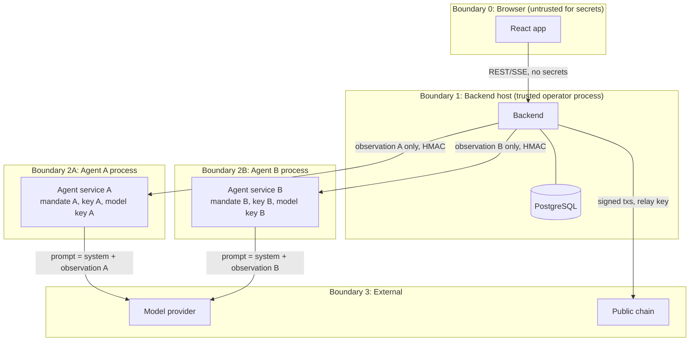

# Security and Trust Boundaries

| | |
|---|---|
| **Version** | 0.1.0 |
| **Date** | 19 September 2026 |
| **Status** | Draft for build |
| **Source** | Spec sections 4.2, 4.3, 5, 7, 8 |
| **Related** | [architecture.md](architecture.md), [protocol.md](protocol.md), [data_model.md](data_model.md), [test_strategy.md](test_strategy.md) |

This is an experiment on a testnet with manufactured assets. The purpose of this document is not production hardening. It is to make every trust assumption explicit so that the demo's claims are honest and the information boundary between agents is verifiable.

---

## 1. What is being protected

| Asset | Why it matters | Class |
|---|---|---|
| Agent A's mandate | Leakage to B invalidates claim 1 of the PRD | Private experimental input |
| Agent B's mandate | Same | Private experimental input |
| Participant private keys | An offer signature is real authority to trade while active | Secret |
| Operator private key | Can create and abort sessions | Secret |
| Relay private key | Pays gas; cannot sign trades | Secret |
| Model API credentials | Spend | Secret |
| Agent internal API shared secrets | Would let a caller feed forged observations or extract signatures | Secret |
| Canonical chain record | The evidence | Public, integrity-critical |
| Database projection | Convenience copy of the evidence | Public, rebuildable |

## 2. Trust boundaries

| Boundary | What crosses it | What must never cross it |
|---|---|---|
| 0 → 1 | Run configuration including mandates at creation time; control actions; observer reveal requests | Keys, credentials |
| 1 → 0 | Public run state, SSE, exports; private views only with `X-Observer-Reveal` | Keys, credentials, the opponent's data inside an agent panel |
| 1 → 2A | Mandate A once at provisioning; observation A per turn; session approval data; release | Mandate B, B's decisions or feedback, any key, RPC access, database access |
| 2A → 1 | Signed action, decision records, failure codes | Model credentials, private key |
| 2A → 3 | System prompt plus observation A | Anything about B beyond public chain state; credentials other than the API key header |
| 1 → 3 | Raw signed transactions; RPC reads | Mandates, model outputs |

Boundaries 2A and 2B are **process and credential isolation on a host the operator controls**. They are not an adversarial separation between independent parties. The runbook and UI say so.

## 3. Information boundary between agents

The mechanism is structural:

1. **Allowlisted observation schema.** The observation is built from a Pydantic model with `extra="forbid"`. Only fields in [protocol.md](protocol.md) section 12 exist. The observation builder takes the acting party and can only load that party's mandate.
2. **Separate processes and credentials.** Each agent service instance is provisioned with one mandate and one key. It has no database URL and no RPC URL in its environment.
3. **No tools.** The model call has no tool definitions. The agent service exposes no filesystem, browser, shell, HTTP, SQL, or contract-call capability to the model.
4. **Private feedback stays private.** Validation feedback is returned to the backend as a decision record and stored in `decisions`. It is never placed in the counterparty's observation, SSE, or default export.
5. **Outbound-context assertion.** Before every model request, the agent service scans the serialized request for a denylist compiled at provisioning: the opponent's address is allowed (public), but any string equal to a private mandate value not its own, any key material pattern, and any credential pattern aborts the call. The backend performs the same scan on the observation it sends. Both are tested in A12.
6. **Explanations are self-reports.** The optional `explanation` field is shown to the operator, labelled, and never sent to the counterparty.

Inference from bargaining behavior is not prevented and is disclosed: public balances and allowances reveal capacity, and offers reveal preference.

## 4. Authority model

| Authority | Held by | Enforced by |
|---|---|---|
| Decide offer, accept, or walk away | Policy (model or deterministic) | Policy signer restricts to legal, in-mandate actions |
| Sign a typed message | Policy signer with the party key | Constructs the message itself from validated state; never signs model-supplied bytes |
| Create a session | Operator key | `onlyOperator` in the contract; addresses fixed by deployment |
| Abort a session | Operator key | `onlyOperator`, only while Open and before deadline |
| Submit a signed action | Anyone (relay in practice) | Contract verifies signer and role; submitter gains nothing |
| Record expiry | Anyone | Contract checks deadline |
| Move tokens | Contract only, inside `acceptAndSettle` | Finite allowances to the exchange address only; two mocks with ordinary semantics |
| Mint mock tokens | Operator | Restricted mint; excluded from negotiation outcomes |

The policy signer validates the **complete trade** before signing an offer, because an active offer is authority for the counterparty to execute it. Validation repeats on accept. The contract re-checks balances implicitly via `transferFrom` and reverts both legs on failure.

## 5. Threat model (in scope for v0.1)

| Threat | Vector | Control | Verified by |
|---|---|---|---|
| Mandate leakage | Observation builder bug, prompt template bug, log line, SSE, export default | Allowlist schema, denylist scan, log redaction, classification table, default export excludes private | A12, leakage scanner, export snapshot test |
| Model redirects settlement | Model output includes addresses or amounts for other tokens | Decision schema has no such fields; signer builds message from state; contract has no target parameters | Schema tests, A04 |
| Silent price alteration | Controller "fixes" an out-of-bound quote | Never clamp model output; deterministic policy clamps only itself | A04, code review checklist |
| Replay of a signed action | Resubmit an old Offer or Accept | Sequence, `sessionId`, `configHash`, active-digest check, terminal status | A05, A06, fuzz |
| Cross-chain or cross-contract replay | Same signature on another deployment | EIP-712 domain binds chainId and contract | A07 |
| Wrong participant or self-acceptance | Signature from a third key or the proposer | Role check against session config | A08 |
| Stale acceptance after counter | Accept references replaced digest | `StaleOfferDigest` | A05 |
| Double settlement | Duplicate `acceptAndSettle` | Terminal status set before transfers; reentrancy guard | A06, A10 |
| Partial settlement | Second transfer fails | Single transaction; `SafeERC20`; whole revert | A10 |
| Front-running submission | Third party submits the signed action first | Identical result or revert; submitter gets nothing | Contract test |
| Abort racing settlement | Operator abort and accept in the same block window | Canonical order decides; abort cannot reverse Settled | A11, integration |
| Duplicate broadcast after crash | Restart rebroadcasts an already-mined tx | Outbox with nonce and hash; receipt lookup before rebroadcast | A13 |
| Reorg shows false success | Included event later removed | Block-hash tracking, canonical flag, projection rebuild, pause | A14 |
| Forged observation to an agent | Attacker on the container network calls the internal API | HMAC with per-instance secret; network only reachable from backend | Integration test with bad HMAC |
| Key exfiltration via logs or export | Key in env dumped by a debug log | Redaction filter; keys loaded into a `KeyHolder` that exposes only `sign()`; `key_ref` stored, not key | Log scanner test |
| Model spend runaway | Loop bug | Per-run call ceiling and spend ceiling checked before each call; SDK retries disabled | Unit tests on `BudgetGuard` |
| Unlimited allowance | Setup approves max uint | Finite allowances equal to initial inventory; approve only the exchange | Setup test |

## 6. Out of scope for v0.1 (disclosed, not mitigated)

- Adversarial separation between the operators of A and B.
- Compromise of the host running all services.
- Production key custody, HSMs, or MPC.
- Denial of service against the backend.
- Sybil or collusion attacks; there are exactly two known parties.
- Legal enforceability of on-chain records.
- Data retention beyond the exports the operator keeps.

## 7. Secrets handling

| Secret | Where it lives | How it is loaded | Rotation |
|---|---|---|---|
| Participant keys (local) | `.env` (git-ignored), generated per run by a script | `env:` key ref into `KeyHolder` | New wallets every run |
| Participant keys (Sepolia) | Encrypted web3 keystore JSON in `infra/secrets/` (git-ignored), password in env **[assumption]** | `keystore:` key ref | New wallets every run |
| Operator key | `.env` or keystore | Backend only | Per deployment |
| Relay key | `.env` or keystore | Backend only | Per deployment; fund with test ETH only |
| Model API key | `.env` for each agent instance, separately | `anthropic` SDK from env | Operator-managed |
| Agent shared secrets | `.env`, one per instance | HMAC verification | Per deployment |
| Database URL | `.env` | Backend only | |

Rules: `.env.example` documents every variable with placeholder values only. A pre-commit hook and CI grep reject hex private keys, `sk-ant-` prefixes, and keystore JSON. The logger's redaction filter runs on every record. No secret is ever an argument in a URL.

## 8. Remote demonstration checklist

Development binds to localhost. Before exposing the UI or backend beyond the host:

1. Set `OPERATOR_TOKEN` and require it on every route except health.
2. Terminate TLS in front of the backend (reverse proxy).
3. Keep agent services on the internal network only.
4. Confirm the observer reveal routes are logged and that the audience view is a separate browser session without the token if the presenter wants a clean public view.
5. Confirm test-ETH balances are small; the relay key should hold only what the demo needs.

## 9. Disclosure statements

The following sentences appear in the UI, the export disclaimer, and the runbook:

- "All balances are test assets. All scenario economics are simulated."
- "The operator controls both agents and can create or abort sessions. This is process isolation for an experiment, not independent counterparties."
- "Decisions shown as live were generated by the configured model during this run. Decisions shown as replay were recorded earlier. Runs marked fixture used a deterministic policy, not a model."
- "Invalid model responses shown in the private view were never authorized offers."
- "On-chain records establish recorded commitments and transfers under the network's rules. They do not establish truthful external claims or legal enforceability. Public testnets may be reset."
