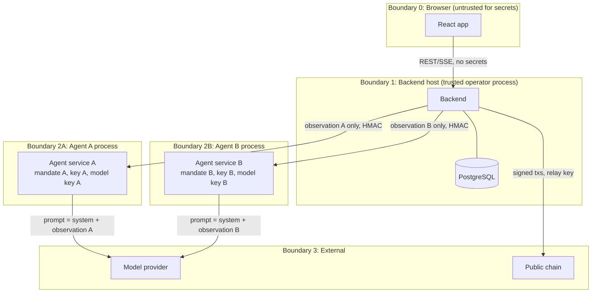

# Security and Trust Boundaries

| | |
|---|---|
| **Version** | 0.1.0 |
| **Date** | 19 September 2026 |
| **Status** | Draft for build |
| **Source** | Spec sections 4.2, 4.3, 5, 7, 8 |
| **Related** | [architecture.md](architecture.md), [protocol.md](protocol.md), [data_model.md](data_model.md), [test_strategy.md](test_strategy.md) |

This is an experiment on a testnet with manufactured assets. The purpose of this document is not production hardening. It is to make every trust assumption explicit so that the demo's claims are honest and the information boundary between agents is verifiable.

---

## 1. What is being protected

| Asset | Why it matters | Class |
|---|---|---|
| Agent A's mandate | Leakage to B invalidates claim 1 of the PRD | Private experimental input |
| Agent B's mandate | Same | Private experimental input |
| Participant private keys | An offer signature is real authority to trade while active | Secret |
| Operator private key | Can create and abort sessions | Secret |
| Relay private key | Pays gas; cannot sign trades | Secret |
| Model API credentials | Spend | Secret |
| Agent internal API shared secrets | Would let a caller feed forged observations or extract signatures | Secret |
| Canonical chain record | The evidence | Public, integrity-critical |
| Database projection | Convenience copy of the evidence | Public, rebuildable |

## 2. Trust boundaries

```mermaid
flowchart TB
    subgraph B0["Boundary 0: Browser (untrusted for secrets)"]
        UI[React app]
    end
    subgraph B1["Boundary 1: Backend host (trusted operator process)"]
        API[Backend]
        DB[(PostgreSQL)]
    end
    subgraph B2A["Boundary 2A: Agent A process"]
        A[Agent service A<br/>mandate A, key A, model key A]
    end
    subgraph B2B["Boundary 2B: Agent B process"]
        B[Agent service B<br/>mandate B, key B, model key B]
    end
    subgraph B3["Boundary 3: External"]
        LLM[Model provider]
        CHAIN[Public chain]
    end
    UI -->|REST/SSE, no secrets| API
    API -->|observation A only, HMAC| A
    API -->|observation B only, HMAC| B
    A -->|prompt = system + observation A| LLM
    B -->|prompt = system + observation B| LLM
    API -->|signed txs, relay key| CHAIN
    API --- DB
```

| Boundary | What crosses it | What must never cross it |
|---|---|---|
| 0 → 1 | Run configuration including mandates at creation time; control actions; observer reveal requests | Keys, credentials |
| 1 → 0 | Public run state, SSE, exports; private views only with `X-Observer-Reveal` | Keys, credentials, the opponent's data inside an agent panel |
| 1 → 2A | Mandate A once at provisioning; observation A per turn; session approval data; release | Mandate B, B's decisions or feedback, any key, RPC access, database access |
| 2A → 1 | Signed action, decision records, failure codes | Model credentials, private key |
| 2A → 3 | System prompt plus observation A | Anything about B beyond public chain state; credentials other than the API key header |
| 1 → 3 | Raw signed transactions; RPC reads | Mandates, model outputs |

Boundaries 2A and 2B are **process and credential isolation on a host the operator controls**. They are not an adversarial separation between independent parties. The runbook and UI say so.

## 3. Information boundary between agents

The mechanism is structural:

1. **Allowlisted observation schema.** The observation is built from a Pydantic model with `extra="forbid"`. Only fields in [protocol.md](protocol.md) section 12 exist. The observation builder takes the acting party and can only load that party's mandate.
2. **Separate processes and credentials.** Each agent service instance is provisioned with one mandate and one key. It has no database URL and no RPC URL in its environment.
3. **No tools.** The model call has no tool definitions. The agent service exposes no filesystem, browser, shell, HTTP, SQL, or contract-call capability to the model.
4. **Private feedback stays private.** Validation feedback is returned to the backend as a decision record and stored in `decisions`. It is never placed in the counterparty's observation, SSE, or default export.
5. **Outbound-context assertion.** Before every model request, the agent service scans the serialized request for a denylist compiled at provisioning: the opponent's address is allowed (public), but any string equal to a private mandate value not its own, any key material pattern, and any credential pattern aborts the call. The backend performs the same scan on the observation it sends. Both are tested in A12.
6. **Explanations are self-reports.** The optional `explanation` field is shown to the operator, labelled, and never sent to the counterparty.

Inference from bargaining behavior is not prevented and is disclosed: public balances and allowances reveal capacity, and offers reveal preference.

## 4. Authority model

| Authority | Held by | Enforced by |
|---|---|---|
| Decide offer, accept, or walk away | Policy (model or deterministic) | Policy signer restricts to legal, in-mandate actions |
| Sign a typed message | Policy signer with the party key | Constructs the message itself from validated state; never signs model-supplied bytes |
| Create a session | Operator key | `onlyOperator` in the contract; addresses fixed by deployment |
| Abort a session | Operator key | `onlyOperator`, only while Open and before deadline |
| Submit a signed action | Anyone (relay in practice) | Contract verifies signer and role; submitter gains nothing |
| Record expiry | Anyone | Contract checks deadline |
| Move tokens | Contract only, inside `acceptAndSettle` | Finite allowances to the exchange address only; two mocks with ordinary semantics |
| Mint mock tokens | Operator | Restricted mint; excluded from negotiation outcomes |

The policy signer validates the **complete trade** before signing an offer, because an active offer is authority for the counterparty to execute it. Validation repeats on accept. The contract re-checks balances implicitly via `transferFrom` and reverts both legs on failure.

## 5. Threat model (in scope for v0.1)

| Threat | Vector | Control | Verified by |
|---|---|---|---|
| Mandate leakage | Observation builder bug, prompt template bug, log line, SSE, export default, an API response | Allowlist schema, denylist scan, log redaction, classification table, default export excludes private; every route's response but the export's and an idempotent replay's validated against a closed response model (the export against `export.v1.json` by its tests, a replay being a response so validated before); the SSE route streams only the contract's event types; private routes behind the reveal header and logged; an exception logged by type and frames, never its message, and database errors without their parameters | A12, leakage scanner, export snapshot test; since stage 2.5 the export of a real run validated with `private: null` and scanned by whole number for mandate values, every public route and every SSE frame of a real run scanned the same way, each private route refused without the header and its access logged without the value |
| Unauthenticated control of a run | Another process or user on the host, or on a network the API is exposed to, calls the operator API | Bound to 127.0.0.1; with `OPERATOR_TOKEN` set, every route but health needs the bearer token, compared in constant time ([ADR-028](decision_log.md)) | Stage 2.5 tests: no token, a wrong token and an unknown route all `401` before anything else, health open, the token never echoed |
| A control request done twice | A client retries a `start` or an `abort` after a timeout, or two retries race | Idempotency keys claimed in the database before the work, a replay answered from the stored response ([ADR-078](decision_log.md)); the controller's own state checks behind them | Stage 2.5 tests: a replay creates nothing, a different body conflicts, four racing requests with one key create one run |
| Model redirects settlement | Model output includes addresses or amounts for other tokens | Decision schema has no such fields; signer builds message from state; contract has no target parameters | Schema tests, A04 |
| Silent price alteration | Controller "fixes" an out-of-bound quote | Never clamp model output; deterministic policy clamps only itself | A04, code review checklist |
| Replay of a signed action | Resubmit an old Offer or Accept | Sequence, `sessionId`, `configHash`, active-digest check, terminal status | A05, A06, fuzz |
| Cross-chain or cross-contract replay | Same signature on another deployment | EIP-712 domain binds chainId and contract | A07 |
| Wrong participant or self-acceptance | Signature from a third key or the proposer | Role check against session config | A08 |
| Stale acceptance after counter | Accept references replaced digest | `StaleOfferDigest` | A05 |
| Double settlement | Duplicate `acceptAndSettle` | Terminal status set before transfers; reentrancy guard | A06, A10 |
| Partial settlement | Second transfer fails | Single transaction; `SafeERC20`; whole revert | A10 |
| Front-running submission | Third party submits the signed action first | Identical result or revert; submitter gets nothing | Contract test |
| Abort racing settlement | Operator abort and accept in the same block window | Canonical order decides; abort cannot reverse Settled | A11, integration |
| Duplicate broadcast after crash | Restart rebroadcasts an already-mined tx | Outbox with nonce and hash; receipt lookup before rebroadcast | A13 |
| Reorg shows false success | Included event later removed | Block-hash tracking, canonical flag, projection rebuild, pause | A14 |
| Forged or corrupted observation to an agent | Attacker on the container network calls the internal API or replays a captured request against another route or run; or our own backend sends a stale or self-contradictory observation | HMAC with per-instance secret over the method, the path and the body, checked before anything else is parsed ([ADR-041](decision_log.md)); secret of at least 32 characters; network only reachable from backend; every observation checked against the approved session and against itself, offer digests recomputed, before any policy decides ([ADR-046](decision_log.md)) | Agent internal API tests: missing, wrong and other-instance MACs refused; a health check's MAC refused on `release`; a provisioning MAC refused on another run's path; a tampered body refused; each kind of contradiction refused with `observation_inconsistent` and nothing signed |
| Key exfiltration via logs or export | Key in env dumped by a debug log, a key pasted where its reference belongs and echoed by an error, or an object's `repr` printed in a log line | Key references have a grammar that a key cannot satisfy, checked at start-up and at provisioning, and are refused without being repeated ([ADR-049](decision_log.md)); a `KeyHolder` that exposes only signing, cannot be pickled or copied and shows no key in a `repr`; a redaction pass over every line the process writes — its own and the standard library's — that drops private field names and renders any object as its type name, never its `repr`; no error text quotes a value, and in the backend, whose library errors can (a database error its row, a schema error its instance), an exception is logged by its type and frames only, never its message (stage 2.5 review); `key_ref` stored, not key | Backend tests: an unhandled exception whose message and cause carry mandate values, raised in a request served by uvicorn under the process's own logging, leaves no trace of them in any structlog or standard-library line; a scenario that fails its schema is refused without its contents. Agent tests: the key holder's exact public surface; pasted keys refused unrepeated in every part of a reference; a scan of every log line of an in-process run, start-up included, for the root, the shared secret and mandate values; the same scan over both agent processes in the exit test for each one's root, shared secret and keystore password; each of these shown failing when its guard is removed |
| Model spend runaway | Loop bug | Per-run call ceiling and spend ceiling checked before each call; SDK retries disabled | Unit tests on `BudgetGuard` |
| Unlimited allowance | Setup approves max uint | Finite allowances equal to initial inventory; approve only the exchange | Setup test |
| Mutable name mistaken for identity | An ENS name in the manifest is re-pointed by whoever controls the registration, or a viewer trusts a name over an address | Names are resolved once at deploy time and stored; nothing resolves ENS at run time; every identity check compares the manifest address against the chain; the UI shows the address alongside the name | A17 name-to-address check, manifest snapshot test |

## 6. Out of scope for v0.1 (disclosed, not mitigated)

- Adversarial separation between the operators of A and B.
- Compromise of the host running all services.
- Production key custody, HSMs, or MPC.
- Denial of service against the backend.
- Sybil or collusion attacks; there are exactly two known parties.
- Legal enforceability of on-chain records.
- Data retention beyond the exports the operator keeps.

## 7. Secrets handling

| Secret | Where it lives | How it is loaded | Rotation |
|---|---|---|---|
| Participant root secrets (local) | `.env` (git-ignored), one per agent instance, generated once by a script | `env:` key ref into `KeyHolder` | Per deployment; the per-run keys derived from it are new every run ([ADR-039](decision_log.md)) |
| Participant root secrets (Sepolia) | Encrypted web3 keystore JSON in `infra/secrets/` (git-ignored), password in env ([ADR-023](decision_log.md)) | `keystore:` key ref | Same |
| Participant keys (per run) | Nowhere. Derived inside the agent process at provisioning from the instance's root, the chain ID, the role and the run ID | Never loaded; recomputed on re-provisioning | New wallets every run; the database stores the address and the derivation metadata only |
| Operator key | `.env` or keystore | Backend only, as `OPERATOR_KEY_REF` into the relay's `LocalTransactionSigner` (stage 2.3) | Per deployment |
| Relay key | `.env` or keystore | Backend only, as `RELAY_KEY_REF` into the relay's `LocalTransactionSigner` (stage 2.3) | Per deployment; fund with test ETH only |
| Model API key | `.env` for each agent instance, separately, named by its `AGENT_MODEL_KEY_REF` (`env:` only, never a variable holding another secret or the root, [ADR-086](decision_log.md)) | the agent's model client, given the key explicitly; no `ANTHROPIC_*` variable, custom header or redirect can substitute for it or send it elsewhere | Operator-managed |
| Agent shared secrets | `.env`, one per instance | HMAC verification | Per deployment |
| Database URL | `.env` | Backend only | |

Keystores are in place from the start rather than retrofitted for the Sepolia stage, so the `keystore:` path through the key holder is exercised by tests from stage 2 and the Sepolia deployment introduces no new code path. The local profile keeps `env:` refs so a developer needs no password to run the suite. Neither is production custody, and the runbook says so.

The two halves landed in different stages. **Generation** exists from stage 0: `infra/scripts/generate_keys.py` writes `env:` refs for the local profile and encrypted keystores into `infra/secrets/` for Sepolia, and from stage 2.2 it names the two agents' secrets as roots, `BUYER_ROOT_KEY` and `SELLER_ROOT_KEY`. **Runtime loading** is the `KeyHolder` in `services/agent/src/agent/keys/`, from stage 2.2 ([ADR-023](decision_log.md)); its stage 2.2 exit test runs one agent on an `env:` root and the other on a `keystore:` root, so both forms are exercised end to end before Sepolia needs one. The backend's two keys, relay and operator, load the same way from stage 2.3: by reference, through the grammar and resolver the agents use (`negotiation_protocol.key_refs`, [ADR-049](decision_log.md)), into a signer that exposes signing only, cannot be pickled or copied, and whose `repr` is its address. Neither signs a typed message. Whatever the reference form, the boundary is the same and does not change in any later stage: a signing key stays inside the agent service process, the key holder exposes signing rather than key material, and no key reaches a model prompt, the browser bundle, an evidence export, an ordinary log line, the database, or the other agent instance.

**What a reference points at is a root, not a trading key** ([ADR-039](decision_log.md)). A fresh wallet every run is a spec requirement, so each agent instance derives the run's key from its root secret with HMAC-SHA256 over the chain ID, its role and the run ID, and reports only the address. Three consequences are worth stating. The derivation is domain-separated, so the same root configured for both roles, or for both profiles, still yields distinct keys. The root never signs anything, so a root and a trading key are never the same secret in use. And a root is more valuable than any one participant key: whoever holds it can derive the key for any run of that instance, which is why it sits behind exactly the controls ADR-023 set for participant keys and no weaker ones.

A participant's one setup transaction, the ERC-20 `approve` of the exchange, is built and signed by the same agent from provisioned state ([ADR-040](decision_log.md)). The backend supplies a nonce and fee caps and nothing that decides what the transaction does.

Mandates are stored in plaintext. Their confidentiality rests on process isolation, repository access control, and the classification table, on a host the operator fully trusts — not on encryption at rest ([ADR-031](decision_log.md)). This is stated plainly rather than softened, because a reader who assumes the database is encrypted would draw the wrong conclusion from an exported dump.

**In the Compose profile** (stage 2.5) each secret reaches only the container that uses it. `agent-a` is given the buyer's root and its own shared secret and `agent-b` the seller's, and neither the other's; each sits on its own internal network, which only `api` also joins, so neither agent can reach the other. `api` is given the relay and operator keys, both shared secrets, and the two roots' *references* only. The one-shot `deploy` reads the relay and operator keys only to learn their addresses and unsets them before it deploys, which it does with Anvil's own unlocked account. No image contains a secret: `.dockerignore` excludes `infra/.env` and `infra/secrets/`, and keys arrive at run time as environment values named by references.

Rules: `.env.example` documents every variable with placeholder values only. A pre-commit hook and CI grep reject hex private keys, `sk-ant-` prefixes, and keystore JSON. The logger's redaction filter runs on every record. No secret is ever an argument in a URL.

## 8. Remote demonstration checklist

Development binds to localhost. Before exposing the UI or backend beyond the host:

1. Set `OPERATOR_TOKEN`; from stage 2.5 the API then requires it on every route except health.
2. Terminate TLS in front of the backend (reverse proxy).
3. Keep agent services on the internal network only.
4. Confirm the observer reveal routes are logged and that the audience view is a separate browser session without the token if the presenter wants a clean public view.
5. Confirm test-ETH balances are small; the relay key should hold only what the demo needs.

### 8.1 Before exposing to a network the operator does not control

The checklist above is the minimum for showing the UI to a colleague across a trusted LAN. It is not sufficient for a public or untrusted network, and `OPERATOR_TOKEN` is a single shared credential with no rotation, no per-user identity, and no revocation short of a restart with a new value.

Exposing the backend or the UI publicly is a separate decision that requires a STRIDE-structured pass over section 5 first, recorded as its own ADR ([ADR-028](decision_log.md)). The v0.1 threat table above is organized by attack rather than by category, which is right for an experiment whose main risk is information leakage between two agents, and wrong for a service reachable by strangers. The pass asks, for each element in the section 2 boundary diagram:

| STRIDE category | The question this deployment has not yet answered |
|---|---|
| Spoofing | Who may present `OPERATOR_TOKEN`, and how is a leaked token detected and revoked without a restart? |
| Tampering | What stops a caller mutating run configuration or mandates between validation and start, given idempotency keys are the only request-integrity control? |
| Repudiation | Access logs record observer reveals; are they durable, off-host, and attributable to a person rather than to a shared token? |
| Information disclosure | The reveal header is friction, not a control. With multiple viewers, what actually separates the audience view from the operator view? |
| Denial of service | Denial of service is explicitly out of scope in section 6. A public endpoint makes model spend and relay gas attacker-triggerable, so the budget guard becomes a security control rather than a cost control. |
| Elevation of privilege | The operator key can create and abort sessions. Does anything reachable from the network reach that key, and is the relay key separated from it in practice as well as in the table in section 4? |

Until those are answered in writing, the deployment stays bound to localhost.

## 9. Disclosure statements

The following sentences appear in the UI, the export disclaimer, and the runbook:

- "All balances are test assets. All scenario economics are simulated."
- "The operator controls both agents and can create or abort sessions. This is process isolation for an experiment, not independent counterparties."
- "Decisions shown as live were generated by the configured model during this run. Decisions shown as replay were recorded earlier. Runs marked fixture used canned model responses, not a live model."
- "Invalid model responses shown in the private view were never authorized offers."
- "On-chain records establish recorded commitments and transfers under the network's rules. They do not establish truthful external claims or legal enforceability. Public testnets may be reset."
